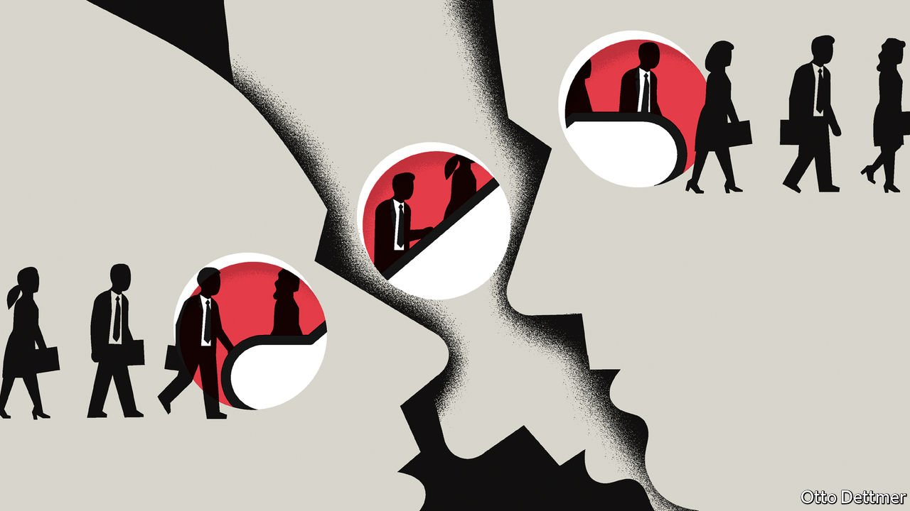

###### Free exchange

# The Nobel prize in economics celebrates an empirical revolution 

##### David Card shares this year’s award with Joshua Angrist and Guido Imbens 

 

> Oct 12th 2021 

A “CREDIBILITY REVOLUTION” has transformed economics since the 1990s. Before that, theory ruled the roost and empirical work was a poor second cousin. “Hardly anyone takes data analysis seriously,” declared Edward Leamer of the University of California, Los Angeles, in a paper published in 1983. Yet within a decade, new and innovative work had altered the course of the profession, such that the lion’s share of notable research today is empirical. For enabling this transition David Card of the University of California at Berkeley shares this year’s economics Nobel prize, awarded on October 11th, with Joshua Angrist of the Massachusetts Institute of Technology and Guido Imbens of Stanford University.

The messy real world can often defy economists’ attempts to establish causality. Working out how a rise in the minimum wage affects employment, for example, is complicated by the fact that some other influence (a chronically weak labour market, say) may have contributed to changes in both policy and employment. In other fields researchers establish causation by designing experiments where subjects are randomly assigned to different groups, only one of which receives a particular treatment, so that the effect of the treatment can be clearly seen. More economists are also using randomised controlled trials—indeed, the Nobel prize in 2019 rewarded such efforts. But many questions cannot be studied this way for reasons of politics, logistics or ethics.


This year’s prizewinners surmounted such hurdles by using “natural experiments”, in which some quirk of history has an effect similar to an intentional trial. In a landmark paper published in 1994, Mr Card and Alan Krueger studied the impact of a minimum-wage increase in New Jersey by comparing the change in employment there with that in neighbouring Pennsylvania, where the wage floor was unchanged. Although theory predicted that a minimum-wage rise would be followed by a sharp drop in employment, such an effect, strikingly, did not seem to hold in practice. The paper inspired further empirical work and injected new energy into thinking about labour markets. Krueger, who died in 2019, would probably have shared the prize had he lived.

The use of natural experiments quickly spread. Mr Card analysed another unique circumstance—Fidel Castro’s decision in 1980 to allow emigration out of Cuba—to examine the effects of immigration on local labour markets. About half the 125,000 Cubans who fled to America settled in Miami. By comparing the city’s experience with that in four other places which were similar in many respects, but which did not receive an influx of migrants, Mr Card found that neither the wages nor the employment of native workers suffered as a result of the migration.

Mr Angrist, together with Krueger, used a similar technique to examine the impact of education on labour-market outcomes. Because students of a more scholastic disposition are likely both to spend more time in school and to earn more in work, what looks like a return to education could in fact reflect natural aptitude. In order to determine causality, the researchers made use of odd characteristics of America’s educational system. Although laws typically allowed students to drop out of school when they turned 16, all students born in the same year began school on the same date, regardless of their birthday. Those born in December, therefore, received more schooling, on average, than those born in January—and, the researchers found, also tended to earn more. Since the month of a student’s birth may be assumed to be random, they concluded that the added education caused the higher earnings.

The study of schooling found that an extra year of education raised subsequent wages by 9%. Such an effect seemed implausibly large to many economists. But that reflected a difference in definition, concluded Mr Angrist in work with Mr Imbens. The two scholars noted that the effect of a “treatment” was not the same for everyone in a natural experiment. If the age at which students could drop out were raised from 16 to 17, for example, some would be forced to receive another year of schooling; others, who had always intended to stay in school, would be unaffected.

Together, the researchers developed methods to make the conclusions from natural experiments more useful. Economists refer to the quirky factor used in natural experiments (like the birth month of a student) as an “instrument”. Messrs Angrist and Imbens explained the assumptions that need to hold for an instrument’s use to be valid: it must, for instance, influence only the outcome being studied (earnings, in this case) through its effect on the treatment (years of schooling), and not other channels. By laying out these assumptions, the researchers allowed for more sophisticated analysis: the estimated boost to earnings in Messrs Angrist and Krueger’s work, for instance, applies only to students who drop out as soon as they can. The benefits to those who choose to study longer cannot be observed. Moreover, the methodology also improved the transparency of research. The reader of a paper can judge for themselves whether an instrument satisfies the needed assumptions, and discount the result accordingly.

It’s only natural

The credibility revolution, like any big upheaval, has had its excesses. Critics point to careless work and the mining of data in search of results that seem meaningful. Scholars are occasionally too eager to extrapolate findings from a particular natural experiment in ways that may not be justified, given the uniqueness of the circumstances. Yet the innovations developed by this year’s prizewinners unquestionably changed the field for the better, illuminating questions once shrouded in darkness and forcing economists to push theory in directions that better describe real-world experience—a cause, indeed, for celebration. ■

Correction (October 12th 2021): A previous version of this article misstated the part of Messrs Angrist and Krueger's study. Sorry. 

