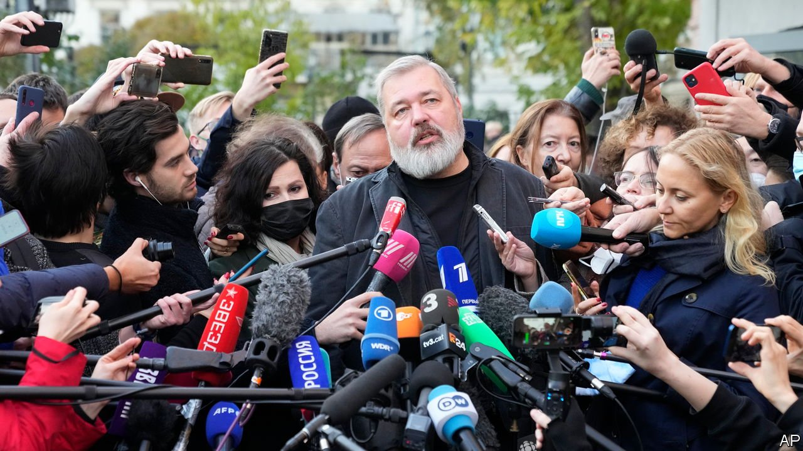

###### An interview with Dmitry Muratov

# A Russian editor says he won the Nobel because his slain colleagues could not 

##### Six journalists for Novaya Gazeta have been murdered since 2000 

 

> Oct 14th 2021 

THE DAY before Dmitry Muratov won the Nobel peace prize, the editor-in-chief of Novaya Gazeta stood in remembrance outside the Moscow apartment block where his newspaper’s most famous journalist was murdered exactly 15 years before.  was shot on October 7th 2006—Vladimir Putin’s birthday. Her death, Mr Putin said at the time, caused more damage to Russia’s authorities than her work. This callousness offended Mr Muratov. It hurts that the statute of limitations has passed and those who ordered the killing have still not been named.

Mr Muratov says he got the prize because it cannot be awarded to the dead. He says it belongs to Politkovskaya and five other colleagues murdered since 2000. To Yuri Shchekochikhin, an investigative journalist who was poisoned. To Igor Domnikov, bludgeoned to death. To , a 26-year-old freelancer who had barely started writing when she was shot in the head in Moscow by an assassin who also gunned down Stanislav Markelov, a human-rights lawyer. To , abducted and killed in Chechnya where she also worked for Memorial, Russia’s oldest human-rights organisation.


Yet it is also a prize for Mr Muratov and the newspaper he founded in 1993 with the help of Mikhail Gorbachev (who used some of his Nobel peace prize money to buy the paper’s first computers). Its investigations into the sufferings of ordinary folk were not the kind of work many Russian journalists were seeking to do in the 1990s. During the oil-fuelled bonanza of the 2000s its campaigning journalism—edited in a down-at-heel office block and printed on A2 paper three times a week—seemed a relic of Mr Gorbachev’s perestroika era. Its relentless reporting on war crimes in Chechnya, torture and other human-rights abuses spoiled the party, like an obsessive relative in a dusty jacket.

But as repression in Russia has grown, Novaya Gazeta’s investigations, including into the shooting-down of a Malaysian Airlines plane over Ukraine, have become mainstream. Every month it reaches more than 23m people on social media. Young journalists visit its office and post snaps on Instagram.

On the same day that Mr Muratov was awarded the Nobel prize the Kremlin labelled another nine Russian journalists “foreign agents”, effectively barring them from the profession. On October 13th Mr Putin implied that Mr Muratov could yet be added to the list. Alexei Navalny, the jailed opposition leader, sent Mr Muratov a congratulatory message from his cell. He is one of the reasons, says Mr Muratov, that Novaya Gazeta continues to print on paper. “People in prisons don’t have access to online. For as long as there are political prisoners in Russia, we will continue to print…You can always pull the plug on Instagram. Pulling a plug on Novaya Gazeta is harder.”

