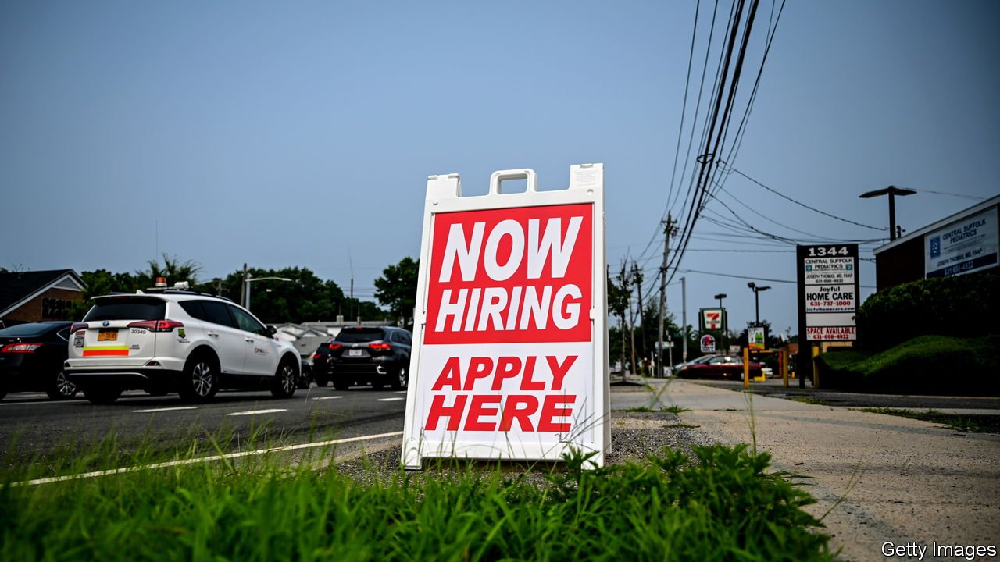
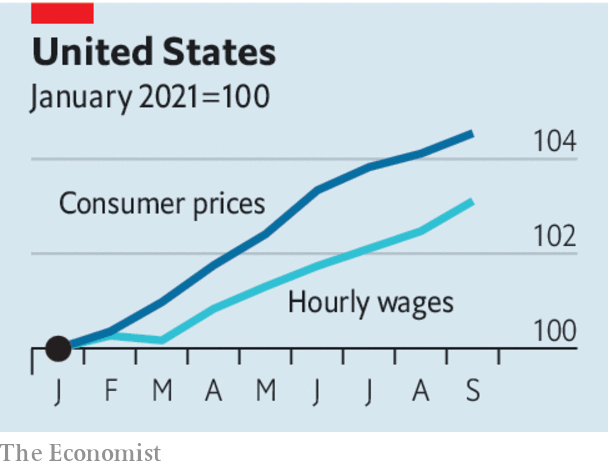

###### Cheques and imbalance

# Is the world economy entering a wage-price spiral? 

##### Both wage growth and inflation are unusually high 

 

> Oct 16th 2021 

THE RICH world is used to wages and prices growing slowly. In the decade after the global financial crisis, inflation rarely exceeded central banks’ targets, and wages seemed unable to grow much faster. The spending power of average hourly pay in Britain, Italy and Japan was about the same at the start of the pandemic as it had been in the mid-2000s. The fact that American wage growth averaged 2.9% from 2015 to 2019 while average inflation stayed below 2% seemed a rare triumph.

The recovery from the pandemic has brought about a startling change: prices and wages are both surging. American hourly pay rose by 4.6% in the year to September while consumer-price inflation of 5.4% is more than wiping out those gains. In Germany inflation has reached 4.1% and the main public-sector union is asking for a pay increase of 5%. Wages and prices have even picked up modestly in Japan.


The causes of higher prices are clear: rampant demand for goods has met bottlenecks in supply chains, and energy prices have soared. Wage growth is more mysterious. In most places employment is lower than it was before the pandemic. Yet workers seem unwilling or unable to take the abundant jobs that are on offer. The labour shortage may reflect how hard it is to move between professions and places as economies go through an unusual adjustment. Fear of the virus and the lingering effects of state support for household incomes could be keeping workers idle. The pandemic may even have led some people to put family and leisure above their careers.

A hazy understanding of what is driving wages up is making life harder for central banks. Most have argued that high inflation is temporary. But excessive wage growth could be the next factor to drive up prices, especially if workers demand higher pay in the expectation of future rises in the cost of living—an insurance that exacerbates the very thing it seeks to offset.

 


To avoid enduring inflation, some combination of three things must happen. Firms could absorb higher wages in their margins rather than raising prices. Productivity growth could make higher increases in real-wages sustainable. Or idle workers could return to the labour force, dampening wage growth.

In the popular imagination workers’ share of the economic pie has room to grow at the expense of profits. But recent research suggests that labour’s share of the value created by firms has in fact been fairly stable in most rich countries during recent decades. We estimate that it has already risen by one percentage point on average in big rich countries during the pandemic. There may not be very much scope for further increases.

Higher productivity growth is a reasonable hope. Output per worker has risen in America since the start of the pandemic. The digitisation brought about by the pandemic should boost living standards, particularly if it reduces the need to live near expensive cities to get good jobs. The trouble is that time lags make it hard to base policy on productivity trends. They are hard to measure in real time and it takes about 18 months for central banks’ decisions to fully feed through into the economy.

That means policymakers should focus on the labour supply. Its recovery has been disappointing so far. There is surprisingly little sign that the end of emergency programmes, such as America’s extended unemployment insurance and Britain’s furlough scheme, has increased the number of people looking for work. Perhaps, though, as bank accounts run dry and the pandemic abates, some slack will reappear in 2022, causing wage growth to slow. Even more than usual, monetary policymakers should keep their eyes fixed on jobs. ■

