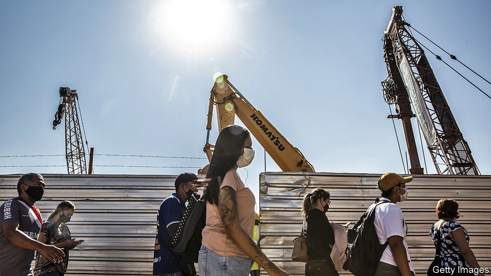

###### Building back best

# Latin America could become an alternative to China 

##### But only if the protectionist policies of the region’s politicians don’t get in the way 

 

> Oct 14th 2021 

LATIN AMERICA’S economies are punch-drunk from the pandemic. No other region suffered a bigger drop in GDP in 2020 or a higher death rate. Even before the coronavirus arrived, the larger Latin economies lagged behind emerging-world success stories in Asia and Europe. They were held back by poor governance, excessive dependence on commodities and protectionism. In the steepness of its barriers to trade, the region is second only to sub-Saharan Africa. From 1995 to 2015 its participation in global supply chains rose by just 0.1%; in the rest of the world supply-chain trade jumped by 19%.

But the Americas now have a chance to make progress. The capriciousness of Chinese regulators, the tangled state of global trade and the trend towards reshoring and nearshoring are prompting firms in the United States to reassess where they should build factories and invest their cash. With the right policies, Latin American countries could be  supplying the United States and each other. This is the best chance in decades to pursue a policy of regional economic integration.


Whether that actually takes place will depend in part on President Joe Biden. Already, Latin American governments are being courted to take part in Mr Biden’s Build Back Better World partnership, an infrastructure-investment programme that is intended to counter China’s Belt and Road Initiative. Yet, for all its good intentions, the Biden plan lacks ambition.

As well as promoting infrastructure-building, Mr Biden should urge his neighbours to lower trade barriers, harmonise provisions across the hundreds of trade agreements which already criss-cross the region and clear up onerous customs procedures. This could help persuade investors to take the plunge.

Nobody should underestimate how hard it will be to overcome Latin America’s scepticism of markets. Big economies such as Brazil and Argentina have long been protectionist, coddling domestic firms behind high trade barriers. The results of past trade deals have sometimes been disappointing.

Policy mistakes continue. Left-wing leaders, such as Andrés Manuel López Obrador of Mexico, want less private capital in the economy, not more. Peru has recently elected a far-left leader, Pedro Castillo, who has been seeking to calm the market’s apprehension about his economic policies, with only some success.

Partly as a result, Latin America has failed to transform itself economically as East Asia has done over the past generation. Since the North American Free Trade Agreement took effect in 1994, real income per person in Mexico, measured by purchasing power, has fallen further behind that in the United States.

However, you can find signs of openness. Uruguay is seeking new trade deals with China and, as part of a regional grouping, South Korea. In Ecuador , the president and a former banker, is valiantly battling populism. Countries that have been open to trade, like Chile and Costa Rica, have outgrown their inward-looking Latin American peers.

Even Mexico holds out some hope. In recent years its exporters competed directly with China’s in industries that China came to dominate. Now Mexicans have adapted. Whereas the country’s overall growth has been disappointing, its manufacturers have shifted from low-value textiles into automotive, aerospace and semiconductor industries that will benefit from being close to the United States and far from China.

Mr Biden could help by pairing access to badly needed investment through Build Back Better with a drive for trade liberalisation. In September members of the Biden administration visited Colombia, Ecuador and Panama to gauge interest in the initiative, which could also boost Latin America’s defences against climate change.

The alternative to integration is grim. Further economic stagnation in Latin America would leave governments struggling to cope with the rising costs of climate change. A lack of jobs and growth would rile their increasingly frustrated citizens, many of whom have taken to the streets in recent years.

Similarly, a further inward lurch in Latin America would not serve the security and commercial interests of the United States. At the very least it would be a missed opportunity to expand markets for the country’s firms. Mr Biden has a chance to help create a more prosperous region. He should take it. ■

