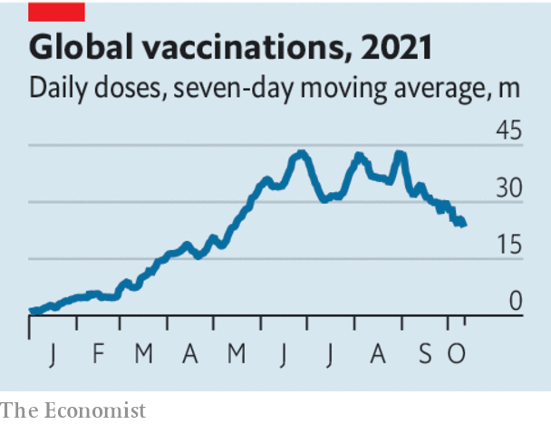

###### The coronavirus

# Millions of lives depend on how the pandemic ends 

##### The world can see the end of the covid-19 emergency, but some daunting tasks lie ahead 

 

> Oct 16th 2021 

ALL PANDEMICS end eventually. Covid-19 has started down that path, but it will not be eradicated. Instead, it will gradually become endemic. In that state, circulating and mutating from year to year, the coronavirus will remain a threat to the elderly and infirm. But having settled down, it is highly unlikely to kill on the monstrous scale of the past 20 months. Covid will then be a familiar, manageable enemy, like the flu.

Although the destination is fixed, the route to endemicity is not. The difference between a well-planned journey and a chaotic one could be measured in millions of lives. The end of the pandemic is therefore a last chance for governments to show they have learned from the mistakes they made at its start.


As the pandemic fades, weekly recorded cases and deaths have been falling globally, including in America, since the end of August. Britain is one country where cases are high and rising, but it has had a lot of disease and has run a successful vaccination campaign. Because 93% of Britons have antibodies, roughly 250,000 cases a week are leading to hundreds of deaths instead of thousands. That is the .

 


Nobody knows how many people around the world enjoy such protection, but you can hazard a very rough guess. About 3.8bn people have had at least one dose of the vaccine. The Economist estimates that during the pandemic excess deaths lie between 10m and 19m, with a central estimate of 16.2m. Working backwards, using assumptions about the share of fatal infections, this suggests that 1.4bn-3.6bn people have had the disease, amounting to 6-15 times the official count. There is an overlap, as many have been both vaccinated and infected.

The reservoir of people with immunity makes covid less dangerous. However, in bringing the pandemic to an end, the world is likely to face several tests.

One is the wave of winter infections in the northern hemisphere. Covid thrives when people spend their time indoors. If cases start to overwhelm hospitals, governments will need to intervene. One line of defence is treatments, including promising new antiviral drugs such as molnupiravir, which cuts rates of serious illness by half if administered early, but is still awaiting approval. Another is measures such as mask-wearing, shielding care homes and closing hotspots, including clubs and bars. The question is whether governments have learned to act promptly, but proportionately.

A second test is mutation. The genetic sampling of infections serves as an early warning if the Delta variant is displaced, yet poorer, unvaccinated parts of the world still go unmonitored. A new variant may require vaccines to be redesigned. That is far easier than starting from scratch, but it would require the production and approval of new jabs and perhaps jettisoning the stocks of old ones. It could trigger a replay of the fights over supply that marred the start of 2021.

The greatest test is how to protect the billion or more people without immunity.  is to try to shut the virus out with harsh and costly quarantines and lockdowns. This allows time for vaccination and stockpiling medicines. The Communist Party has used the country’s tiny number of cases as proof its system is better than democracy, so abandoning its zero-covid strategy is politically awkward. However, as places including New Zealand have accepted, the coronavirus is not going away. One day China will have to relent.

Ultimately, people will gain immunity either through infection or vaccination. Because vaccination is so much safer, governments must get as many needles into arms as possible. According to Airfinity, a data firm, 11.3bn doses should have been produced before the end of the year and 25bn by June 2022. If so, global supply will soon no longer be a constraint—how soon, depends on the demand for boosters. Not all vaccines are equally effective, but all of them are far better than being infected.

This approaching vaccine glut means that exporters should already be shipping doses wholesale. Instead many are holding back supplies for boosters and to vaccinate children, who very rarely die from covid. Doses are promised for next year, but they are needed now.

The last barriers to vaccination will be hesitancy and the capacity of local health care. The World Health Organisation has set a target of 40% of every country to be jabbed by the end of the year. A global vaccine summit set a target of 70% by September 2022. But different countries have different needs for vaccines depending on their demography, their ability to administer jabs, and the threat of covid compared with other diseases like malaria and measles. Blanket targets risk turning sensible priorities into failures.

It is a daunting to-do list. Will governments rise to the challenge? Therein lies the last test. As covid fades into the background, rich countries may start to lose interest in the coronavirus. The disease it causes risks becoming a poor-country killer, like so many of the rest. ■

Dig deeper

All our stories relating to the pandemic can be found on our . You can also find trackers showing ,  and the virus’s spread across .

