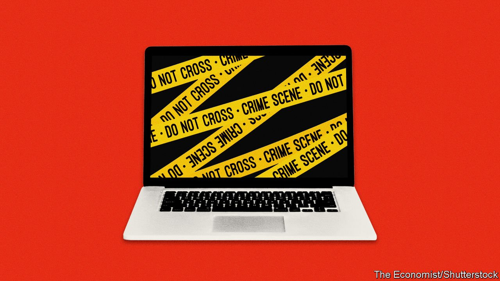

###### Reluctant regulators

# Who should police the web? 

##### Politicians should not offload the responsibility onto others 

 

> Oct 13th 2021 

SHOULD VIDEO websites have to review content before they publish it? Where does the boundary lie between hate speech and incitement to violence? Is pornography created by artificial intelligence an invasion of privacy? These are all hard questions, but behind them lies an even more difficult one: who should provide the answers?

On the internet, such dilemmas are increasingly being resolved by private firms. Social networks are deciding what kinds of misinformation to ban. Web-hosting companies are taking down sites they deem harmful. Now financial firms are more actively .


The digital gatekeepers are doing a mixed job. But it is becoming clear that it ought not to be their job at all. The trade-offs around what can be said, done and bought online urgently need the input of elected representatives. So far governments have been better at complaining than at taking responsibility.

For an example of how private firms have become the digital police, consider the rules on internet pornography being  on October 15th. In a bid to weed out illegal material, the card firm is demanding that porn sites take steps that go beyond what the law requires, including reviewing footage before publication and checking the identity of those who upload or feature in it. Sites that think these sorts of rules too onerous are under no obligation to work with Mastercard. But Visa is also cracking down, and the two firms handle 90% of card payments outside China, meaning that they are becoming the industry’s de facto regulators.

Liberals must strike a balance. Private firms should in general be free to deal with whom they like. Just as Facebook may legally ban people like Donald Trump from its network and Amazon Web Services can decline to host alt-right-friendly apps like Parler, Mastercard is free to drop particular porn sites. Yet the market power of these firms and their often like-minded rivals means that without their approval and support, individuals or businesses may face exclusion, even if they have broken no law. In edge-cases, private gatekeepers will err on the side of caution. What incentive is there for a social network to allow borderline hate-speech, or for a bank to deal with a legally tricky industry like cannabis?

The best remedy would be more competition, so that if Visa and Mastercard bar a porn site or Facebook cancels a controversial figure, consumers have alternatives. That will not happen soon: network effects are powerful in social media and crushing in the payments business.

In the meantime, private companies that find themselves acting as gatekeepers should be transparent about their rules, how they make them and what redress they offer. Under public pressure, social networks have taken steps in this direction. Facebook sends difficult decisions to an independent “oversight board”; Twitter this week published a set of principles for regulating online speech. Financial institutions are more opaque. Mastercard explained its new rules in a blog post. When OnlyFans, a site known for sexually explicit content, blamed banks for forcing a change in its content policy earlier this year, the banks in question made no comment.

Yet the bigger responsibility lies with governments. They are right to be wary of constraining speech. In much of the world leaders are only too ready to muzzle online debate (see International section). But carefully laying out a method for drawing lines around free expression and building in safeguards would help clarify where despots have overstepped the boundary.

What is more, in many areas the gatekeeping power wielded by private firms is really a consequence of government inaction. Keeping revenge-porn off the web or limiting children’s access to viral content are areas where governments could act if they wanted to. Instead, the approach of many has been to do nothing and then feign shock when profit-maximising companies come up with answers that may not be in the interest of society.

Politicians are right to warn that some private companies have too much power online. But those firms have ended up with so much responsibility partly because politicians themselves have abdicated it. ■

