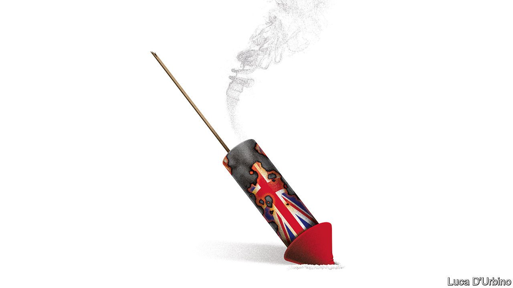
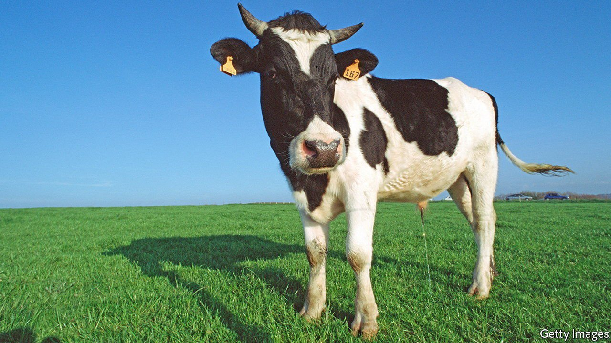

###### The London Stock Exchange, philanthropy, religion, urinating cows, Brazil, “like”

# Letters to the editor 

##### A selection of correspondence 

 

> Oct 16th 2021 


The London Stock Exchange

Your leader, “” (October 2nd), and the accompanying briefing, “”, were correct in highlighting that the London Stock Exchange remains one of the world’s largest stockmarkets and is the biggest bourse in Europe. An increasing number of firms are choosing to list in London. This year has been our strongest market for initial public offerings for seven years, with tech or tech-enabled companies accounting for 43% of all capital raised.


We agree that Britain’s capital markets must continue to evolve and innovate, as they have done for the past 300 years, to serve investors in Britain and around the world. We should also not lose sight of the fact that public markets are an engine of growth, innovation and employment.

The LSE is a strong supporter of the reforms proposed by the British government and the regulator. I am confident there is real momentum to make changes that will ensure London remains the home to one of the world’s strongest, most diverse and most international exchanges for decades to come.

JULIA HOGGETT

Chief executive

London Stock Exchange

 


Outputs v outcomes

I enjoyed your article on philanthropy (“”, September 18th). However, you made a fundamental category error in describing Bill Gates’s approach to dispensing grants as a “hyper-efficient, outcomes-oriented” one. Following the established conventions of impact measurement, in this case the widely used Theory of Change Model, the examples you gave are of outputs, not outcomes. The former are widely criticised for being technocratic and failing to account for the real changes, negative as well as positive, brought about by philanthropy.

The case of malaria nets that you mentioned is a perfect example of the dangers of such an outputs approach. Although the “output” of the programme was considered a substantial success, counted by the number of nets distributed, the actual outcome was that on the ground the nets were repurposed for fishing rather than fighting off mosquitoes. By that measure the programme failed. In this context, Melinda French Gates’s more holistic, and participatory, grant-making model is, in fact, likely to yield greater overall impact than a rationalistic, Silicon Valley approach.

ALEX NICHOLLS

Professor of social entrepreneurship

Said Business School

University of Oxford

 


Religious sense

Noble suffering and mutual aid were two themes presented in your article on whether religious belief makes poverty more bearable (“”, September 25th). There is another theory. The world is indifferent to us all. Individually and collectively we are informed by conditions and events on a daily basis that we do not matter and our existence is an accident. Religious belief offers an appealing lie of a beneficent force that cares about us if we do the “right” things. This gives meaning to life, giving us essential purpose and resolving existential despair.

ALEXANDER WILSON

Aurora, Colorado

Between Marx and Seneca you struck a cynical tone, suggesting that religion promises rewards in the next life without acknowledging the incredible contribution it can make to drawing the sting of poverty in the here and now. You don’t have to look far for the evidence. The official aid agency representing Catholics in England and Wales, CAFOD, is part of one of the largest aid networks in the world and is entirely dedicated to global poverty relief regardless of faith, gender or ethnicity.

Marx did not notice that true religion promises jam today as well as tomorrow.

GERARD CONROY

Reading, Berkshire

 


Where there’s muck

“” (September 18th) presented a complicated solution to an unnecessary problem resulting from an increasingly out-of-date farm management system. Cows on my farm are at pasture throughout the year, even for calving. Their urine is immediately taken up as natural fertiliser and the dung quickly taken into the soil by dung beetles and stored as carbon. Housing cattle breaks the dung beetle life-cycle, has a heavy carbon footprint and starves the bats that eat the beetles. The neglected story of the humble dung beetle is just as entertaining as potty-training cows, and, as we approach COP26, more relevant.

TOM MORRISON

Member of the Pasture-for-Life Association

Hogshaw, Buckinghamshire

The last sentence of your article ended with “every little helps.” Surely you meant “every wee bit helps?”

KEITH SCHWARZ

Cupertino, California

 


Brazil’s nuclear programme

You were right to quote an expert affirming that Brazil’s nuclear-powered submarine programme is legitimate (“”, October 2nd). Brazil is possibly the only country in the world with a constitution that prohibits the use of nuclear energy for non-peaceful purposes. For 30 years we have had full transparency through the nuclear-monitoring mechanisms of the Brazilian-Argentine Agency for Accounting and Control of Nuclear Materials as well as the International Atomic Energy Agency. Brazil is a signatory to all the main international instruments on non-proliferation. And our determination to promote meaningful nuclear disarmament is also unwavering: we were the first country to sign the Treaty on the Prohibition of Nuclear Weapons.

Simply put, the nuclear-propulsion submarine that Brazil has been developing for four decades is a response to the country’s need to look after its vast Atlantic coast. No more, no less.

FRED ARRUDA

Ambassador of Brazil

London

 


What’s not to like?

An entire essay on my pet peeve: “like”, the filler word that multiplies like bacteria within an otherwise unblemished sentence. As said (September 18th), the person who uses “like” to excess is not “stupid or thoughtless”. The problem is that peppering his speech with the word makes him sound vapid when he’s not. If he manages to strip the word from what he’s saying, he comes across as smarter and more articulate without sounding pompous or nerdy. No teenager need ever worry that ditching “like” will make him uncool.

MARGARET MCGIRR

Greenwich, Connecticut

The use of “like” was familiar in 1959. To wit, Woody Herman’s announcement of the piece “’Like Some Blues, Man’, like”, eliciting laughter from the audience at the Monterey Jazz Festival of that year.

HANS SPROSSCologne

Calvin Trillin, an American humourist, once said that the best SAT analogy question for his teenage daughter would be “Like is to like, as like is to…?”

DAVID ABRAHAMSON

Professor emeritus

Northwestern University

Evanston, Illinois

