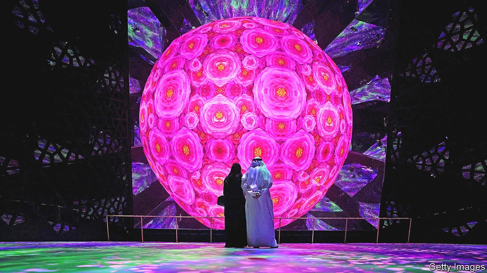

###### The far-fetched pavilions

# At the Dubai expo, no one is eager to talk about reality 

##### There are no politics at the Middle East’s first world’s fair 

 

> Oct 16th 2021 

THE SETTING is dramatic. Visitors passing from the harsh midday sun to the dim interior are met with slogans. “We believe that every human is part of the collective conscience,” reads a message on the walls of the Syrian pavilion at the Dubai expo. Why the Syrian government has spent years dropping bombs on many of those humans is not explained.

The $7bn fair is the first “World Expo” in the Middle East. Like much else in the United Arab Emirates (UAE), which wants to attract visitors to revive its economy, the expo strives to gloss over politics. Exhibitors are able to present Panglossian visions of themselves to investors and tourists.


Many of the pavilions, intentionally or not, capture something about a country’s character. America puts guests on a moving walkway for an earnest civics lesson. China greets them with a video from Xi Jinping. Visitors to the British one spend most of their time in an orderly queue.

For countries in the region, there is much to gloss over. Lebanon’s pavilion feels like a tourism ad, with large monitors showing glamour shots of the country. Such an exhibit would be impossible in Lebanon itself, where the power went out for 24 hours earlier this month. Some countries have yet to showcase anything. Libya’s is almost empty, with walls that smell of fresh paint and a television playing cartoons. Iraq missed the opening, too.

Egypt is a popular stop. There are a few nods to the past: hieroglyphs and a replica of King Tut’s coffin. Much of it, though, is given over to portraying Egypt as an economic powerhouse, an image at odds with its sluggish private firms. On a giant video screen, a woman in pharaonic garb talks about industrial zones being built along the Suez canal. If Abdel-Fattah al-Sisi is Egypt’s new pharaoh, a fish farm near Suez is apparently his Karnak temple.

No one acknowledges politics, not even occupied Palestine, which allows visitors to touch a piece of Jerusalem’s Dome of the Rock and smell soap made in Nablus. Instead, many countries want to do business. At Iran’s unfinished pavilion, where one door leads to a construction site, space is given over to a sort of bazaar, with companies hawking ceramic tiles and carpets.

Back at the Syrian stall there are booths for firms selling cables and olive oil, and one for Cham Holding, a conglomerate under American and European sanctions. Another space is lined with 1,500 wood panels that were posted to Syrians around the world with instructions to draw their hopes. Some are painted with the regime’s flag, or Bashar al-Assad’s face. Organisers insist they tried to reach a representative sample of the now-sprawling diaspora. Yet none seems to have sent wishes for a less brutal government or accountability for a war that killed hundreds of thousands of their fellow citizens. A neon sign nearby declares, “What you see isn’t all there is”—an apt slogan for the whole expo. ■

