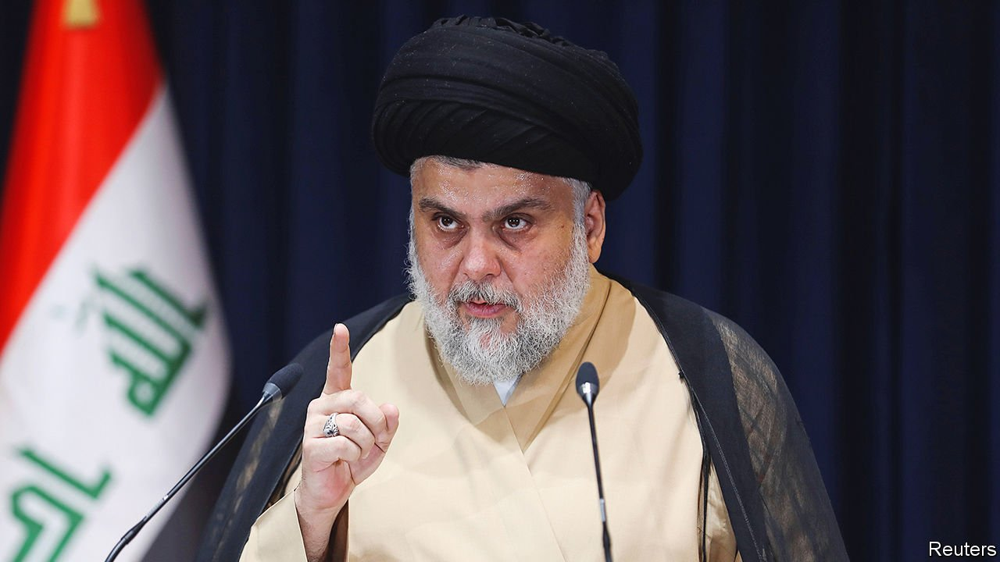

###### Vote first, fight later

# Iraq’s dismal election prompts militias to threaten violence 

##### Parties are talking war rather than wrangling over cabinet posts 

 

> Oct 14th 2021 

ELECTIONS ARE supposed to be a smooth way to change power. In Iraq they seem to heighten hostilities. The vote on October 10th split the Shia majority between two snarling blocs. Muqtada al-Sadr, a gruff cleric-cum-militiaman popular with working-class Shias, emerged as the front-runner, with more than 70 of parliament’s 329 seats, a third more than his tally in the previous election, in 2018. His nearest Shia rival, Nuri al-Maliki, won about half as many. But within hours Mr Maliki, a besuited former prime minister, had assembled a coalition of Shia factions and militias friendly with Iran, topping Mr Sadr’s tally. Both men are claiming to have a mandate to form the next government.

Much will depend on which side Iraq’s Kurds and Sunni Arabs take. Preliminary results suggest that Masoud Barzani’s Kurdistan Democratic Party has 32 of the 63 seats won by Kurdish parties, so he will probably style himself as a kingmaker. Sunni voters, previously more divided, rallied behind Muhammad al-Halbousi, parliament’s speaker, giving his party, Taqaddum, 38 seats.


Elections in Iraq are usually followed by months of wrangling between the main parties over who gets the big jobs with control of big budgets. But this time, before they could begin horse-trading, the two Shia blocs were threatening war against each other. In his victory speech on state television, Mr Sadr (pictured) vowed to disarm the pro-Iranian factions. “Arms must be controlled by the state only,” he said, without a hint of irony, even though he heads one of Iraq’s largest private armies.

The pro-Iranian militias bristled. Their main political arm, Fatah Alliance, had a bad election. According to preliminary results, its clutch of seats dropped from 48 to 14. Kataib Hizbullah, the most pro-Iranian militia, fielded 31 candidates, but won only a single seat. Few Iraqis, it seems, want it to brandish its swords. But rather than heed the message, the group’s spokesmen denounced the result as “the biggest fraud…in recent history” and called on the militia to assemble. For some, this deployment was simply theatrical sabre-rattling. For others it was preparation for a re-enactment of the bloodshed of 2008, when Mr Maliki, then the prime minister, sent troops to crush Mr Sadr’s forces in Basra, Iraq’s second city.

Western tensions with Iran are making matters worse. Mr Sadr once fought against American forces but now considers Iran the bigger threat to Iraq’s independence. In his victory speech he said embassies from every foreign country were welcome, tacitly including America. Although he still refuses to meet American officials, he uses the incumbent prime minister, Mustafa al-Kadhimi, as a go-between.

Iran, meanwhile, is egging on its local allies to oppose Mr Sadr. Esmail Ghaani, the head of Iran’s Quds Force, the foreign wing of the Islamic Revolutionary Guard Corps, arrived in Iraq on election day. “They’re not going to hand Iraq to Mr Sadr on a golden plate,” says an Iraqi official.

Iraq’s election commission further muddled the mayhem. Its claim of a turnout of 9m voters, or 41%, in the face of a boycott, induced a few guffaws. Some monitors guessed it was possibly half that. The EU, observing an Iraqi election for the first time, listed numerous violations in its mission report. The comma in its phrase, the “officially announced turnout was low, 41%”, sounded a bit like a cough. Millions of people were left off the register of voters. Days after the vote the election commission was still changing results on its website, citing problems with manually counting the vote. Some losing candidates and their followers have alleged vote tampering and blocked main roads with protests. Others called on armed supporters to descend on the commission’s offices unless the results were changed.

The gloom, however, is not entirely without glimmers. Mr Kadhimi, who is also a former intelligence chief, is wisely staying outside the fray. He withdrew from the election months ago, but hopes he may again be picked as the compromise candidate on whom all factions might agree. Young Iraqis, who call themselves the Tishreenis (after the Arabic word for the month in 2019 when they first started their protests to demand sweeping change), also celebrated. Despite their calls for a boycott of the ballot, their main party, Imtidad, together with independents, won some 20 seats. New Generation, their Kurdish counterpart, won another nine. “Next election we’ll sweep the board,” enthused a protester in the southern city of Najaf. Had he and his friends voted, they might not have needed to wait. ■

