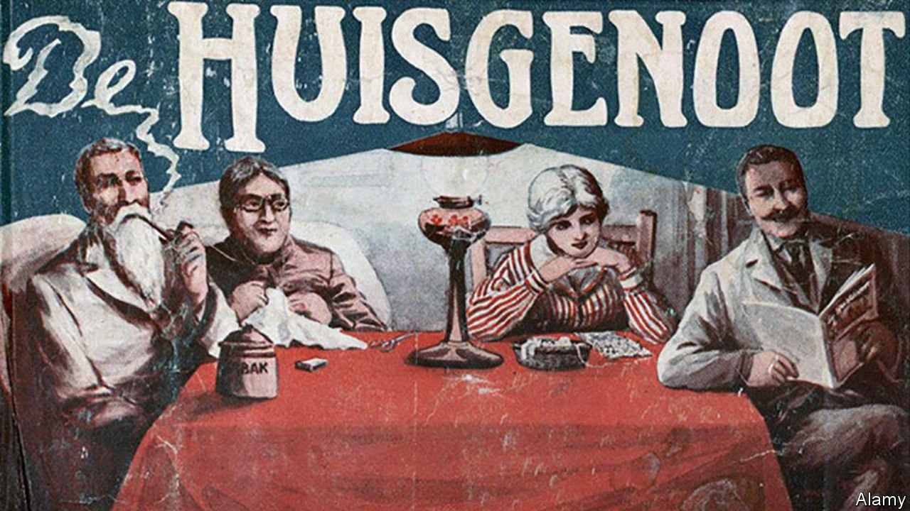

###### Ja to change

# The meaning of South Africa’s most popular magazine 

##### For more than a century Huisgenoot has reflected shifts in Afrikaner culture 

 

> Oct 16th 2021 

A  GLANCE AT its website belies the historical significance of Huisgenoot, the magazine with the highest circulation in South Africa. Among the most-read stories in early October were “Skokoomblik toe bruidegom se rug tydens onthaal breek” and “Vrou se oog per ongeluk met supergom toegeplak”. For those unfamiliar with Afrikaans, the language spoken at home by 12% of South Africans, these tales concern the “Shocking moment when groom’s back breaks during wedding reception” and the sticky situation in which a “Woman’s eye is accidentally glued shut with super glue”.

It is a far cry from the early days of the magazine. After the Anglo-Boer war (1899-1902) there was what Herman Giliomee, a historian, calls “the building of an Afrikaner ethnic consciousness” among the disparate group of South Africans of mostly Dutch descent. Important to that effort was Huisgenoot (Home companion), launched in 1916. It presented Afrikaner history as a heroic epic, extolled Afrikaner literature and helped standardise Afrikaans as its articles were used in school comprehension tests.


By the 1970s Afrikaner nationalism had long since metastasised into apartheid, and circulation of the dry cultural weekly was dwindling. As well as being racist, apartheid South Africa was stuffy, pious and insular. Television, which one politician called the “devil's own box”, was introduced nationwide only in 1976, meeting a pent-up demand for escapism and glitz. A revamped Huisgenoot tapped into that desire, introducing celebrity features, puzzles, recipes and so on, while glossing over apartheid. It was like People, but for white people.

“It is painful to look at how we covered politics in those days,” says Yvonne Beyers, the current editor. But in its own way Huisgenoot reflects how nowadays, “We are South Africans first and Afrikaners second.” White celebrities are prominent but reporters use shoe-leather journalism to get gripping first-person accounts of South Africans from all walks of life. It recently featured the gay wedding of two “coloured” (mixed-race) characters in a soap opera. “If we had published that 20 years ago there would have been an outcry,” says Ms Beyers. Today the magazine reflects “how varied Afrikaans-speakers are”, she adds. Some 44% of its readers are coloureds (most of whom speak Afrikaans), a slightly higher share than the 42% who are white.

Editors remain the custodians of Afrikaans. They keep an eye on English neologisms or translations of English idioms. (In Afrikaans one says the “ears of the hippopotamus” rather than “the tip of the iceberg”.) But, in contrast to a century ago, Huisgenoot embraces the language’s diversity by, for instance, quoting coloured South Africans in their vernacular. “We want to show a language that is still alive,” says Ms Beyers. “This is not the Afrikaans of 1916.”

