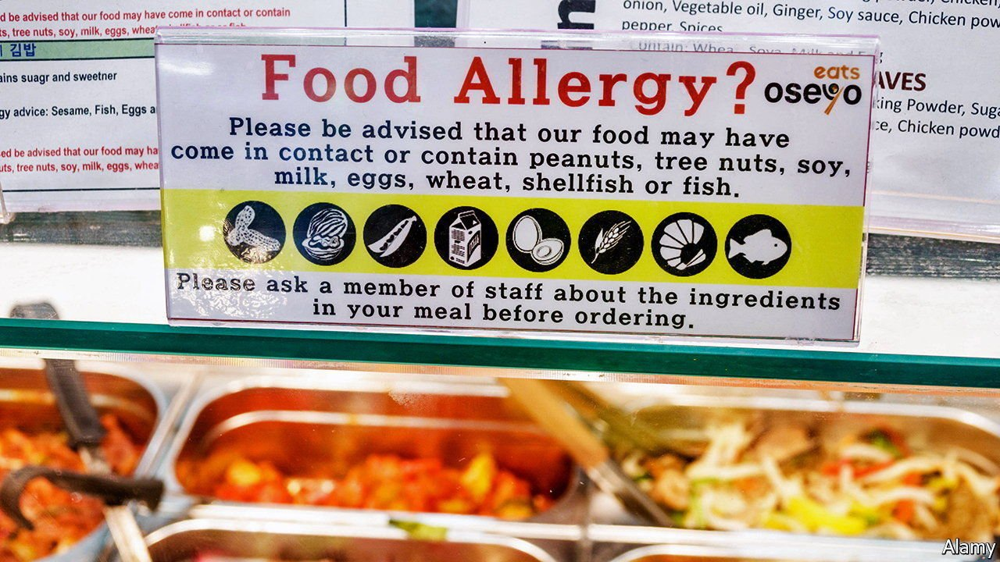

###### Fishing for allergens

# A novel technique can discover new allergens 

##### It will help make food safer to eat 

 

> Oct 13th 2021 

FOR MANY, eating out is a pleasure. For the 5% or so of people who suffer from food allergies, though, it is anything but. Mostly, such allergies cause mild rashes and minor digestive trouble, but they have the potential to trigger anaphylactic shock, a potentially lethal inflammatory response. The resulting swelling can block a patient’s airways, crash blood pressure and either speed up or slow down the heart.

The allergy-prone thus need to avoid contact with foods which may provoke this reaction. But that is hard, for two reasons. One is that some common allergenic foodstuffs, such as peanuts, are widely used as ingredients, so cross-contamination in factories and kitchens is an ever-present threat. That threat, though, is being countered by the development of a range of technologies intended to scan food quickly for the presence of allergenic proteins.


The other reason is that there is no comprehensive list of such allergy-provoking proteins for which to scan. This is particularly true for various sorts of seafood, which frequently provoke allergic reactions with untraceable chemical causes. But, as they describe in the Journal of Agriculture and Food Chemistry, Bi Hongyan at Shanghai Ocean University, in China, and his colleagues think they have invented a way to overcome this problem, by assembling a catalogue of suspects.

Their trick is a technique called immunomagnetic separation. This involves attaching antibodies from people suffering specific allergies to microscopic beads made of a special magnetic plastic, then exposing these beads to solutions with the problematic foods blended into them. As they would in the body, the antibodies bind to allergens when they encounter them in these solutions. The beads can then be fished out with a magnet, so that the allergens they have accumulated can be studied. Dr Bi knew this technique had been used in the past to detect a peanut allergen in both cornflakes and biscuits. He speculated that he could use it to discover allergens that had not yet been identified.

Many marine creatures eaten as food are allergenic, but the allergens in these seafoods are not as well studied as immunologists would like. Dr Bi and his colleagues therefore collected samples of blood serum from seven sufferers from severe seafood allergies. As a control, they also collected serum from eight allergy-free individuals. They then extracted antibodies from all of these samples, fixed them to beads and placed those beads in saline solutions that had had either a few grams of sablefish flesh or a few grams of greasy-back shrimp mixed into them. These two species stood in for ray-finned fish and crustaceans, two types of marine animals that can be particularly allergenic.

As the researchers hoped, some of the antibodies from the allergic volunteers stuck to proteins from the samples. This did not happen with antibodies from non-allergic volunteers. Using a combination of mass spectrometry and liquid chromatography they then identified the captive allergens. While some were familiar, many were not. Specifically, the process revealed that a protein called SVBP, which regulates the growth of blood vessels in sablefish, is an allergen that, if it had made it into the bodies of two of the blood-serum donors, would have triggered an allergic reaction.

Since SVBP was not a previously known allergen, this finding alone is important. Far more important, though, is that Dr Bi’s technique appears to work and has the potential to identify yet more potentially lethal allergens. ■

