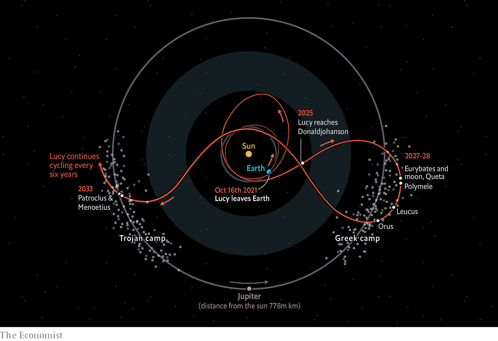

###### An embassy to the Trojans

# A probe intended to study the Trojan asteroids takes off shortly 

##### Lucy will visit more heavenly bodies than any previous mission 

 

> Oct 12th 2021 


THE STORY of the Trojan war, as told by Homer and related down the centuries, is one of intrigue and heroes. And, as is the way of characters from Greek mythology, the names of many of those involved have ended up attached to objects in the sky.

In the early 20th century astronomical photography showed that Jupiter, the solar system’s largest planet, was accompanied not only by its moons, but also by more distant acolytes. These were clusters of asteroids that followed the giant planet’s orbit precisely, but either led or trailed Jupiter itself by about 60° of arc.


Those clusters are centred on places called Lagrange points L4 and L5, after the mathematician who predicted their existence. L4 and L5 are traps in space caused by the interaction of the gravitational fields of Jupiter and the sun. Once in one of them, an asteroid is generally stuck there. Given the division of these captured asteroids into two camps, it amused their early discoverers to call bodies discovered at L4, which leads Jupiter, after Greek heroes of the war, and those at L5, which trails that planet, after Trojans (though each camp also has a spy from the other in its midst).

The siege of Troy

Most known asteroids reside in a belt between the orbits of Mars and Jupiter. Spectroscopic analysis of sunlight reflected from these, and comparisons with chunks of space rock that have fallen to Earth as meteorites, suggest that some are fragments of dwarf planets which subsequently collided with each other (a few such dwarfs, for example Ceres, remain intact), while the rest are conglomerations of material from the early solar nebula, often including pebbles of once-molten rock called chondrules. Many of the conglomerate-based asteroids are rich in carbon, which makes them dark and vaguely reddish in colour. In particular, their spectra resemble those of chondrule-bearing meteorites called carbonaceous chondrites.

Certain asteroids in the outer part of the main belt are, however, redder still—carbonaceous chondrites on steroids, as it were. These types are also abundant in a second, more distant set of asteroids and dwarf planets, the Kuiper belt, found beyond the orbit of Neptune, of which Pluto is the best-known member. The nuclei of active comets are often objects of this sort. And they constitute, too, the bulk of the members the Greek and Trojan camps.

The distant orbits of these asteroids mean that they do not seem to contribute to the mixture of meteorites that fall to Earth, so there is nothing to compare them with directly. Their colour, though, is suspected to be caused by complex organic molecules similar to terrestrial kerogen collecting on their surfaces. This material’s exact chemistry will reflect where in the solar system these asteroids formed, and thus cast light on how objects moved around in the system’s early days. That makes the Trojans (as the two groups are known collectively) of special interest to those who study the formation of planetary systems. So, on October 16th, if all goes well, NASA, America’s space agency, will launch a probe to have a look at them.

Lucy, as this planetary-ancestor-investigating mission is dubbed, after a well-known specimen of Australopithecus, an early hominid, will blast off from Cape Canaveral, in Florida, and will then follow one of the most complex paths around the solar system yet devised by NASA’s orbital navigators. The diagram which show’s Lucy’s journey using the orbit of Jupiter as a fixed frame of reference, indicates how the craft will first pick up speed using two velocity-boosting fly-bys of Earth. It will then head for the Greek camp, passing, for a practice run at observation, by way of a convenient main-belt asteroid that the mission’s scientists have named Donaldjohanson, in honour of the discoverer of Lucy the Australopithecine. When it arrives at L4 in 2027, it will encounter five bodies: Eurybates and its tiny satellite Queta, Polymele, Leucus and Orus.

Having examined each of these, it will leave the Greek camp in 2028 and cross, via another velocity-boosting fly-by of Earth, to the Trojan camp at L5. Its final planned encounter, when it reaches L5 in 2033, is with Patroclus and Menoetius.

These were thought to be a single object until 2001, when an examination by the Gemini North telescope, in Hawaii, showed they were actually a pair of rocks, each about 100km across, in orbit around one another. Classicists will recognise Patroclus, the name used when the pair were believed to be one, as the Greek spy in the Trojan camp. It is now the name given to the larger of the two. Menoetius, hurriedly pressed into service to designate the smaller, was Patroclus’s father. (For the curious, the Trojan spy in the Greek camp is Hektor, which is not on Lucy’s itinerary.)

The most widely used classification of asteroids, invented by David Tholen of the University of Hawaii, now recognises 14 spectral types, each called by a letter of the alphabet. Main-belt asteroids are mostly types C (carbon-rich, as with carbonaceous chondrites), M (believed to be metallic, and derived from the cores of dwarf planets) and S (silicaceous, or stony, and either other types of conglomerate or fragments of the outer layers of dwarf planets). Some Trojans are also type C. But the deep-red ones are of rarer types known as D and P—the difference between them being the exact shapes of the curves of their spectra.

To look at its targets in detail (Polymele, Patroclus and Menoetius are type P; Orus and Leucus are type D; and Eurybates and Donaldjohanson are type C), Lucy is equipped with three instruments: a high-resolution camera, an optical and near-infrared spectrometer, and a thermal spectrometer. Together, these will be able to map the various asteroids the probe encounters, and analyse the chemical compositions of their surfaces.

That, in turn, will test the ideas of Harold Levison, the mission’s principle scientific investigator. Dr Levison, who works at the Southwest Research Institute in Boulder, Colorado, helped create the Nice model of the solar system’s early days. This hypothesises that the largest planets, Jupiter, Saturn, Uranus and Neptune, have moved around a lot since they formed.

The gravitational effects of all this movement would have scattered asteroids like leaves in a gale, ejecting many of them from the solar system altogether and moving others far from their places of origin. Dr Levison suspects the Trojan D and P asteroids to be such travellers, and that their surface chemistry will show they formed much farther from the sun than Jupiter’s current orbit. The Nice model suggests such distant asteroids would have been scattered, in particular, by the movement of Neptune, which began life closer to the sun than Uranus but is now farther from it, and that some would then have been ensnared by Lagrange’s gravitational traps. If the D and P types Lucy encounters did indeed form far from the sun, that would add weight to the Nice model.

Once Lucy has visited Patroclus and Menoetius its formal mission will be over. These days, however, space probes often have an afterlife beyond the period intended. The New Horizons mission to Pluto, for example, has gone on to observe a second Kuiper-belt object, Arrokoth, and Opportunity, an American Mars rover that had a design life of 90 Martian days, actually operated for 57 times that period. In Lucy’s case, the craft’s final orbit will take it on an endless loop from L5 to L4 and back again. Each loop will take six years. So, if the hardware holds up, there is sufficient fuel left for manoeuvring, and someone is willing to pay to keep the mission team together, other Trojans might yet receive a visit. ■

Image source: NASA


