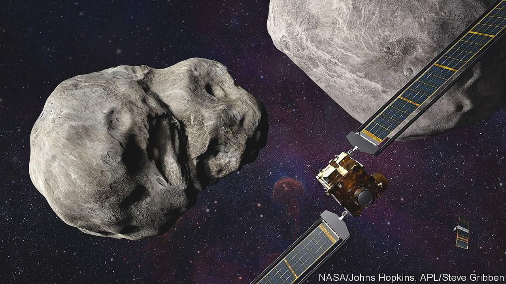

###### The Double Asteroid Redirection Test

# An exploration of Earth’s defences will launch next month 

##### It will check how far it is possible to deflect an incoming asteroid 

 

> Oct 13th 2021 

, on October 16th, if all goes well, is not the only forthcoming mission with asteroids as its destination. On November 24th DART should follow. The Double Asteroid Redirection Test, though, has a more practical purpose than Lucy. It will assess the feasibility of changing an asteroid’s path, should one be discovered that threatens to collide with Earth.

DART, a probe weighing 600kg, is intended to crash, in September 2022, into Dimorphos, a tiny asteroid in orbit around a larger one, Didymos, at a velocity of 6.2km per second. The intention is to alter the speed of Dimorphos’s orbit by about half a millimetre a second, thus shortening its orbital period, now 11.9 hours, by about ten minutes.


Didymos is 780 metres across. According to the project’s lead investigator, Andrew Cheng of Johns Hopkins University, in Baltimore, if an object that size hit Earth it could devastate half a continent, causing firestorms and a subsequent cooling of the climate that might last for years. But even something the size of Dimorphos, only 160 metres across, would do a lot of damage. Its impact would create an explosion equivalent to 400-600 megatonnes of TNT. By comparison, the Tunguska bolide that exploded over Siberia in 1908, flattening more than 2,000km of forest, released something like 20 megatonnes. And recently published evidence suggests that an explosion of similar size to Tunguska destroyed Tall el-Hammam, a city in the Jordan valley, in about 1650BC.

There are, moreover, a lot of unknown asteroids out there. NASA’s Near-Earth Object Observation Programme, intended to discover 90% of asteroids larger than 140 metres across that have orbits near Earth’s, is reckoned to have so far found less than half of them. None yet located is seen as a threat. But if such a threat were identified, the question would be whether anything could be done about it.

If collision with Earth was imminent, the answer is probably “no”. But if it were years or decades away, a nudge of the sort DART will give Dimorphos could change a space rock’s path enough for it to miss Earth after all—even a tiny alteration in such a body’s orbit will grow over time.

Dimorphos’s behaviour after DART hits it will thus be the subject of intense scrutiny. The impact itself will be monitored by LICIACube (Light Italian CubeSat for Imaging of Asteroids). This is a small craft, built by Italy’s space agency, which will be launched along with DART and separate from it shortly before impact. After that, Didymos and Dimorphos will be tracked by ground-based telescopes. Then, in 2024, the European Space Agency will launch a follow-up craft called Hera that will arrive at the double asteroid in 2026, for a more detailed inspection. All these data will then be crunched to find out just how feasible an asteroid-deflection mission would be.

With luck, no such mission will ever be needed. But if one is, DART may prove to be the most important space probe ever to have flown.

