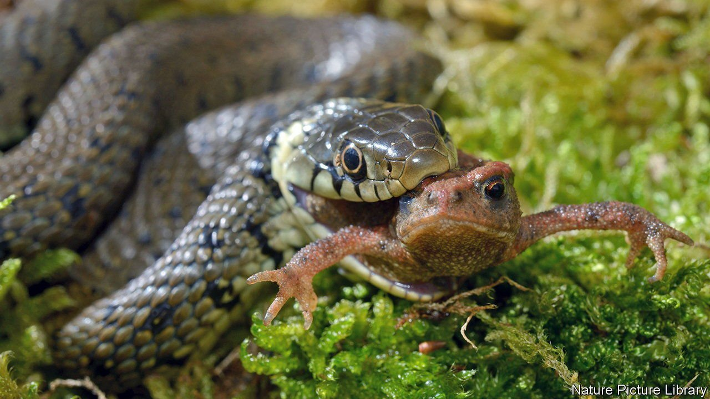
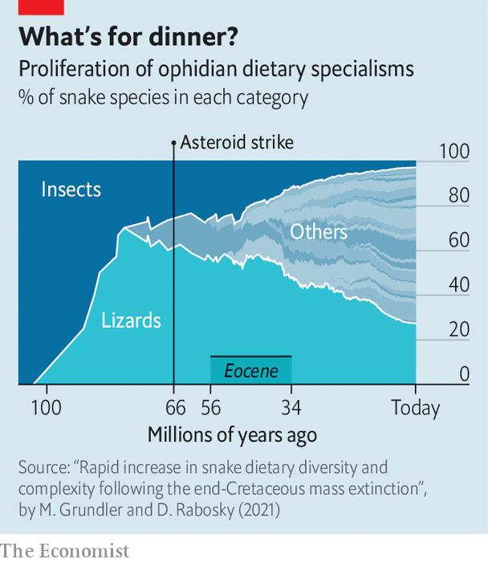

###### Snakes alive!

# Why there are so many species of serpent 

##### Mammals were not the only group to benefit from the dinosaurs’ demise 

 

> Oct 16th 2021 

THE CAENOZOIC—the era of Earth’s history since an asteroid strike 66m years ago ended the dinosaurs’ reign—is often called the age of mammals. And mammals did, indeed, do well in the scramble to fill the ecological niches suddenly vacated by that catastrophe, for there are now about 6,500 species of them. But several other groups were equally, if not more successful. Birds (technically dinosaurs, too, by ancestry, though few think of them that way) have about 11,000 species. Lizards have 7,000.

And there is yet another set of terrestrial vertebrates that prospered post-impact, but which are sadly neglected by zoologists. These are snakes. With almost 4,000 representatives, they are not as speciose as mammals. But they are not far behind.


Snakes’ success is intriguing. Phylogenetically, in the way that birds are dinosaurs that sprouted wings, they are actually a group of lizards that lost their legs. But birds’ success is unsurprising. They were the only dinosaurs to master flight. By contrast, partial or total leglessness has evolved more than a score of times in lizards. Yet each abandonment of limbs, except by snakes, has led to only a handful of modern representatives.

 


In a study just published in PLOS Biology, Michael Grundler of the University of California, Los Angeles, and Daniel Rabosky of the University of Michigan shed light on the matter. They argue snakes’ unique success among legless lizards is a consequence of a huge diversification of their diets made possible by the new animal groups that flourished after the (non-avian) dinosaurs’ demise. To back their theory up, they put together information about the diets of 882 modern snake species. They then mapped this onto the best available understanding of snakes’ family tree.

The oldest snake fossils go back to the mid-Jurassic, about 170m years ago. These snakes were predators of invertebrates, mainly insects. Their diets thus matched those of most of the other groups of limbless lizards now alive. Just over 100m years ago, however, as the chart shows, Dr Grundler’s and Dr Rabosky’s analysis suggests some snakes started eating other lizards. This change of diet was presumably enabled by the evolution around that time of what might be thought of as snakes’ killer app—the equivalent, if you like, of a bird’s wings. This is the detachment of their lower from their upper jaw, which gives them their famous ability to swallow prey whole. Then, around 75m years ago, some snakes started adding other small vertebrates, such as frogs, to their diets.

But that was just the overture. As the chart shows, ophidian dietary diversification really got going in an epoch called the Eocene, which began 56m years ago, 10m years after the dinosaurs’ demise. It was during the Eocene that many groups of animals now familiar first emerged (including most modern orders of mammals). Snakes, preying upon this diversity, themselves diversified in response, developing such hunting tricks as the venoms for which they are notorious. The result is the plethora of slithery serpents found today. ■

