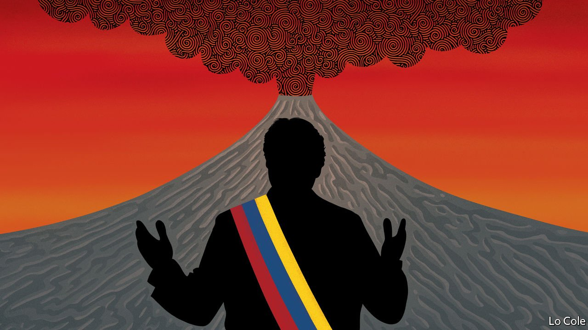

###### Bello

# Guillermo Lasso’s battle against populism in Ecuador 

##### After a good start, problems have mounted for the banker-turned-president 

 

> Oct 14th 2021 

AFTER HIS surprising victory in Ecuador’s election in April, Guillermo Lasso, a conservative self-made banker, confounded sceptics yet again by getting his presidency off to a flying start. He fulfilled a campaign promise to vaccinate half the population in his first 100 days (57% are now fully jabbed). His approval rating soared to over 70%. But the past fortnight has been difficult. A fight among gangs inside a prison ended with 119 inmates dead. The board of the National Assembly sent back without debate Mr Lasso’s key initiative, a bill to raise taxes and loosen restrictions on labour. And then the president was named as the controller of a number of offshore companies in a global trove of documents dubbed the Pandora Papers.

Last week Mr Lasso sat down with Bello in the unassuming presidential palace in the whitewashed colonial heart of Quito. He was unabashed by the setbacks to his plans. “I presented myself as I am and the Ecuadorean people voted for me,” he said. “They realised that we needed a change and that we couldn’t continue with this totalitarian, populist model that has impoverished Ecuadorean citizens.”


He was referring to the decade in power, from 2007 to 2017, of Rafael Correa, a populist leftist, which coincided with an oil boom. Mr Correa built roads and public buildings but he also doubled the cost of the central government in a spending binge that left the country laden with debt and near-bankrupt when the oil price fell. Mr Correa abused his popularity to harass opponents and the media, and to enact a new constitution which gave him control of supposedly independent institutions such as prosecutors and courts.

The country, which has used the US dollar as its currency since 2000, is still suffering the consequences of Mr Correa. His chosen successor, Lenín Moreno, turned against him while battling to reduce debt and a fiscal deficit of 8% of GDP. Mr Lasso wants to combine fiscal responsibility with faster economic growth. A recovery from the pandemic recession is picking up speed, helped by the vaccination drive which has allowed schools to open. His labour reform would also boost the number of jobs by making new contracts far more flexible.

Mr Lasso promises an “investment shock” by sweeping away barriers in oil, mining, electricity and telecoms. Ecuador has rejoined a World Bank body that arbitrates disputes with foreign investors. The government has renegotiated an agreement with the IMF which commits Ecuador to a fiscal adjustment that Mr Lasso says is now “very gentle”. Most of the effort will come from a tax reform which is “social democratic” and targets the rich, says Simón Cueva, the finance minister.

The government now faces a choice in its dealings with the assembly, where the left won a majority. If it cuts its bill in two it can probably get most of the tax increase approved. Or Mr Lasso could put the proposals to a referendum. “We are analysing the alternatives,” he says. “I don’t think we need to talk of extremes,” such as invoking a never-used clause of the constitution that allows him to trigger a fresh general election.

The president faces other political battles. The assembly has begun an investigation into the offshore investments which could possibly lead to his impeachment. He says that he severed all links to the companies in 2017, that Mr Correa’s attacks on bankers obliged him to invest abroad and that he is Ecuador’s top taxpayer, contributing $2.2m in income tax last year.

Leonidas Iza, the far-left president of CONAIE, Ecuador’s powerful organisation of indigenous peoples, threatens a “rising” to halt the removal of fuel subsidies. Two years ago such a rising almost toppled Mr Moreno. But CONAIE is more divided now, and Mr Iza says that talks with the government will continue.

To prosper, and even to survive, Mr Lasso needs to honour his promise of job creation (in which, of course, his bill would help). It favours him that other institutions are discredited. But he also needs to get his message across more effectively. He won because a majority of Ecuadoreans didn’t want Mr Correa’s proxy candidate, but many remain in thrall to populist ideas. Mr Lasso hasn’t yet managed to sell his liberal economic programme to the people, says Sebastián Hurtado, a political consultant. Before Mr Correa’s decade Ecuador, a country of many volcanoes, was dogged by eruptions of political instability. Unless Mr Lasso can persuade people of his plan, it risks a return to that.

