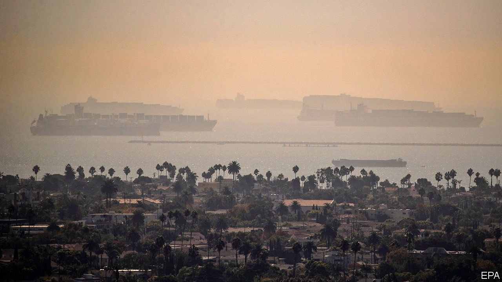
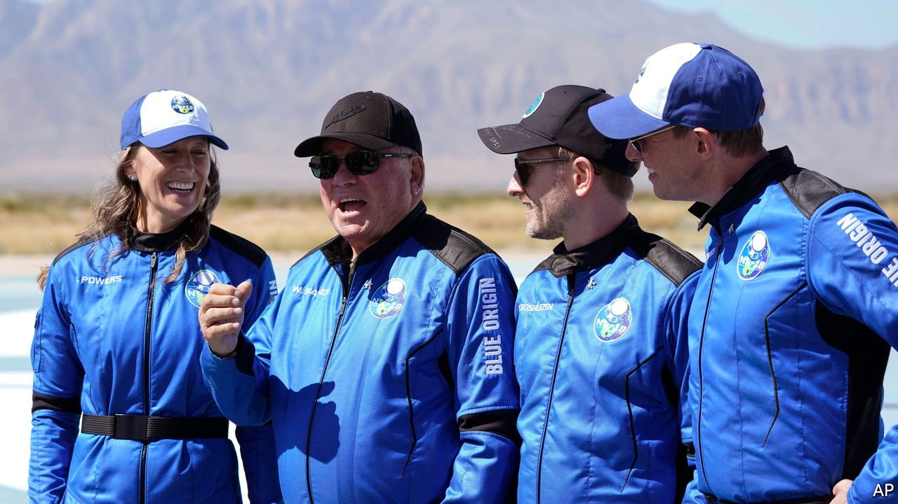

###### The world this week

# Business 

#####  

 

> Oct 16th 2021 

America’s annual inflation rate climbed again in September, to 5.4%, having dipped slightly in August. In its latest outlook on the world economy the IMF said that rising inflation reflected “pandemic-related supply-demand mismatches and higher commodity prices”, and warned that central banks would need “to walk a fine line” between tackling inflation and supporting post-pandemic economic recovery.

All at sea


Battling a supply-chain crisis that has caused a backlog of imports, a factor contributing to inflationary pressures, Joe Biden announced that the port of Los Angeles would operate 24 hours a day. Along with the port of Long Beach (which is already open 24 hours) the complex is the biggest entry point in America for products from China and South-East Asia. Big retailers and logistics companies, such as Walmart, pledged also to work longer hours to keep goods flowing.

Apple’s share price fell sharply amid speculation that it would have to curtail production of its new iPhone 13 during the coming months because of problems obtaining chips. Retailers in America and Europe have warned of shortages in a wide range of goods ahead of the Christmas shopping season.

Almost 4.3m Americans left their jobs in August, raising the “quit rate” to 2.9% of total employment. That was the highest rate since the data started to be measured in 2000. Most workers who jacked in their jobs were in the retail and restaurant industries, suggesting that they are confident of finding better-paid employment. America’s unemployment rate fell to 4.8% in September, the lowest since March 2020, when the pandemic struck. But it was also the weakest month this year for job creation, with employers adding just 194,000 people to the payrolls.

The White House claimed that many organisations that have instigated a requirement that staff be vaccinated against covid-19have increased their vaccination rates by more than 20 percentage points, to 90%.

After years of negotiations under the auspices of the OECD, 136 countries agreed to introduce a global minimum corporate-tax rate of 15% and bring in new measures to force companies to pay more tax in the countries where they do business. Ireland, a low-tax haven for firms, overcame its hesitancy and signed up. Only four of the countries that entered the talks did not. To ease its passage through the American Congress, the pact imposes a two-year moratorium on new digital taxes, which affect Google and the like.

The IMF’s executive board chose not to remove the fund’s boss, , after an independent investigation determined that in her former role at the World Bank she pressed staff to boost China’s ranking in the bank’s influential Doing Business report. She denies the claims. China and Europe supported her keeping the job; America was reluctant. The World Bank is still investigating potential staff misconduct during the compiling of the report.

The American Congress passed a bill to raise America’s federal debt ceiling, but only until December. The Treasury had warned that it would run out of money to repay government dues on October 18th. Senate Republicans dropped their opposition as the deadline approached, but are adamant that they will not vote for another extension.

A Chinese regulator imposed a 3.4bn yuan ($534m) fine on Meituan, an online shopping platform, for abusing its dominant position in the market. Meituan is one of the companies targeted by the government in its attempt to rein in big tech, but the penalty was less than had been feared and its share price soared.

Henry Kravis and George Roberts officially stepped down from their leadership roles at KKR, which they founded along with the late Jerome Kohlberg (he left in 1987). Messrs Kravis and Roberts were part of the breed of corporate raiders in the 1980s that symbolised a freewheeling approach to business, culminating in the private-equity firm’s $25bn buy-out of RJR Nabisco in 1989, immortalised in “Barbarians at the Gate”.

Google counter-sued Epic Games, a big games developer, for violating the rules of the Play Store, which sells smartphone apps. Epic’s original suit alleges that Google limits competition on smartphones running its Android operating system. A similar lawsuit against Apple was recently decided mostly, though not entirely, in Apple’s favour.

He boldly went

 


Captain Kirk at last made a voyage to the final frontier, even if many men (and women) have gone before him. William Shatner, the actor who played the iconic character in “Star Trek”, took a trip on the second flight of Jeff Bezos’s New Shepard capsule. At 90, he is the oldest-ever person to have made it to space.

