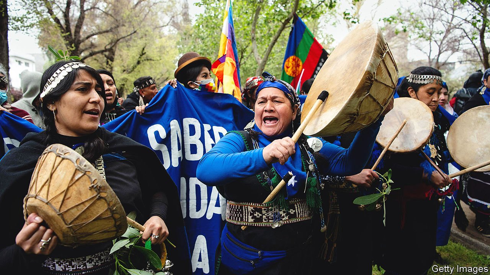
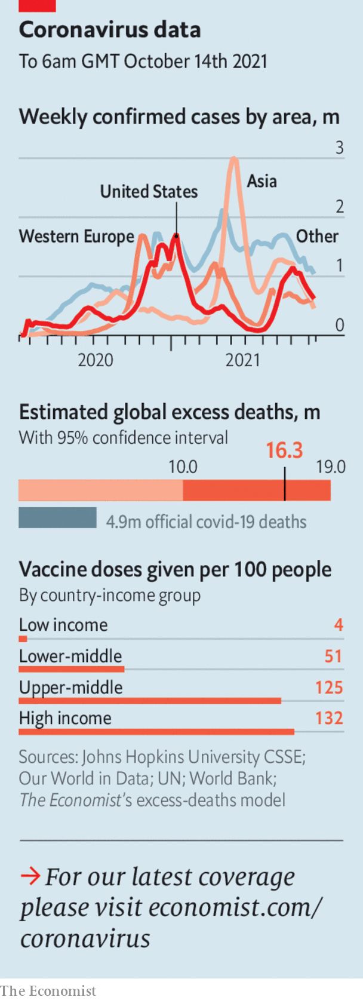

###### The world this week

# Politics 

#####  

 

> Oct 16th 2021 

Chile’s president, Sebastián Piñera, declared a state of emergency for 15 days in two southern regions. The army will be deployed to help local police, who have struggled to contain violent attacks by indigenous groups seeking to reclaim ancestral lands. A demonstrator died during a protest led by indigenous groups in Santiago. Chile is in the process of drafting a new constitution, which may decentralise power and expand indigenous rights. A far-right presidential candidate campaigning on a law-and-order platform is polling well in a tight race ahead of the election on November 21st, in which Mr Piñera cannot stand.

In Bogotá, Colombia’s capital, at least five American families connected to the United States embassy appear to have been afflicted with the Havana syndrome. The mystery illness, which causes ringing in the ears, fatigue and dizziness, first surfaced in Cuba in 2016.


Vaccination, then vacation

The American government said it would open up land and ferry crossings at its borders with Canada and Mexico in November, but only to travellers who are vaccinated against covid-19. From January this will also apply to truckers and students from Canada and Mexico, who had been exempted from the ban on crossings.

Texas’s governor, Greg Abbott, banned employers, including private ones, from requiring their workers to be vaccinated against covid-19. That sets up a clash with the federal government, which is ordering large employers to do the opposite.

Poland set itself on a collision course with the rest of the European Union, after the country’s constitutional court ruled that some of the EU’s most important rules, including Article 1 of its main treaty, are incompatible with Poland’s constitution. The EU seems sure to retaliate, perhaps by freezing the covid-19 recovery funds it was due to send to Poland.

Austria’s chancellor, , resigned. It had become clear that his coalition partners, the Greens, would bring down his government if he stayed on, because of a scandal swirling around him involving payments for favourable press coverage. Mr Kurz denies wrongdoing.

An election in the Czech Republic appeared to spell the downfall of Andrej Babis, the country's billionaire prime minister. An opposition alliance secured more seats. Mr Babis, who is also mired in scandal, remains prime minister for now.

Emmanuel Macron, the French president, launched a plan called “France 2030", which calls for €30bn ($35bn) to be spent on cutting carbon emissions and boosting industry. It includes a renewed commitment to nuclear power.

Police in Norway said that a Danish man who killed five people with a bow and arrow was a convert to Islam. The attack, in the town of Kongsberg, was the country’s worst since 2011, when a far-right extremist murdered 77 people.

The EU proposed reducing or scrapping most of the border checks for  that were imposed after Brexit and are causing headaches for business. More talks will be held.

“Many thousands of deaths” could have been avoided in Britain in the early stages of the covid-19 outbreak, according to a parliamentary report. It criticised the government’s initial approach as “fatalism …seeking to manage, but not suppress, infection”. Britain subsequently suffered an egregiously high death rate.

Several Asian countries announced plans to loosen pandemic-related border controls. Thailand and Singapore will start allowing fully vaccinated visitors from low-risk countries to enter without quarantine, Malaysia said it would allow its citizens to travel abroad again, and India will restart issuing tourist visas for all passengers. Sydney ended 107 days of lockdown.

The G20 held a meeting to discuss the economic situation in Afghanistan. The EU promised €700m ($810m) in emergency aid, in addition to the €300m it has already pledged. The leaders agreed to co-ordinate efforts with the Taliban, but stopped short of recognising the government. American officials met representatives from the Taliban in Qatar for their first talks since the jihadists seized power.

At least 50 people were killed in a bombing at a Shia mosque in Kunduz, the deadliest attack in Afghanistan since American forces withdrew at the end of August. Islamic State claimed responsibility.

The party of Muqtada al-Sadr, a cleric-cum-militia-boss, won the largest tally of parliamentary seats in Iraq’s election, with over 70 out of 329. But other Shia parties claimed the vote was unfair. Since some have large private armies, haggling over who forms the next government could turn violent. Some of Mr Sadr’s rivals are backed by Iran.

President Joe Biden considered imposing sanctions on parties to Ethiopia’s civil war, which he was ready to discuss with Uhuru Kenyatta, his Kenyan counterpart. The fighting has plunged 400,000 people in Ethiopia’s northern region of Tigray into famine. The Ethiopian army has started an offensive against rebel forces from Tigray on several fronts.

 


The International Court of Justice ruled mostly in favour of Somalia in its dispute with Kenya over which country owns a patch of ocean that is thought to be rich in oil and natural gas. Kenya rejected the ruling.

China’s president, Xi Jinping, said that reunification with Taiwan “must be fulfilled” and should be achieved peacefully. But he said no one should underestimate China's “strong ability” to defend its territorial integrity, a hint that it may use force. His Taiwanese counterpart, Tsai Ing-wen, said the island would not bow to pressure from China.

Tanks for the memory

The University of Hong Kong ordered the removal of a sculpture, called the Pillar of Shame, commemorating the crushing of the Tiananmen Square protests in 1989. It was erected 24 years ago.

