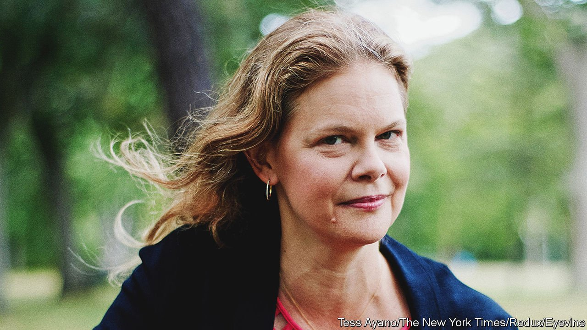

###### Money talks

# A prominent academic resigns after benefactors try to exert influence over her curriculum 

##### Universities need to get better at resisting academic pressure from donors 

 

> Oct 11th 2021 

WHEN BEVERLY GAGE announced that she was stepping down from her role as director of a prominent programme at Yale University, she received an influx of support. Colleagues from other institutions tweeted their approval and fellow Yale professors wrote statements of solidarity. Her complaint—that conservative donors had tried to wield undue oversight over her curriculum—resonated with other academics, and highlights a different concern over free speech at universities, one that does not involve lefty students trying to cancel speakers (or each other).

Since 2017, Ms Gage had led the Brady-Johnson Grand Strategy Programme, a prestigious one-year course in statecraft and politics. No complaints were offered by the programme’s two biggest donors: Nicholas Brady, who served as Treasury Secretary under Ronald Reagan and George H.W. Bush, and Charles Johnson, a businessman who frequently gives to Republican causes. Initially, says John Gaddis, who helped found the programme, he had the sense that neither man wanted a say in what was taught, but “somehow that changed”. Ms Gage retained Grand Strategy’s core tenets: students still read Thucydides and Machiavelli, and discussed war and foreign policy. But, in line with a broader movement across humanities disciplines, she supplemented the curriculum with lessons on social justice.


Soon after last year’s presidential election, Bryan Garsten, who taught in the programme, wrote an article in the New York Times that called Donald Trump a “demagogue”. Mr Brady complained about the article to Ms Gage and sent her a passage from his original donor agreement that called for an advisory committee to help select course teachers and speakers. Yale administrators began the process of creating the board.

The board’s precise duties remain contested. Mr Gaddis, who has seen the contract, believes that it was not “meant to pronounce on issues of curriculum. All it was meant to do was help us recruit people who were willing to spend vast amounts of time on the Acela going back and forth” (the Acela being the train running from Washington to Boston through New Haven, where Yale is located). Ms Gage said that Yale should not have agreed to the original terms, nor should the university have interpreted the terms as they did. “These kinds of advisory boards are problematic in their own right,” argues Ms Gage. “There are real questions about why a board of outsiders would, in this case, be advising about the conduct of a class.”

Ms Gage requested the members come from diverse backgrounds, including their age, race, gender and intellectual viewpoint. Mr Johnson wanted a more conservative-leaning board, and in March, Ms Gage learned that the university planned to go ahead with his choices, which included Henry Kissinger. Although Ms Gage accepted the existence of the board, she objected to the inclusion of Mr Kissinger and resigned, effective this December. When that decision was made public, Peter Salovey, Yale’s president, said he was “genuinely sorry that she did experience more unsolicited input from donors than faculty members should reasonably be expected to accept.”

This dispute highlights a problem many universities face: they must appeal to increasingly liberal student bodies and professors as well as the more conservative old boys’ club that provides them with money. Administrators and donors often negotiate the terms of gifts under institution-specific regulations. The funds generally come in two forms: “expendables”, which are one-off payments designed to be exhausted, or “endowed gifts,” which, like the gift that established the Grand Strategy programme, last in perpetuity. But a university’s priorities may shift, and academic goals may diverge from causes donors think they are supporting. “Sometimes the benefactor doesn’t understand that the influence they have has limitations,” says Audrey Kintzi, who serves on the Ethics Committee of the Association of Fundraising Professionals.

Donors often have the upper hand in negotiations. Tufts University accepted $15m from the Sackler family and its company, Purdue Pharma, over the course of several decades under terms that permitted Purdue to collaborate on campus research and appoint a member to a steering committee for the Pain Research, Education and Policy programme. Charles and David Koch funded a variety of conservative-leaning courses and institutes in higher education and inserted some clauses that allow them seats on selection committees that choose professors. The University of Illinois at Urbana-Champaign rescinded a job offer for a professor after his public criticism of Israel’s behaviour in the 2014 Gaza conflict prompted donors’ threats to withdraw their gifts.

This summer, the University of North Carolina at Chapel Hill did not vote on a tenure recommendation for Nikole Hannah-Jones—a journalist who was appointed to an endowed chair in journalism—despite a strong endorsement from the relevant university committee. Among those opposing her appointment was Walter Hussman, a donor who had pledged $25m to the school and who objected to the tenor of her journalism.

Accepting money from any donor can expose a university to criticism, but there is a difference between accepting funds and allowing a benefactor a say in the academic undertaking. The donors, Ms Gage says, grew dissatisfied. She worries that the freedoms of academics are too often overlooked in conversations between universities and donors. For universities, that matters immensely: not only are millions of dollars at stake, but their reputations for integrity too. ■

