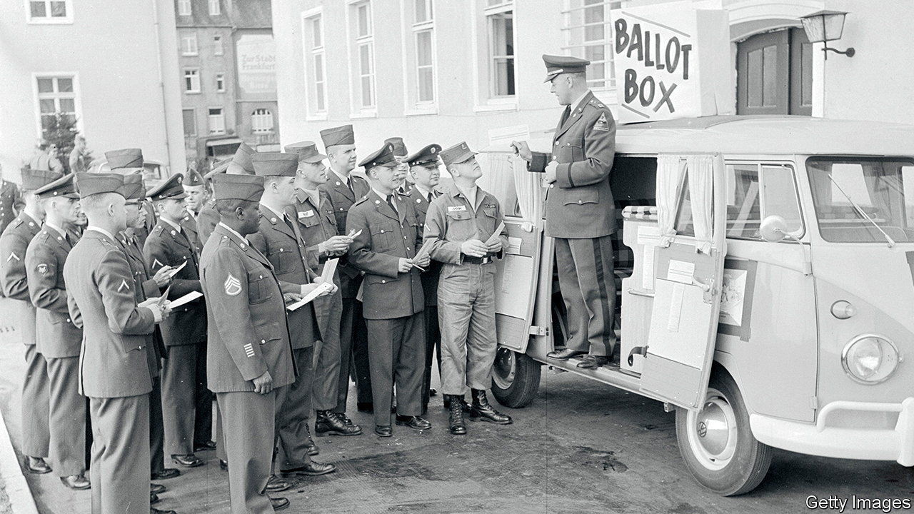
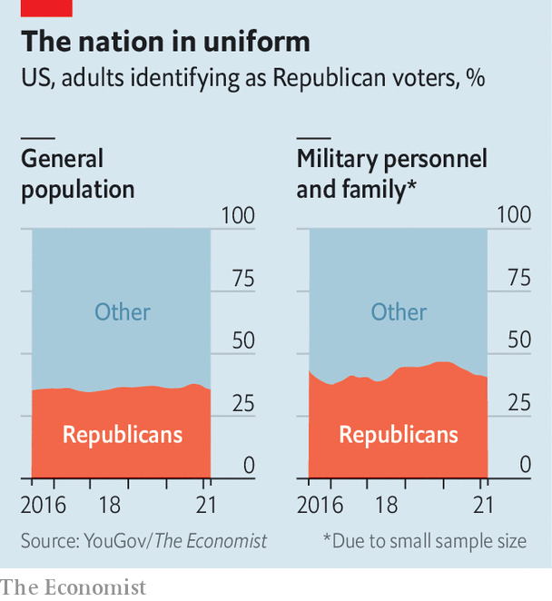

###### Left march

# Military bases swung hard away from Republicans in 2020 

##### By our calculations they moved towards Democrats by eight points, compared with a nationwide swing of just two 

 

> Oct 14th 2021 

ALLEGATIONS OF FRAUD can seldom be stood up by mere insinuation of fishiness. But with scant evidence, one Republican Party poll-watcher in Detroit fell back on that in 2020. In a notarised statement presented by the Trump campaign, the onlooker noted that most of the military ballots he “saw were straight ticket Democrat or simply had Joe Biden’s name filled in on them”. “I had always been told that military personnel tended to be more conservative, so this stuck out to me as the day went on,” he added. Although military voters and their families do tilt conservative (see chart), there is little evidence that they are a Republican constituency. In fact, analysis by The Economist suggests that Mr Trump performed far worse in 2020 across precincts that map onto military bases than he did four years earlier.

The political leanings of service members are difficult to measure. The Department of Defence–reluctant to poll active duty soldiers about their commander-in-chief and his party—rarely approves external political surveys. And while today’s soldiers are encouraged to exercise their right to vote, for some, including a number of America’s most distinguished generals, non-partisanship has precluded boots in the ballot box. General George C. Marshall once wrote, “I have never voted, my father was a Democrat, my mother was a Republican, and I am an Episcopalian.”


“There’s a broader narrative that the military is monolithically conservative or Republican, and that just really isn’t the case, or at least is not any more”, says Danielle Lupton, a scholar of civil-military relations at Colgate University in New York. Enlisted soldiers are drawn from, and thus generally reflective of, the American public, although they have greater racial diversity (a constituency that leans Democratic) and far more men (who tend Republican). As voting patterns shift nationwide, so too do they shift among the armed forces.

 


The Economist’s analysis of precincts that map closely onto military bases found a median swing of nearly eight points towards Joe Biden, compared with a nationwide shift of a little over two points in the same direction. On average, Mr Trump still won these precincts, though his margin shrank by nearly half. Patrick Air Force Base—located on Florida’s Atlantic coast and since renamed Patrick Space Force Base—supported Mr Trump by a 17-point margin in 2016. By 2020, his lead there shrank to 11 points. This method is inexact: two-thirds of enlisted service members who vote send in absentee ballots and military bases are often sprawling compounds where spouses, civilian contractors and other support staff reside and vote.

But so too is this finding borne out in the limited available polling of active military personnel. Shortly before the election of 2020, the Military Times and the Institute for Veterans and Military Families (IVMF) at Syracuse University augured an even more extreme swing. Whereas in October 2016 their joint poll showed Mr Trump outpacing Mrs Clinton by 20 points, four years later Mr Biden was ahead of the incumbent by four points. “In 2020, one of the interesting developments was that Trump himself...tried to drive a wedge...and claim populist style that it was the rank and file who liked him, not the senior brass,” noted Peter Feaver, a professor of political science at Duke University.

The Military Times-IVMF polling before the election showed Mr Trump lost ground among both enlisted soldiers and the officer corps, the latter of whom had historically voted disproportionately Republican. Looking ahead to 2024, for Republicans to regain what was lost of the military vote, Mr Feaver speculates the best thing would be “for Trump to shuffle off stage”. ■

