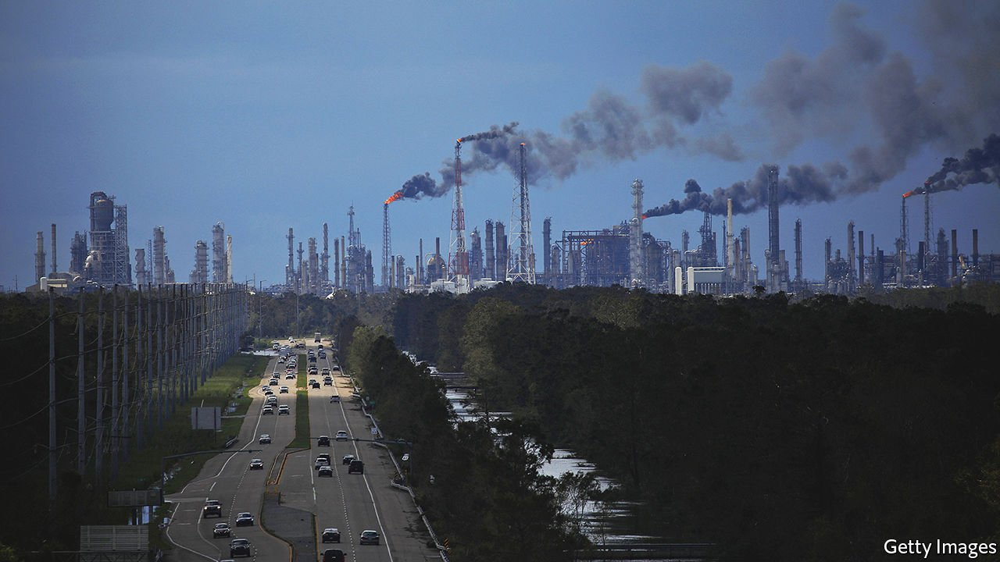
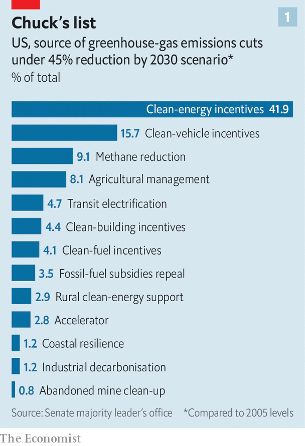
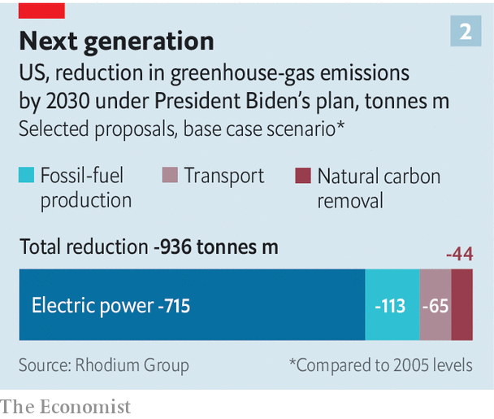

###### The keeper

# One policy accounts for a lot of the decarbonisation in Joe Biden’s climate plans 

##### As Democrats trim the legislation, they should focus on keeping it 

 

> Oct 12th 2021 

TAKE A ROAD trip to Indianapolis, home to a certain two-and-a-half-mile race track, and you will find yourself in good company. A survey carried out before the pandemic found that about 85% of local commuters drive to work, alone. Standing on a bridge over 38th Street, which runs by the state fairground, you cannot escape the roar of six lanes of petrol-fired traffic below—and, reports a local, this is quiet compared with the noise on pre-virus days. Getting Americans to kick their addiction to fossil fuels will require many of these drivers to find another way of getting to work, and to move on from the flaming hydrocarbons celebrated each May at the city’s famous oval.

Joe Biden hopes to use what looks like a narrow window of Democratic control of Congress to encourage this transition. The last time lawmakers came close to writing climate legislation on anything like this scale was in 2009, when the Waxman-Markey bill, which would have established a trading system for greenhouse-gas emissions, was passed by the House. Since then, a Democratic White House has tried to nudge America to reduce emissions, by issuing new regulations, and a Republican White House has tried to undo them. That record illustrates what a delicate political operation this is.


Yet despite having a much weaker grip on Congress than Barack Obama had in the first year of his presidency, Mr Biden and his legislative allies have put forward a sweeping set of proposals for decarbonising America’s economy. These would promote everything from clean energy on the grid and electric vehicles on the road, to union jobs making green technologies and measures for left-behind communities.

Were this wish list passed in its entirety, which is unlikely, it would give a boost to Mr Biden’s pledge to reduce America’s emissions by roughly half from their 2005 level by 2030. A chart released by the office of Chuck Schumer, the Senate’s majority leader, suggests that implementing all of these provisions could reduce America’s emissions by 45% below 2005 levels by 2030, thus achieving almost all of Mr Biden’s goal of cutting them by roughly half in that period (see chart 1). Passing a law, even a less expansive one, would allow Mr Biden to travel to the UN climate summit in Glasgow in November representing a country that is making progress towards internationally agreed goals, rather than asking for the patience of poorer, less technologically sophisticated countries while America sorts itself out.

 


Some of the Democratic proposals are in an infrastructure bill with bipartisan support that spends $1trn over ten years. But most are in a budget bill disbursing $3.5trn (also over ten years) that, on account of Senate rules, can only pass through a partisan parliamentary manoeuvre known as reconciliation. This requires the assent of all 50 Democratic senators. The likeliest outcome is a compromise between Democratic progressives and moderates that yokes together the agreed infrastructure bill with a much slimmer version of the $3.5trn proposal. Yet it is possible that neither bill will become law.

This raises two questions. First, how good can a salami-sliced version of Mr Biden’s agenda, the result of a negotiation between 270 Democratic members of Congress each angling for their constituents’ interests, really be for the climate? Second, how bad would it be for America’s decarbonisation efforts if both bills fail?

 


Happily even reconciliation-lite could bring meaningful progress, if key bits of the current proposals survive the negotiations. Paul Bledsoe of the Progressive Policy Institute, a think-tank, is confident a deal “likely a bit under $2trn” will happen this month. Only a fraction of that spending will be on climate, because the bill also contains proposals to make the social safety-net more generous. The Rhodium Group, an analysis firm, reckons that just six proposals would cut emissions by nearly 1bn tonnes in 2030 compared with no new policies (see chart 2), about a sixth of America’s total net emissions per year. That is roughly equivalent to the annual emissions from all cars and pickup trucks on American roads, or the emissions of Florida and Texas combined. The six include proposals related to “natural carbon removal” (from forests and soil), fossil fuels (making it more expensive to emit methane) and transport (a generous credit for buyers of electric cars).

Carrots beat sticks

The big prize, though, is the power sector. Two proposals for decarbonising the grid account for the lion’s share of likely emissions reductions: a new Clean Electricity Performance Programme (CEPP) and more mundane reforms to the tax credits received by clean energy. The CEPP has been touted by Mr Biden’s cabinet officials and leading progressives as a linchpin of the climate effort. It is loosely based on the mandatory clean-electricity standards imposed by over two dozen states which have successfully boosted adoption of low-carbon energy.

The CEPP is flawed in a couple of ways, though. Because it has to be primarily a fiscal measure in order to squeeze through the reconciliation process, it does not involve mandatory regulation—unlike those successful state energy standards. Rather, it uses (biggish) subsidies and (rather punier) penalty fees to try to nudge utilities to build more clean energy. It is politically vulnerable because it is unfriendly to natural gas and coal (unless they have expensive add-on kit to capture and store related emissions). That has incurred the hostility of Senator Joe Manchin, a Democrat who represents coal-rich West Virginia, without whose approval the bill will fail. Some influential utility companies with coal assets, including Ohio-based American Electric Power, do not like it either.

Despite the attention paid to it, CEPP is actually less potent as a greenhouse-gas slayer than those boring tax credits, which are less controversial because they do not overtly penalise coal or gas. Two energy veterans, one at a top renewables lobbying outfit and the other at a fossil-heavy utility, agree that the tax credits would sharply boost investment in low-carbon technologies. That is because they improve the current set-up by replacing stop-go uncertainty with a predictable long-term tax regime, and make tax breaks “refundable” rather than needing to be offset against tax liabilities, meaning even utilities that do not have such tax liabilities can enjoy them as freely as cash in the bank.

Thus the CEPP is overshadowing the real star proposal. The tax credits have “a huge impact potentially”, reckons Rhodium, accounting for over one-quarter of the greenhouse-gas emissions reductions in the legislation, at a cost of roughly $150bn over ten years. A former administrator of the Environmental Protection Agency (EPA) puts it bluntly: “Take the wind and solar tax credits at ten years if you had to choose—and let everything else go.”

What if Democrats fail, the negotiations fall apart and Mr Biden is left empty handed? That would be embarrassing. And it could make it difficult to pursue ambitious federal climate policies through Congress for years, just as the failure of Waxman-Markey in 2009 haunted lawmakers. However it would not mean America can do nothing at all about climate change.

First of all, as Mr Biden’s officials have already made clear, they stand ready to use regulations to push ahead on decarbonisation efforts, just as the Obama administration did. Last month the EPA issued rules cracking-down on emissions of hydrofluorocarbons, an especially powerful greenhouse gas. The administration also has plans for loan guarantees for energy innovations and for speeding-up approvals for offshore wind farms. Yet this is tinkering compared with the federal law being discussed, especially as new regulations are likely to encounter legal challenges.

Even if the federal government fails again, states and cities have climate policies too. Drawing on analysis funded by Bloomberg Philanthropies, Leon Clarke of the University of Maryland calculates that decentralised policies emulating the current best efforts of states like California could achieve roughly one-quarter of Mr Biden’s objective. But this is a bad deal: such efforts would fall a long way short of the federal proposal in reducing emissions, and what reductions they achieve would be more expensive than if done at the federal level. Still, it is not nothing. Last month, Illinois passed the country’s boldest climate-change law. Democratic states such as New York and California have green policies, but Republican states such as Texas and Indiana have big wind industries too.

Although Mr Clarke says Congress has to act if America is to achieve Mr Biden’s targets, he believes that progress will continue even if Congress falters, because there is now a deeper sense of ownership of climate policy among local and state governments. “The Trump years really changed the way that subnationals in the US view climate action,” he says. “They can’t rely on the federal government.”

Change is happening in surprising places. Take that flyover in Indianapolis. The city’s officials have made it into a bike path that will be connected to 55 miles of commuter-friendly trails traversing the city. The city has allocated $100m for building a bus-rapid transit system, which is a cheap and efficient substitute for underground rail, with more such rapid bus lines on the cards. Bloated 38th Street will undergo a “lane diet” with car and lorry traffic yielding two lanes to the buses. Come back in a few years and the view from the bridge should be a bit quieter. ■

For more coverage of climate change, register for The Climate Issue, our fortnightly , or visit our . To read more about Joe Biden’s presidency, visit 

