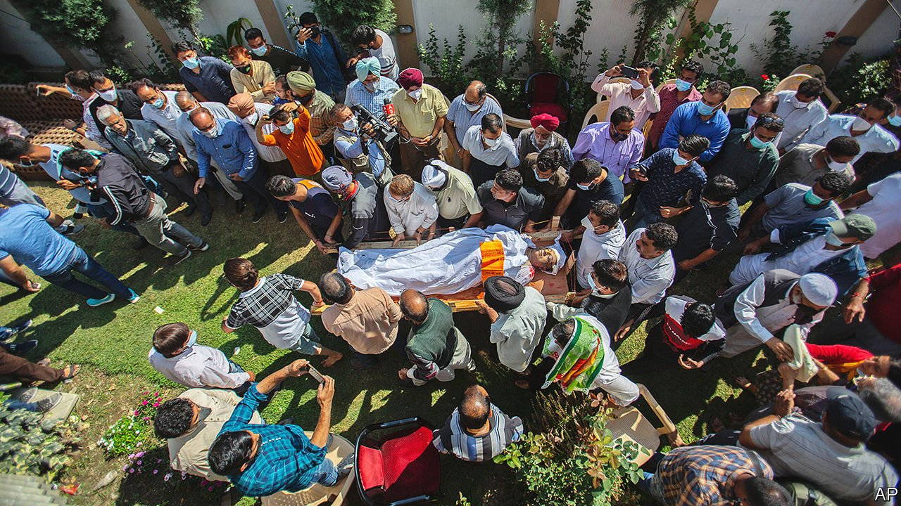

###### Valley of fear

# Militants are targeting Hindu and Sikh civilians in Kashmir 

##### A spate of killings aimed at minorities recalls the bad old days 

 

> Oct 21st 2021 

SANJAY TICKOO fidgets in a small, yellow-walled room at a secret location surrounded by concertina wire and military patrols. The security forces tell Mr Tickoo that his confinement is for his own good, and he believes them. He is a Pandit, born to one of the 800-odd Hindu families in Kashmir who stayed on through a generation of deadly insurgency. This month unidentified militants have shot and killed at least 11 civilians—Pandits, Sikhs and non-Kashmiri migrants from elsewhere in India—for the apparent purpose of terrorising those minorities who still live alongside the Kashmiri Muslim majority.

India and Pakistan have been fighting over the state of Jammu &amp; Kashmir since 1947. Each administers a part and claims the whole. But the region’s centre of gravity, the Kashmir valley, has always been held by India. It has been gripped by separatist fevers since 1989. Roughly half a million Indian troops have become a permanent presence. Tens of thousands of Kashmiris have been killed in the process. Millions more are angry about living in what has come to resemble occupied territory.


This was all supposed to change on August 5th 2019. Fresh into his second term, India’s prime minister, Narendra Modi, pushed two bills through parliament that cleaved the state in two and scrapped what autonomy it still enjoyed. Under the new regime, Kashmir is ruled directly from Delhi, the national capital. The reorganisation promised to replace corrupt politicians, to attract investment and prosperity and to bring lasting peace.

Two years on, none of these aims has been realised. No new political class has been mustered to represent the Kashmiri people at home or in Delhi; unemployment, at 21%, is the highest in India; and killings of all kinds rattle Srinagar, the former state’s capital. The pandemic could be blamed for some of these problems. Instead the central government pretends they do not exist. On October 12th the head of its human-rights commission praised the home minister for blessing Kashmir with “a new era of peace, and law and order”. A week earlier, a Hindu businessman named Makhan Lal Bindroo (pictured) had been shot point-blank at his pharmacy.

Not all bloodshed in Kashmir garners coverage. It is barely news when troops are ambushed—nine died on October 11th—or when Kashmiri Muslims are killed, as when paramilitary forces gunned down a young nomad named Parvez Ahmed Khan for failing to stop at a checkpoint, two days after Mr Bindroo’s death. But the current wave of assassinations targeting victims on the basis of religious and ethnic identity has reminded Kashmiris of old wounds.

Most Pandits fled during a grim insurgency in 1990s. There are also some 80,000 Sikhs, some of whom are now being murdered too. But by far the largest, most vulnerable group of potential targets are the migrant workers who have come from the rest of India, mainly the poor states of Bihar and Uttar Pradesh, over the past two decades. Some are Muslim; most are Hindu. None speaks the local language and almost all relocated to escape penury. There may be 300,000-400,000, including many now scrambling to flee.

An outfit calling itself the Resistance Front (TRF), which Indian security forces say has links to Pakistan, has claimed responsibility for the killings. Most Kashmiris of all religions are appalled at the violence aimed at the defenceless. It may be that TRF or other groups are attacking civilians around Srinagar because their forces have been worn down from the fight against armed forces in the countryside and are finding softer targets.

Or it may be that the terrorists are trying to pre-empt an influx of Indian settlers into the valley. Their actions betray a broader obsession with demography in the territory, one in which Muslims are the majority. When Kashmir’s special protections were abrogated, Kashmiris were most alarmed to be losing a constitutional assurance that purchases of land would never be opened to outsiders, who could overwhelm them with sheer numbers. Mr Modi’s Hindu-nationalist government has hardly allayed those fears. Instead it has tested ways to minimise the demographic strength of the valley’s Muslims. First it made 400,000 Hindus displaced from Pakistan in 1947 eligible for permanent residency. Then it liberalised the criteria for more recent immigrants to settle. It also seems to be gerrymandering Kashmir’s future constituencies to the disadvantage of Muslims.

The government’s priority is to thwart the terrorists from provoking another exodus. In response to the murder of three Bihari workers, the territory’s police chief this week ushered vulnerable migrants into military camps for their protection. That will not be enough. Sandeep Koul, a young Pandit hunkering down at his mother’s home in Srinagar, complains, “We have done nothing to deserve this fate.” Mr Koul is 29 years old; he has lived under the shadow of militancy his whole life. “If the attacks continue,” he laments, “my family, too, will have to leave Kashmir.” ■

