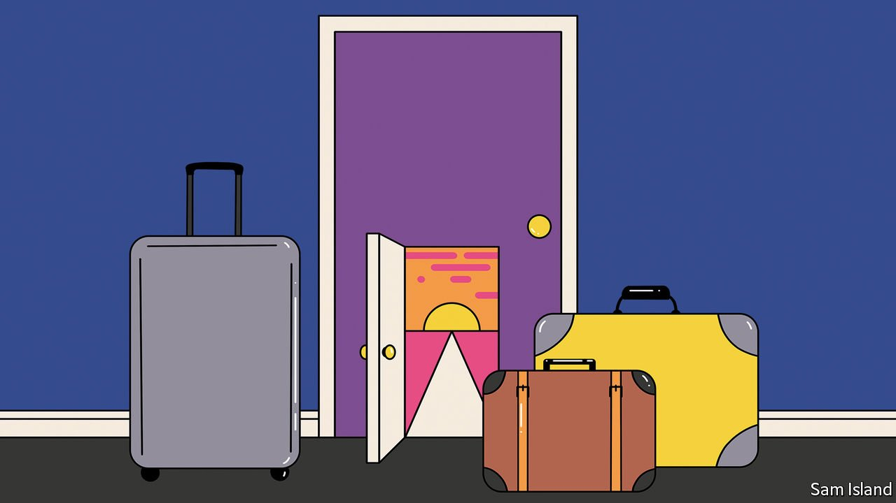

###### Banyan

# Restarting Asian tourism will be harder than shutting it down 

##### Tourism-dependent economies are taking a cautious approach to reopening 

 

> Oct 23rd 2021 

CALL IT AN October surprise. Almost every day over the past two weeks countries across Asia have revealed plans to loosen pandemic-induced restrictions on inbound tourism. India went first, announcing on October 7th that it would at last resume issuing tourist visas for visitors from all countries on November 15th. Two days later Singapore expanded its quarantine-free travel lanes beyond just Germany and Brunei. Prayuth Chan-ocha, Thailand’s prime minister, said on October 11th that fully vaccinated tourists would be able to visit many parts of the country without quarantine from November 1st.

Several Indonesian islands, including Bali, opened up on October 14th. Malaysia’s prime minister hinted at a reopening in December. Fiji’s government said it wants people to spend Christmas there. Even parts of Australia, which has had among the harshest travel policies in the world, will welcome travellers again from next month. “For double-vaccinated people around the world, Sydney, New South Wales, is open for business,” said Dominic Perrottet, the state’s premier.


Yet India is an exception in throwing open its borders to all tourists. Most Asian countries welcoming travellers are doing so only for those from a carefully chosen list of countries, with acres of small print. Thailand initially planned to open its doors only to ten, mostly European countries. Bali is welcoming travellers from 19, half from Europe and none from its own region of South-East Asia. Singapore’s list has expanded from two to 11, with most in Europe, and even then only on designated flights. Scott Morrison, Australia’s prime minister, threw cold water over Mr Perrottet’s reopening a few days later when he said that it will at first apply only to Australian citizens, residents and their families.

Indeed, the more reliant a country is on tourism, the greater seems to be its caution. In 2019 tourism made up about half of Fiji’s exports, a fifth of Thailand’s, and nearly a tenth of Malaysia’s. India, by contrast, relied on tourists for just 6% of exports. The share for Singapore is smaller still, but the city-state’s economic model depends on being open to the world. The announcements are less an indication of enthusiasm for welcoming visitors back than of the sense that it would be especially damaging to delay longer: now is when people book their winter holidays.

That is one reason why the reopening is so limited. Many Asian economies desperately need a decent season of inbound tourism but do not feel fully prepared to welcome lots of visitors. Even in Thailand, where tourism accounts for a fifth of jobs, 60% of people said in a recent survey that November 1st was too soon for the country to open up. Yet that must be balanced against people’s livelihoods. On October 21st Mr Prayuth announced that Thailand would in fact open to 46 countries, more than half of them European. “If we wait until everything is fully ready, we’ll be too late. Besides, tourists may choose to go elsewhere,” he wrote on Facebook.

A phased approach allows locals to get used to the idea of tourists again. It will also help businesses, which must refill their swimming pools and rehire workers after nearly two years of closures. Taking things slowly is useful for governments, too, which are watching covid-19 case numbers and worry that they may need to throttle back.

“The first markets to open up will be vulnerable to overtourism,” says Liz Ortiguera of the Pacific Asia Travel Association, an industry body. The choice of European countries may in part reflect that concern. The vast majority of tourists in Asia come from other Asian countries, who tend to make shorter trips and therefore spend less per visit. Europeans and Americans, having travelled all the way, often stay longer and spend more freely, says David Vanzetti of the University of Western Australia. As countries re-open, they are trying to maximise profits while keeping visitor numbers manageable.

The near-total halt in travel and tourism caused by the pandemic is unique in being caused by a lack of supply rather than demand, says Xiang “Robert” Li of US-Asia Center for Tourism &amp; Hospitality Research at Temple University in Philadelphia. People still want to travel, and will get back on the road as soon as they are allowed. After past crises, such as the SARS outbreak in 2002-04, travel recovered domestically at first, then regionally and eventually across long distances. The same will be true this time, perhaps even more so after nearly two years of public-health messages that painted the outside world as a mortal threat. “We used to take travel for granted,” says Mr Li. But after 18 months of being grounded, “we realise that tourism is not just superficial fun. It actually is part of the contemporary lifestyle and has a lot to do with our well-being, who we are, and how to be happy.”

This piece has been updated to include Thailand’s announcement that residents of several dozen more countries would be allowed to enter from November 1st. It has also been corrected to note that they can travel only to certain parts of the country. 

Dig deeper

All our stories relating to the pandemic can be found on our . You can also find trackers showing ,  and the virus’s spread across .

