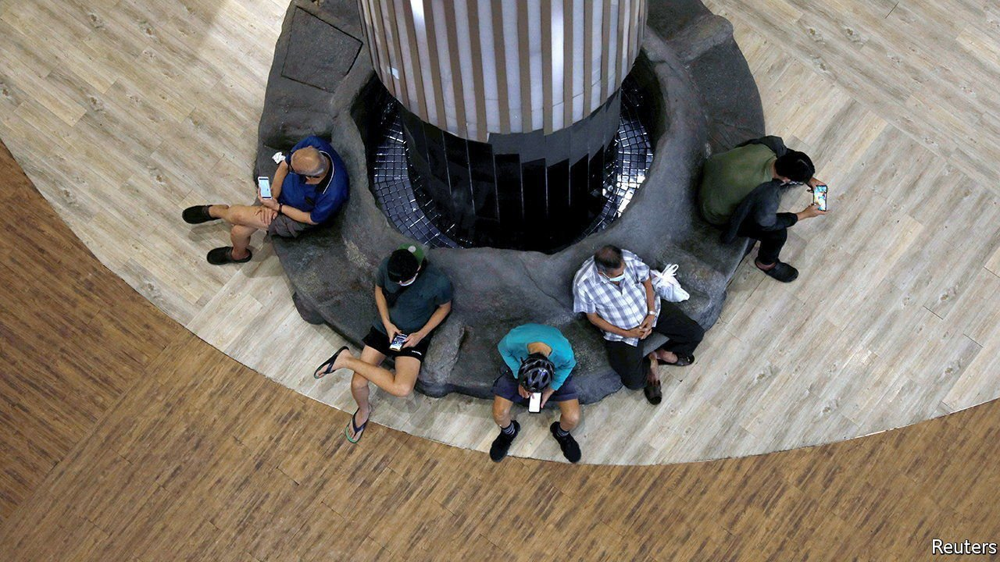

###### Outside job

# Singapore is cracking down on foreign political interference 

##### A new law designed to prevent outside meddling could muzzle civil society 

 

> Oct 23rd 2021 

PARLIAMENTARY DEBATE in Singapore, which has been governed by the same political party since 1959, usually makes for snoozy viewing. Not on October 4th. The bill under discussion was to give the government sweeping powers to curb foreign influence in local politics. Legislators agreed that the government needed tools to strike back at malign foreign actors. But the Foreign Interference (Countermeasures) Act is “draconian”, one opposition MP thundered. And why, other lawmakers asked, was Parliament given just three weeks to digest a 249-page bill? Nonetheless, the bill was eventually passed into law.

The government maintains that the law is urgently needed in an era when foreign countries are ramping up cyber-espionage. The city-state “is especially vulnerable to foreign interference”, it says, because of its diverse racial make-up. Though the home affairs ministry has avoided directly naming countries it is worried about, it cited a report from a French defence think-tank which said that Singapore was vulnerable to Chinese influence operations because of its multi-ethnic population.


The law gives the government several tools to put the brakes on hostile-information campaigns and thwart any spies or locals enlisted by foreign actors. The state can compel internet companies to hand over user information and to remove content and apps without giving a reason. People who are designated as “politically significant” must report donations exceeding S$10,000 ($7,440) and disclose their dealings with foreigners, even if those relationships are apolitical in nature. The law covers Singaporeans’ ties not just with foreign governments but also with foreign individuals, organisations and companies.

Penalties for violating the act are harsh, and include up to 14 years in prison and S$100,000 in fines. Appeals must be made to the home minister or a government-appointed tribunal. The government maintains that decisions must not be disputed in open court because sensitive information would leak. But without transparent judicial oversight, it will be hard for people to challenge the government’s decisions. There is a “50-50” chance that the courts will deem this unconstitutional, reckons Eugene Tan, a law professor at Singapore Management University.

Critics worry that terms like “foreign interference” are so broadly defined as to include “almost any form of expression and association relating to politics”, as 11 human-rights organisations put it in an open letter. “Nonsense,” says K. Shanmugam, the law and home-affairs minister. The legislation only applies to Singaporeans who work with foreigners “to undermine Singapore's public interest”. Some civil-society organisations critical of the government fear that the law will be used to silence them. The government counters that citizens are free to express their political views.

Mr Shanmugam says that the law is popular with a “significant majority” of Singaporeans. Yet many Singaporeans are nervous. P.J. Thum, the boss of New Naratif, an independent news website, says that a local company has broken its contract with his firm because it is worried it may breach the law merely by transacting with it. During the parliamentary debate, Mr Shanmugam suggested that Mr Thum, who is often critical of the government, is an agent of foreign interference. Already, says one activist, “that culture of fear” is back.■

 This piece has been updated to include comments from K. Shanmugam. 

