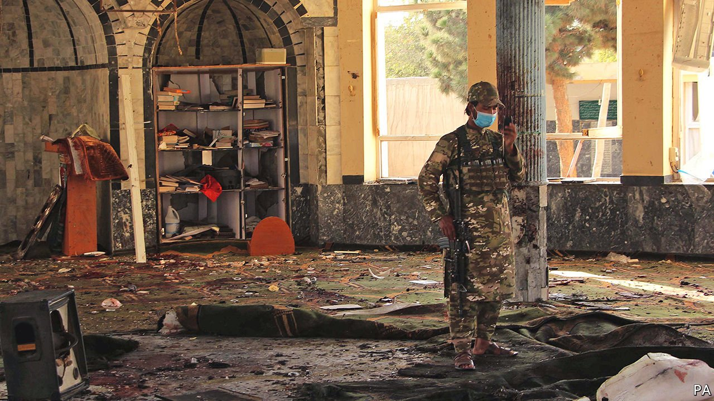

###### Extremists v ultra-extremists

# The Taliban find themselves on the wrong side of an insurgency 

##### The new Afghan regime promised peace. It has not delivered 

 

> Oct 23rd 2021 

AS SOON AS the first gunshots echoed across the courtyard from the street outside, the congregation began to scatter. The worshippers at Kandahar’s Bibi Fatima mosque were all too aware of the fate of their fellow Shia Muslims in Kunduz a week earlier and immediately started running. The warning came too late. Suicide-bombers had shot their way into the building. Seconds later a cloud of dust engulfed the scene as they blew themselves up.

The blast on October 15th killed at least 40 people, though some put the toll far higher. Seven days earlier, at the Gozar-e-Sayed Abad mosque in the capital of Kunduz province, Friday prayers had been interrupted by a similar atrocity. In that attack at least 50 died. Both bombings were claimed by the local offshoot of Islamic State (IS), known as Islamic State Khorasan Province (ISKP).


Two months after the Taliban’s takeover and America’s withdrawal—during which an ISKP bombing killed more than 100—it is this group, rather than any residual resistance from the former government, that has emerged as the new regime’s biggest security challenge. The mosque bombings have been accompanied by assassinations of Taliban fighters. Patrols have been ambushed and fighters kidnapped and beheaded.

ISKP first gained a foothold in the region in 2014, when it was not only fiercely anti-Western, but also quickly became a bitter rival of the Taliban. The jihadists went on to accuse the Taliban of selling out for signing a deal with America and co-operating with its withdrawal. They regularly attacked the country’s Shia minority, whom they deem infidels. Their brutality became notorious in a country already accustomed to horror. They began to carve out territory in Afghanistan’s eastern provinces before being largely beaten back by the Taliban, who benefited from American air strikes on the jihadists.

In the tumultuous August days as the government of Ashraf Ghani, the former president, collapsed, hundreds of jailed ISKP fighters escaped from prison. Bolstered by these reinforcements, the group switched from trying to hold rural territory to waging an urban terrorist campaign, using the Taliban’s hit-and-run tactics and suicide-bombings against them. David Petraeus, a former director of the CIA, who also led international troops in Afghanistan from 2010 to 2011, this week told British MPs that the Taliban were “becoming acquainted with how much more challenging it is to be a counter-insurgency force than it is to be insurgents and hang out in the hills”.

The Taliban’s message, as they seized power, was that they would bring peace. Clearly, they have not. Their attempts to downplay the insurgency sound hollow. “Daesh [Islamic State] is not a big threat in Afghanistan, and it has been controlled,” said the Taliban spokesman, Zabihullah Mujahid, a day before the Kandahar blast.

Such complacency reassures neither Afghans nor the country’s neighbours. Iran’s president, Ebrahim Raisi, on October 18th called on the Taliban to do more. “They should know if they do not deal with Daesh seriously and if Daesh is not destroyed in the region this will pave the way for the harassment of many other countries and people in the region,” he warned. Indeed the attacks on Shias may spur Iran to engage more closely with the Taliban, perhaps sharing intelligence.

The Taliban say they have been breaking up ISKP cells. There are reports of clerics associated with the militants being killed and of sympathisers being rounded up. But as Western forces discovered over the past 20 years, brutal or clumsy counter-insurgency efforts can be counterproductive. Asfandyar Mir at the United States Institute of Peace, a government think-tank in Washington, warns of a “vicious cycle” of counter-insurgency and violence against a backdrop of mass-casualty attacks, particularly against minorities.

Though ISKP is, for now, the most serious armed opposition to the Taliban, its extremism and paranoia make it unlikely to attract recruits from wider anti-Taliban constituencies, says Haroun Rahimi, assistant professor of law at the American University of Afghanistan. But the Taliban know their many enemies will be watching for signs of weakness.■

