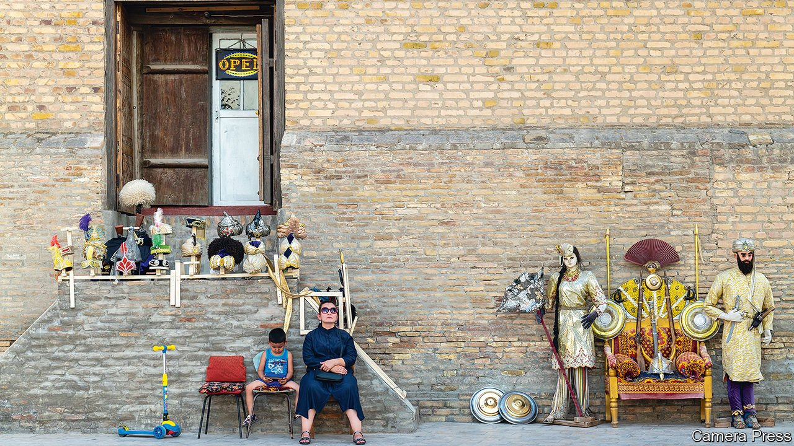

###### From gulag to ordinary grumbles

# Uzbekistan’s president abolished slave labour. What next? 

##### Shavkat Mirziyoyev’s reforms are at risk of losing momentum 

 

> Oct 23rd 2021 

THE SCREENS of the digital billboards illuminating the streets of Tashkent flip between the faces of politicians who are running in a presidential election on October 24th. Shop windows display posters of the five candidates lined up side by side. Newspapers plastered in press kiosks grant equal space to all contenders. Uzbekistan is engaged in a scrupulous attempt to show one-person, one-vote democracy at work in a competitive election. But in truth there is only one man, and that is the president, Shavkat Mirziyoyev, who is guaranteed to win with a thumping landslide. He may well improve on the 89% of the vote he won five years ago.

Mr Mirziyoyev took office in 2016 after the death of Islam Karimov, whose brutal 27-year rule made his regime a particularly nasty one even by the standards of the five Central Asian post-Soviet republics. Under Karimov—with Mr Mirziyoyev as prime minister—Uzbekistan forced adults and children to pick cotton, slaughtered demonstrators and tortured prisoners. The elevation of Mr Mirziyoyev promised more of the same. Yet over the past half-decade he has surprised both the 35m-odd Uzbeks and the world by embracing change. Forced labour has dramatically declined, the country’s most notorious prison camp has been closed, Soviet-era planning in the vast cotton sector has ended and strict rules mandating where citizens could live and travel have been abolished.


Economic reforms have accompanied political ones as international institutions have been invited in to offer advice. Entrepreneurs say the lifting of currency-conversion restrictions and streamlined customs procedures have transformed the climate for business. Day-to-day life has become much easier, says Dildora Atadjanova, who runs two small firms. In the Karimov era she gave up running a café because of the need to comply with “ridiculous requests”, such as feeding local apparatchiks for nothing. These days officials are keen to meet the needs of business owners instead. “The ideological change has been tremendous,” says Zafar Khashimov, the boss of Korzinka, a supermarket chain. The government even managed to sustain growth last year, when the pandemic caused most economies to contract.

 


Yet the reforms so far have been the “pleasant”, or less painful ones, says Jamshid Kuchkarov, a deputy prime minister. The difficult business of structural change lies ahead. The state squats heavily over the economy, controlling 55% of assets and 85% of the banking sector. A privatisation drive aimed at reducing the number of state-owned enterprises by three-quarters has begun, but the behemoths need overhauling to lure investors. Land reform is going slowly. Corruption and cronyism remain endemic.

Political reform might help Mr Mirziyoyev and his overworked ministers tackle these challenges. Sodiq Safoev, the deputy chairman of the Senate, said as much recently, remarking that society could not develop without opposition and “alternative ideas”. The president has declared himself open to opposition. But in practice his government has proved resistant to registering parties critical of the status quo. Citing a technicality, the government rejected a bid by one little-known maverick to set up an opposition party as a springboard for an election bid.

The law bars independent candidates from running, and Mr Mirziyoyev faces little threat from the four candidates representing pro-government parties—the only type that exists. “I’ll toss a coin,” jokes Shavkat Mamedov, who rents out bicycles in Tashkent, explaining how he will decide which box to tick on the ballot paper.

One reason for the slow pace of change is the intelligence service, which remains resistant to the emergence of a genuine civil society, says Agzam Turgunov, a former political detainee who spent a decade in Jaslyk, a prison camp shut down by Mr Mirziyoyev. He is one of 50 political prisoners released under the president’s rule. But 2,200 inmates—10% of the prison population—are still in jail on religiously and politically motivated charges, according to an American government commission.

One of Mr Mirziyoyev’s early moves after coming to power was to rein in the security service by firing its longtime boss and curbing its powers. But the legacy of a police state lurks, and the spooks like to flex their muscles. They are behind several secret trials on spurious treason and espionage charges that have alarmed rights campaigners. These include the case of Kadyr Yusupov, an ex-diplomat who remains behind bars on treason charges despite UN calls to free him.

Emboldened Uzbek media report unflattering news, and these days take on topics that were formerly taboo, such as corruption. But red lines remain for reporters, and some websites and social-media networks are blocked. The jailing of an outspoken blogger on dubious corruption charges and the arrest of a social-media firebrand on charges of insulting the president this year made journalists shiver.

There are mutterings in Tashkent that the government is losing reform momentum as vested interests push back. But Mr Mirziyoyev’s supporters are bullish nonetheless. U-turns are out of the question, insists Mr Safoev, deputy chairman of the Senate. “The way back is suicide.”■

