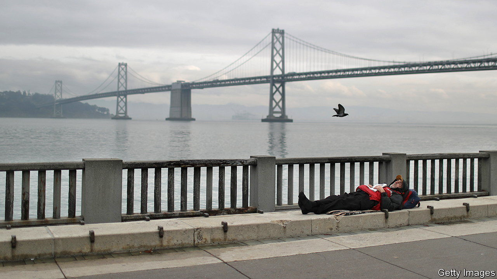

###### The coast of dystopia

# A cautionary tale from the streets of San Francisco 

##### A new book shows how well-meaning urban policies have backfired 

 

> Oct 23rd 2021 

San Fransicko. By Michael Shellenberger. Harper; 416 pages: $28.99 and £20

“THERE’S A CRUELTY here that I don’t think I’ve ever seen,” said Leilani Farha, then the UN’s special rapporteur on adequate housing, in San Francisco in 2018. Visitors are routinely dismayed by the desperation of those living on the streets of the wealthy west-coast city. From 2005 to 2020 the estimated number of unsheltered homeless people nearly doubled, even as homelessness declined nationwide. How can a place brimming with resources and good intentions fail so flagrantly to meet the basic needs of the population?


This question and its uncomfortable answers form the spine of “San Fransicko” by Michael Shellenberger, a former journalist who runs Environmental Progress, a non-profit group. He blames San Francisco’s woes on a culture of permissive lawlessness and a mistaken view of what constitutes moral policymaking. For example, many on the left believe the lax prosecution of laws is compassionate. As a result, the city mostly does not enforce drug laws, even against dealers—at a mounting cost to addicts. Last year 713 people died of accidental drug overdoses, more than double the toll of covid-19. “What kind of city regulates ice-cream stores more strictly than drug-dealers who kill 713 of its citizens in a single year?” Mr Shellenberger asks.

Oddly, a countercultural metropolis famed for innovation has been beset by groupthink. Activists claim San Francisco simply needs to spend more to house the homeless, without scrutinising the funds that the city already doles out to a web of unaccountable non-profits, or reckoning with the magnetic effect of its permissive policies on troubled folk elsewhere. Around 30% of the homeless population of San Francisco say they were homeless before they arrived.

Mr Shellenberger’s urge to tell the truth is brave. Those who challenge the policies espoused by advocates for the homeless are often attacked as inhumane—even though the same policies have contributed to so many unfortunates lacking access to shelter altogether. Mr Shellenberger thinks they are on the streets in part because of a “housing-first” approach, which holds out for permanent, individual homes at the expense of building enough temporary accommodation. In a pricey city, where long-term residents routinely oppose new construction, that is unrealistic.

At its best, “San Fransicko” has the air of a spirited dinner-party conversation, as Mr Shellenberger recounts his intellectual duels with well-intentioned but wrong-headed opponents. Depressing statistics abound. Between 2014 and 2018, for instance, the number of complaints about human faeces to the city helpline doubled. There are 50% more injection drug-users in San Francisco than there are students enrolled at its public high schools.

Yet what the book offers in data, it lacks in characters. Readers are left without a strong sense of the personalities and backgrounds of Mr Shellenberger’s interlocutors. Nor is there enough analysis of the city’s dysfunctional governance. He omits to mention it, but San Francisco is the focus of an FBI probe that has already charged three former City Hall officials with wrongdoing. Could his hometown be even sicker than he suggests? The definitive book on modern San Francisco has still to be written. ■

