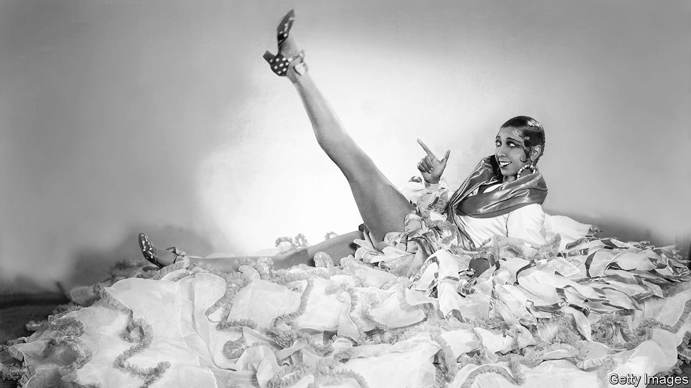

###### Spies and the stage

# A new book explores the symbiosis of espionage and entertainment 

##### They have a lot in common—including personnel 

 

> Oct 23rd 2021 

Stars and Spies. By Christopher Andrew and Julius Green. Bodley Head; 512 pages; £20

AT THE HEIGHT of his powers in the late 18th century, there was no more feted dramatist in Europe than Pierre-Augustin Caron de Beaumarchais, the author of “Le Barbier de Seville” and “Le Mariage de Figaro”. He was also an extraordinarily successful spy, an agent of the French king’s personal intelligence agency, the Secret du roi. Sent to London in 1775 to negotiate a deal with a rogue French agent—a flamboyant transvestite chevalier called d’Eon de Beaumont—Beaumarchais reported to Louis XVI’s foreign minister, the Comte de Vergennes, that pessimism was in the air over the war to keep the American colonies.


To hasten Britain’s defeat, Vergennes authorised Beaumarchais to set up a front company to supply arms to the American rebels. By early 1777, while he was rehearsing a production in Le Havre, Beaumarchais managed to send nine shiploads of weapons to George Washington’s army. Remarkably, his fame was not an impediment to his clandestine activities, and may even have helped him avoid suspicion. The CIA’s Centre for the Study of Intelligence concluded that his efforts had helped bring “the infant United States through the most critical period of its birth”.

The interplay between show business and espionage was already well-established before the exploits of Beaumarchais. Since stars seek the limelight and spies lurk in the shadows, the symbiosis is not at first obvious, acknowledge Christopher Andrew (the official historian of Britain’s Security Service, MI5) and Julius Green (a theatre historian and producer). But, they argue, the two professions require similar skills: deception, role-playing and the ability to create and stick to scripts. Both attract characters at ease with the transitory lifestyle common to itinerant entertainers and undercover agents.

Dubbed the second-oldest profession, spying has always found entertainment a useful cover. King Alfred penetrated a Danish camp pretending to be a harpist; legend had it that the troubadour Blondel used his licence to wander across Europe to find the place of Richard I’s imprisonment. But this delightful history begins with the extraordinary intelligence network established by Elizabeth I’s spymaster, Sir Francis Walsingham. Catholic sympathisers, such as the lutenist John Dowland and the exiled adventurer Anthony Standen, were “turned” to work for the Protestant state. Standen was an accomplished actor and, posing as “Pompeo Pellegrini”, provided vital information about Spain’s invasion plans; Dowland infiltrated the Danish court. Christopher Marlowe, a playwright and poet, also spied for Walsingham.

In the 17th century the dramatist Aphra Behn became the first British woman to earn her living as a writer—and to be officially recruited as a spy by the British government. In 1666, after the outbreak of the second Anglo-Dutch war, she was sent to Antwerp to persuade a former lover and Dutch agent to switch sides in a classic honeytrap operation. The book then speeds through the age of revolution and counter-revolution with quick-fire anecdotes and a huge cast of larger-than-life characters. They include the libertine and memoirist Giacomo Casanova, who was probably the first professional spy to describe himself as a “secret agent”.

Espionage in the 20th century is the book’s main focus. Before the first world war, the authors relate, spy dramas were all the rage in both novels and on the London stage. The first head of MI5, an engagingly theatrical naval officer called Mansfield Cumming (known as “C”), employed a West End costumier, Willy Clarkson, to provide him with a succession of disguises. During the war, the most celebrated agents were women. The most famous of all, the upmarket Dutch stripper Mata Hari, spied, not very effectively, for the Germans—until her capture and execution.

Stage fright

A far more successful spy was Mistinguett, a singer, dancer and film star who extracted from a Prussian prince, her one-time lover, the location of the final German offensive in 1918—in Champagne, not on the Somme as had been expected. Her successor in the second world war was the great African-American entertainer Josephine Baker (pictured), who, after moving to France, carried out numerous missions for her adopted country’s Deuxieme Bureau, winning Charles de Gaulle’s gratitude.

During the second world war, SIGINT, or signals intelligence, was mostly more valuable than HUMINT, the human kind. But theatre intruded even at Britain’s code-breaking centre at Bletchley Park. Before the war its deputy director, Frank Birch, had a stellar career as a pantomime dame, particularly as an acclaimed Widow Twankey in “Aladdin”. Initially Britain’s main HUMINT mission was to help persuade America to enter the fight. The head of the MI6 (foreign-intelligence) station in New York, William Stephenson, recruited a galaxy of stars as influence agents, including Roald Dahl and Noel Coward.

Another of Stephenson’s recruits was Eric Maschwitz, a Hollywood screenwriter and lyricist. He produced a forged map purporting to reveal a Nazi master plan for taking over South America. President Franklin Roosevelt was completely fooled. Maschwitz went on to become head of light entertainment at BBC television.

The book has its faults. Surprisingly, for instance, it omits the spies and adventurers who played the “Great Game” between Britain and Russia in the 19th century. At times, the stylistic joins between the two authors are a little too visible. But anyone who loves a good spy story will find and enjoy hundreds of them here. ■

