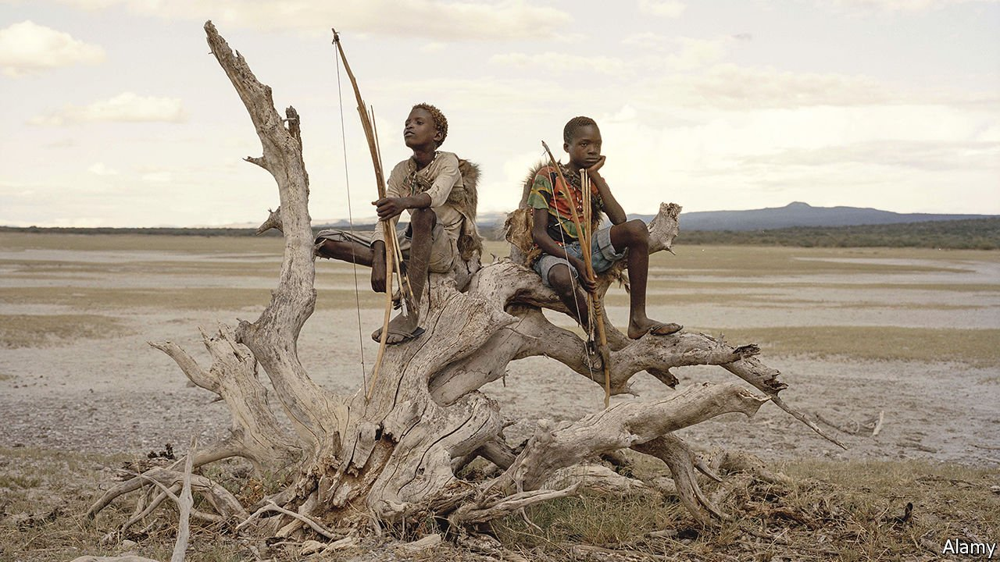

###### Endangered foods

# Human diets are becoming less diverse, a new book warns 

##### Dan Saladino tells delicious tales of rare foods and the people trying to save them 

 

> Oct 23rd 2021 

Eating to Extinction. By Dan Saladino. Farrar, Straus and Giroux; 464 pages; $26.99. Jonathan Cape; £25

THE FRENCH eat foie gras, the Icelandic devour hakarl (fermented fish with an aroma of urine), Americans give thanks by baking tinned pumpkin in a pie. The range of human foods is not just a source of epicurean joy but a reflection of ecological and anthropological variety—the consequence of tens of thousands of years of parallel yet independent cultural evolution.


And yet, as choice has proliferated in other ways, diets have been squeezed and standardised. Even Parisians eventually let Starbucks onto their boulevards. Dan Saladino, a food journalist at the BBC, reminds readers of what stands to be lost. In “Eating to Extinction” he travels far and wide to find “the world’s rarest foods”. These include the murnong, “a radish-like root with a crisp bite and the taste of sweet coconut”; for millennia it was a primary food for Australia’s Aboriginals, before almost vanishing. The unpasteurised version of English Stilton, meanwhile, was salvaged from hygiene rules by an American enthusiast who renamed it Stichelton.

The book’s overarching theme is the rapid decline in the diversity of human foods over the past century. Inside the stomach of a man who died 2,500 years ago, and whose body was preserved when it sank into a Danish peat bog, researchers found the remains of his last meal: “a porridge made with barley, flax and the seeds of 40 different plants”. In east Africa, the Hadza, one of the last remaining hunter-gatherer tribes, “eat from a potential wild menu that consists of more than 800 plant and animal species”. By contrast, most humans now get 75% of their calorie intake from just eight foods: rice, wheat, maize, potatoes, barley, palm oil, soya and sugar.

Even within each of those food groups there is homogenisation. Decades of selective breeding and the pressures of global food markets mean that farms everywhere grow the same varieties of cereals and raise the same breeds of livestock.

Why should anyone care about having 25 varieties of wheat when a single one can be optimised to produce more grain, in more reliable fashion and with a guarantee of the same taste, year after year? For the same reason that fund managers seek to diversify their assets. In an ever-changing world, diversity is an insurance policy. The pressures of climate change and rapidly spreading diseases make that insurance all the more important.

The unhappy fate of the Large White pig is a case in point. Picture the quintessential farmed swine—pink, long-bodied, almost cartoonlike—and you will probably be imagining a Large White. Originating in England in the 19th century, the Large White quickly put on weight (ie, meat) and could be kept inside or out. From England, it was exported to Europe, Australia, Argentina, Canada, Russia, America and China. Today, it fills the world’s biggest industrial pig farms.

But in the past few years African swine fever has swept through such farms, from China to South-East Asia, Mongolia and India. By summer 2020 it had reached Europe—and may have killed nearly half of China’s pigs and a quarter of the world’s. Homogeneity made the planet’s piggy population a pathogen’s playground.

Such stories remind readers of the stakes, but the real delicacies in Mr Saladino’s book are its tales of people who have tried to resist the shrinkage of diets, sometimes heroically. Nikolai Vavilov, for example, founded the world’s first seed bank, in Leningrad (now St Petersburg). He and his disciples gathered more than 150,000 seed samples before he was sent to a prison camp under Stalin. In 1943 Vavilov “was claimed by the very thing he had spent his life working to prevent: starvation”.

His seed collection, however, lives on thanks to the immense sacrifice of the conservationists he inspired. Under siege by the Nazis, and with Vavilov stuck in prison, they moved hundreds of boxes to a freezing basement and took turns standing guard over their trove of genetic diversity. “By the end of the 900-day siege”, writes Mr Saladino, “nine of them had died of starvation.” Among them was the curator of the rice collection, found dead “at his desk, surrounded by bags of rice”.

Mr Saladino offers many wonderful vignettes of indigenous food cultures. The most enchanting involves the symbiosis between the Hadza (pictured) and a feathered collaborator, which evolved over thousands of years. He witnesses an elaborate singalong between his host and a small black-and-white bird—and realises that the exchange is guiding his party to a baobab tree, at the top of which is a honeybee hive. The bird can find the nest, but “can’t get to the wax it wants to eat without being stung to death”. For their part, the humans “struggle to find the nest but armed with smoke can pacify the bees”.

Later that day, Mr Saladino’s group arrives at an isolated hut beside a well. Inside are branded biscuits and sugary pop—tokens of a global food industry that continues its relentless march. ■

