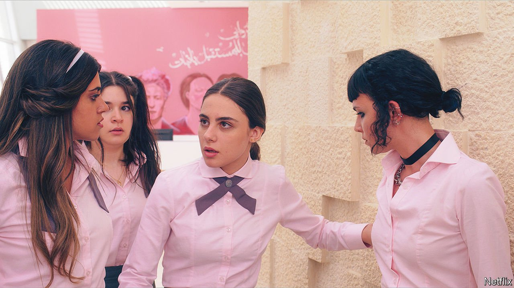
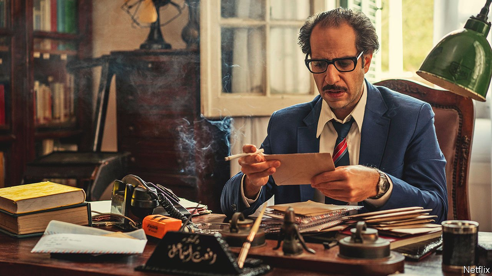

###### Entertainment in the Arab world

# Streaming services are helping Arab producers liven up television 

##### They can reach wider audiences—and tell untold stories 

 

> Oct 23rd 2021 

AT LEAST FOR its first few seconds, “AlRawabi School for Girls” seems set to be just another teen drama. As piano chords ring out in the background, a teenage girl dressed in pink strolls past a school bus. “School was always my favourite place,” she says. Then her classmates assault her. The set-up will be familiar to anyone who has seen “Mean Girls”, an American film of 2004.

The context is not, though. Produced in Jordan and directed by a Jordanian woman, Tima Shomali, “Rawabi” (pictured) is not only about students being vicious to one another, but also about the patriarchal society that surrounds them. They are shaped by it, and they unwittingly reinforce it: the show ends, six episodes later, with a gunshot, after a teenage revenge plot spirals into an “honour killing” (a widespread problem in the Arab world).


Soon after its premiere in August, “Rawabi” jumped to the top of the Netflix chart in Jordan. Viewers praised it for tackling difficult issues—and for portraying the lives of girls, whom Arabic-language television often overlooks. It received valid criticism, too: some noted that the setting, an elite private school, is a rarefied world few Jordanians experience. Many complaints were of the more tendentious sort, though. Saleh al-Armouti, an MP, asked the prime minister why the authorities had granted a licence for a show that “spreads moral and educational decadence”.

There will be more carping to come. After a slow start, streaming services are taking off in the Arab world. Netflix now has about 5m subscribers in the Middle East. Shahid, which is run by MBC, a Saudi-owned media company, has grown 20-fold since its relaunch last year, to 2m subscribers. To expand further—Netflix aims to double its Arab customers within five years—these outfits are investing heavily in original content. Some of it will bust the taboos of Arabic film and television, not only in the ways you might expect.

The salacious stuff often grabs the headlines. Take “Jinn” (also made in Jordan), which in 2019 became the first original Arabic drama on Netflix. It was not very good; critics panned the writing and acting. But the loudest public criticism focused on a smooch between two youthful characters. As love scenes go, this one was chaste, just a quick peck on the lips. Still, it was enough for Jordan’s top prosecutor to ask the government to ban the series.

That sort of debate is neither new nor unusual, however. “Chicago Street”, a Syrian drama broadcast last year, featured actors kissing not only on-screen but in its advertising campaign. “Newton’s Cradle”, which aired in Egypt this spring, was praised for its depiction of relationships and sex, particularly a scene that tackled marital rape. Despite the occasional outburst from the clerical set, Arab producers find ways to explore these issues.

Two other constraints chafe more tightly than public morality. First, politics: governments do not want television programmes to challenge them. Second, commercial imperatives. Traditional studio bosses want shows to fit a well-worn model, typically aimed at middle-aged women—rather than the younger viewers who are a prized audience elsewhere.

Even on streaming services, the political restrictions are hard to dodge. Asked to ban “Jinn”, Jordan’s media regulator said it had no jurisdiction over Netflix. Other governments disagree. In 2018 Netflix pulled an episode of “Patriot Act with Hasan Minhaj”, an American comedy show, from its catalogue in Saudi Arabia. The episode criticised the kingdom over the war in Yemen and the murder of Jamal Khashoggi, a Saudi journalist. Saudi Arabia said the show violated its cyber-crime laws.

Commercial barriers may be easier to surmount. For decades the centrepiece of Arabic television has been the Ramadan serial, which airs one episode each night during the holy month, and is meant for families glued to the tube in a post-prandial stupor. These are expensive—production can take a whole year—and face stiff competition. The format is restrictive, since it often requires around 30 episodes (imagine the first three years of “Game of Thrones” squeezed into a month). For many media companies, Ramadan brings in 15-20% of annual revenues.

Paranormal activity

With so much at stake, producers play safe. They prefer established stars, because advertising is easy when you can slap a well-known face on a billboard. The dramatic range is narrow: historical sagas, mindless action fare, slapstick comedy. Other genres have been overlooked. Arab fans of science fiction, for example, often bemoan a dearth of screen offerings. That is not for lack of material: one of Egypt’s best-loved 20th-century authors, Ahmed Khaled Tawfik, churned out scores of horror and sci-fi novels,despite objections from publishers who wanted crime stories.

That background made “Paranormal” all the more, well, abnormal when it was released on Netflix last year. Egypt’s first original series on the platform, the supernatural anthology show is based on Tawfik’s novels. Its protagonist, Refaat Ismail, is a chain-smoking haematologist from Cairo played by Ahmed Amin—previously known for sketch comedy and YouTube videos he produced himself. The first season ran for just six episodes.

None of this fitted the traditional mould of Arabic television, but viewers lapped it up. A few clunky special effects aside, “Paranormal” earned rave reviews from local audiences, with Mr Amin (pictured) drawing praise for his brooding portrayal of the hero. It spent ten weeks in Netflix’s top-ten chart in Egypt and shorter periods in those of other Arab countries; a second season is due in November. Its success proves that, though the Ramadan serial will endure, there are now more ways to make prestige Arabic TV—some of them involving relatively unknown performers and experimental formats.

Crucially, instead of targeting their fare at middle-aged domestic viewers, Arab directors, like those elsewhere, can now reach a dispersed and larger audience. “Paranormal” was deeply Egyptian, and not only in the vintage Nefertiti cigarettes Ismail smokes. The fourth episode dealt with the legendary naddaha, a female spectre that lures men to their deaths in the Nile. Viewers eventually learn that the ghost was the victim of an honour killing. Yet the series was well-received far beyond Egypt. Variety magazine called it one of the best international shows of 2020. Foreign reviewers likened it to “The X-Files”.

 


Other innovative ideas are in the works. In September Shahid launched a series called “Hell’s Gate”, set 30 years in the future and depicting a dystopian Beirut that is controlled by a gang of oligarchs. It was billed as the platform’s first science-fiction drama (given recent events in Lebanon, calling it fiction may seem facetious). Last year Netflix released “Six Windows in the Desert”, a run of short films by directors in Saudi Arabia, and “Whispers”, a mystery series. It has signed several deals with Saudi production houses to make original feature films and animated shows, in a country where cinemas were only legalised in 2018 after a 35-year ban.

Not all these productions will break boundaries. Netflix is working on a musical drama with Amr Diab, an ageless Egyptian pop star. Some rules will stand: no one in Cairo is likely to pitch an Egyptian version of “Yes Minister”, lampooning the workings of Abdel-Fattah al-Sisi’s government. But streaming services are helping do for Arabic television what HBO did for America’s 20 years ago—bringing stories to life that would otherwise go untold. ■

