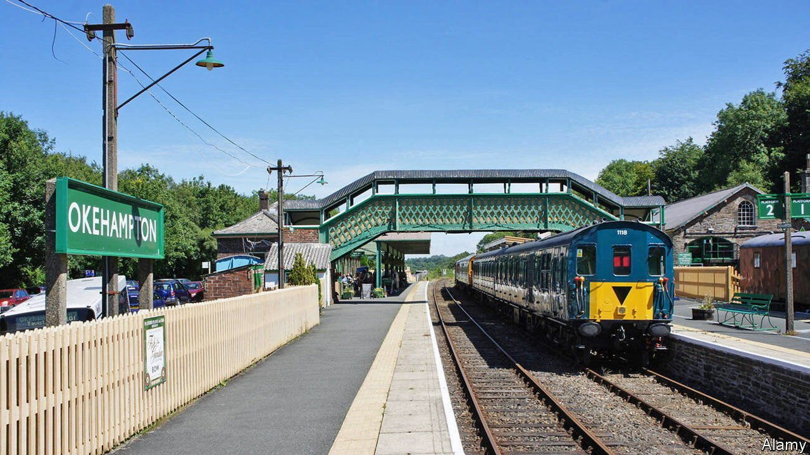

###### Railing against modernity

# A plan to revive Britain’s rural railways gathers steam 

##### The poetry makes more sense than the economics 

 

> Oct 23rd 2021 

IN THE SILENT ticket office, beneath the half-moon windows of the booths, a large green sign announces “OKEHAMPTON” to an empty room. On the platform, a faded poster reads “DEVON—Travel by rail”. Those reading it have had little chance to do so. The last passenger train left Okehampton on June 3rd 1972. The town turned out to mourn: the mayor stood by, holding a wreath. On the line, between the sleepers, the grass started to grow.

But Okehampton is changing. New steel tracks gleam beneath the platform; diggers toil in the car park. The station is being reopened as part of the government’s “Restoring Your Railway” fund, launched in January last year to keep a manifesto promise. The aim of the scheme is, as the transport secretary Grant Shapps explained, to “reverse catastrophic cuts to the rail network primarily led by the Beeching axe”. Some 141 bids have been made; 25 have been successful. Okehampton is the first to reopen. Eleven miles of track have been laid with Brunellian briskness in four weeks. The first train arrives on November 20th at 7.10am.


In 1963 a report by Richard Beeching, chairman of the British Railways Board, earmarked 5,000 miles of track and 2,363 stations for closure. To this day, it is seen less as a piece of bureaucracy than as an act of “infamy”; its cuts “a wound that hasn’t healed”, according to Stewart Francis, a former chairman of the Rail Passengers’ Council. On the Beeching “wound”, Okehampton’s 11 miles of shiny new track are a mere sticking plaster.

But to see this in terms of pure numbers is to miss the point. More than sleepers and steel were lost. “Railways have a strange position in the British psyche,” says John Preston, a professor of rail transport at the University of Southampton. “A lot of rural lines disappeared that were emblematic of a way of life…for which there was a lot of nostalgia,” he notes.

The new line is less about travelling through Devon than about travelling through time. Lots of infrastructure is prosaic. In Britain trains become poetry, their lines not just crossing the land, but running on into the literature of Robert Louis Stevenson, John Betjeman and W.H. Auden. Restoring railways nods to this fictional England, a place of branch lines and straight backs, railway porters and station masters; an England paused, like the train in Edward Thomas’s poem “Adlestrop”, in the late June of national memory.

But poetry, while nice, has never been particularly profitable. It remains to be seen whether these lines will be. There could hardly be a worse time for them to open: in the first covid-19 lockdown passenger numbers fell by around 90% and “the post-covid demand path is not yet clear”, says Mr Preston. Still, in Okehampton the locals seem pleased. Becky Tipper, the Network Rail manager in charge of the reopening, was surprised when, as her workers started laying the track, “a crowd of people” turned out once again. This time, no wreaths. Instead, says Ms Tipper, they started clapping. ■

