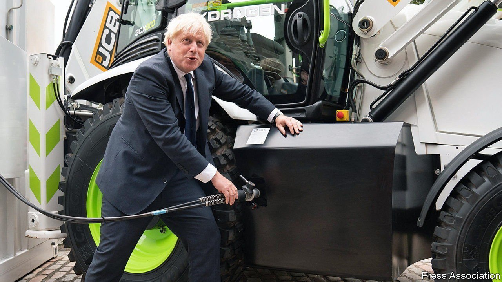
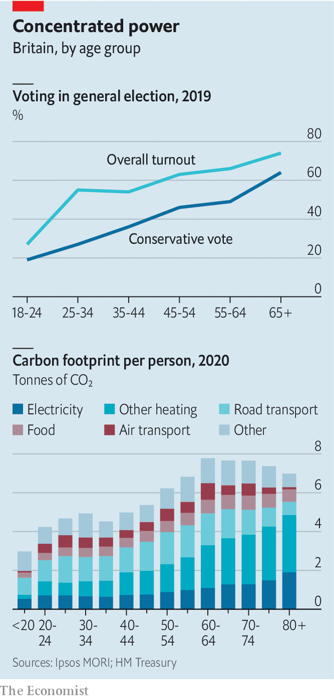

###### Decarbonising Britain

# Britain has ambitious climate-change plans—and two problems 

##### Unfortunately, they are the most powerful government department and the prime minister 

 

> Oct 23rd 2021 

WHEN IT COMES to tackling climate change, the British government lacks neither ambition nor self-regard. In 2019 it enacted a law committing itself to reaching net zero greenhouse-gas emissions by 2050. A medium-sized country that accounts for 1% of global emissions believes it can pull the rest of the world along at a UN climate conference next month in Glasgow. But is Britain serious about keeping its own promises? A flurry of government plans released this week suggest not.

The net-zero strategy contains many bold targets, which often come with caveats. By 2035 Britain will be powered entirely by green electricity, “subject to security of supply”. By the same year, every new home-heating system installed should be an efficient electric-heat pump or a hydrogen boiler, so long as the costs of such things fall to a reasonable level. Tree-planting will more than double in speed.


Wisely, the government recognises that there are many ways to reach net-zero emissions. Britain may move quickly away from fossil fuels and to electricity provided by wind turbines and new nuclear-power stations. Alternatively, it could rely on hydrogen, capturing the carbon released when it is created from natural gas. The government will spray money at lots of tech—hydrogen production, small nuclear reactors, devices that take carbon from the air—in the hope that some work cheaply.

“It’s more detailed and ambitious than anything you’ll find elsewhere in the world,” says Chris Stark, chief executive of the Climate Change Committee, an official watchdog. Inevitably, some government departments (such as business and transport) have bolder, more detailed plans than others (such as agriculture). But it is useful to know which are the laggards. Encouragingly, most political critics of the plans argued that the government should do more, not less.

Yet getting to net zero, or even close, is so difficult that Britain must do everything right. And there are two weak links in the chain that connects dreams to accomplishments. Unfortunately, these are the two strongest institutions in the government.

The first is the Treasury. The problem is not so much that it might have provided more money to speed the green transition, although that is true. A much-touted £450m ($620m) subsidy scheme for heat pumps may cover only 30,000 installations a year, for example. The larger problem is what Jill Rutter, a former Treasury official who now works at the Institute for Government, a think-tank, calls the department’s “wholly owned, proprietorial approach” to tax.

The Treasury sees its job as collecting money from the public and distributing it to other departments, to be spent (often unwisely, it fears) on their projects. It does not regard taxes as devices to help departments achieve their objectives. So the transport department must try to decarbonise the roads by subsidising electric cars and banning the sale of petrol- and diesel-powered ones. The more obvious (and economically efficient) route of taxing fuel more highly is out of the question.

The second weak link is the prime minister, Boris Johnson. This week he shilled for his government’s green plans with typical bonhomie. He cheerfully misquoted Gordon Gekko from the film “Wall Street”, likened himself to Moses and assured readers of the Sun newspaper that the “greenshirts of the boiler police” would not “kick in your door with their sandal-clad feet” and seize their gas-fired devices.

 


Political salesmanship and cheer are good things. The trouble with Mr Johnson is that he cannot bear to deliver bad news. The government’s net-zero strategy contains soothing words about working with the grain of consumer choice. There is, as the prime minister puts it, not “a hair shirt in sight”. But if Britain is to reach net zero, many noses must be put out of joint.

Especially noses belonging to people on whose votes Mr Johnson depends. The old have bigger carbon footprints than the young, largely because they tend to live alone or with one other person. Their consumption patterns will have to change. Yet the Conservative government relies on older voters (see charts). Nasty geographical patterns exacerbate the problem. Installing a heat pump costs around 7% of average net housing wealth across the Midlands and north of England, where the Conservatives won many new votes at the general election in 2019, but less than 3% in London, where the party has given up.

Mr Johnson could be bolder. A poll for The Economist by Ipsos MORI finds not only that 83% of Britons are concerned about climate change, but also that 51% believe the cost of tackling it will, in a year’s time, be larger than any savings from things like lower heating bills and cheaper petrol. Only 9% think the savings will be higher than the costs. People expect the trade-off to be more favourable in ten years’ time. Britons seem to be prepared for hair shirts. They just don’t want to wear them forever.■

For more coverage of climate change, register for The Climate Issue, our fortnightly , or visit our 

