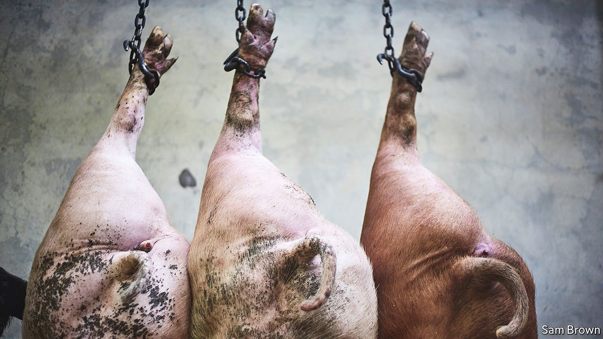

###### Making a pig’s ear of it

# The British government belatedly tries to prevent a porcine tragedy 

##### It faces a number of barriers, including the problem of “boar taint” 

 

> Oct 23rd 2021 

A PIG ARRIVES at an abattoir panicking. It enters a chamber full of carbon dioxide, which knocks it out. Then comes the disassembly line. Slaughtermen hang the hog upside down, slit its throat and remove the guts. Boners split it up with mechanical saws. Deboners slice muscle from bone. Trimmers ready the meat for packing. The work is hard, bloody and miserable. It can also take three years to master.

Across the country, these skilled workers are in short supply. The National Pig Association thinks there are 125,000 to 150,000 pigs waiting to be turned into pork. Boris Johnson, the prime minister, had sought to minimise the problem. But on October 14th the government relented to pressure, announcing 800 new six-month visas for butchers. They will have to get chopping fast to stop hundred of thousands of pigs from going to waste.


The problem started in China, where nearly half of British pork exports were sent last year, and which has a taste for basic cuts. With Chinese farms recovering from African swine fever, demand for imports has dropped this year—meaning more advanced abattoir workers are required. “When exporting to China you could send a whole leg...Here you need to make it all the way down to a loin steak,” explains Bethan Wilkins of the Agriculture and Horticulture Development Board, a quango.

This has affected farms across Europe, but those in Britain face additional problems. In September a carbon-dioxide shortage added to backlogs (the gas is used for packing meat as well as stunning). Post-Brexit immigration rules, particularly language ones, are also starting to bite. Most slaughterhouse butchers “wanted to work with their hands so probably [weren’t] top of their class,” says Nick Allen of the British Meat Producers Association. “Our HR people aren’t sure they’d pass this test in their own language.”

Modern pig farming is vulnerable to disruption. As Mr Allen notes: “Your holy grail is to produce the same number of pigs, week in week out regardless of season.” Welfare laws demand swine be given enough space to turn and lie down freely. A backlog makes this tricky. Even if farmers can find the space, they face other problems, too. Feed prices are high and slaughtering large pigs expensive. Boar taint, an odd taste in older, uncastrated male pigs, is an issue.

If the beasts cannot be killed in abattoirs, they will be killed on farms, which renders them legally unfit for human consumption. Though industry insiders welcome the visas, they reckon Britain needs more than 10,000 skilled butchers. The government will also establish a “private storage aid” scheme to store carcasses for three to six months, and will drop a levy on pork products. In the long run, the aim is to encourage more Britons into the industry. The problem is they are an animal-loving bunch.

