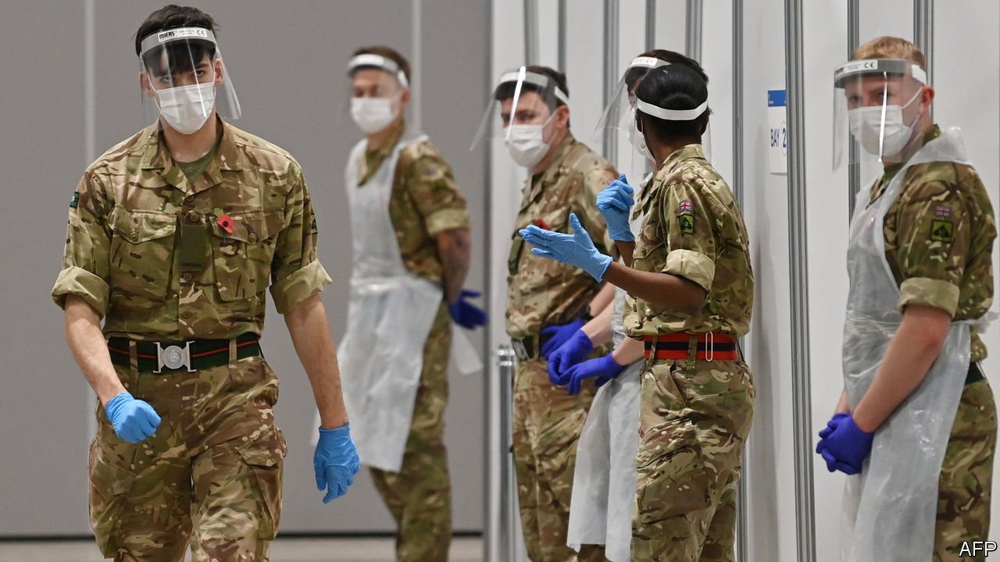

###### Call in the troops, again

# The British state is becoming worryingly reliant on its armed forces 

##### Covid-19 has accelerated an existing trend 

 

> Oct 23rd 2021 

BRITISH SOLDIERS have few battles to fight. But they have plenty else to do. On October 4th, after hurried training, nearly 200 hit the road, delivering petrol to the country’s parched forecourts. The deployment came soon after others had been sent to Northern Ireland and Scotland—to drive ambulances, work in accident-and-emergency wards and run covid-19 testing facilities—and soon before some were sent to Wales. Within days, squaddies were off to help the struggling Home Office collect information about Afghan refugees.

When the state is in trouble, the armed forces step in—and they are being called upon increasingly often. According to the Ministry of Defence, there were 359 instances of civilian aid last year and there have been 237 in the year to date. That is up from 120 or so in the four previous years and fewer than 80 in 2015. Numbers are not available further back, but are expected to have been lower. As a former Tory cabinet minister notes, although governments have long got the armed forces to help out in a crisis, “calling in the troops seems to have become almost second nature now”.


The trend reflects covid, changing military attitudes and the denuded capacity of the state. Legally the armed forces have no responsibility to prepare for civil crises—the task is left to local authorities, the health service, the police and so on. Military intervention is meant for niche jobs where building expertise is impractical (such as bomb disposal) or when capacity is overwhelmed. “In other words, it’s last-resort stuff”, explains Air Marshal Edward Stringer, who ran military operations at the Ministry of Defence from 2015 to 2017. It is a principle designed to stop the rest of the state from relying too much on military help, and to keep the armed forces focused on their actual job.

Things began to change under David Cameron, prime minister from 2010 to 2016. In 2012 troops provided security (and filled empty seats) at the Olympics after a private contractor, G4S, slipped up. When water levels rose a few years later, Mr Cameron’s attitude was: “We’re going to be dealing with some pretty horrendous floods. Why the hell are soldiers still sitting in barracks?” recalls Air Marshal Stringer. Local-authority budgets fell by a fifth in real terms in the decade to 2020. Councils became less reticent about calling for help, and a new precedent was set.

Covid accelerated the trend. Soldiers were called back from overseas operations, only to be pressed into work at home. The military’s response—known as “Operation Rescript”—placed 20,000 troops on standby at covid’s height, and built emergency hospitals, tested entire cities and delivered jabs. The armed forces took this as proof of their adaptability. But there was also a less palatable reason for their enlistment. “You can order a squaddie to work through the night. They don’t do the working-time directive or indeed the minimum wage,” notes the former minister. “You have a pool of manpower that is not unionised.”

More sophisticated work often reflected deficiencies elsewhere. Logistics specialists built considerable expertise in Iraq and Afghanistan, and were well-suited to sorting out problems in PPE supply chains, for instance. Meanwhile resilience forums, which were supposed to co-ordinate local responses, turned out to be of wildly varying quality. At least 300 military planners were sent to government departments and local authorities to help. “They are the unsung heroes of the pandemic,” says Elisabeth Braw of the American Enterprise Institute, a think-tank. “Most civil servants don’t have any experience in contingency planning or planning under duress.”

The armed forces have a mixed attitude to domestic work. It is not what those on the ground signed up for. As a reservist notes, the Olympics were in summer and in London, which helped. “The COP summit is going to be in winter in Scotland; that’s slightly less appealing,” he admits. Yet the demand has come at a helpful time for the higher-ups. “Afghanistan and Iraq have wound down, and so there’s more and more forces lying around,” says Rod Thornton of King’s College London. “If they’re just lying around doing nothing, they will get cut.”

That the armed forces are still involved in the covid response—nearly two years into the crisis—demonstrates they are no longer a back-up option. “We’ve become complacent because we have said, if anything comes along, ‘We’ve got the British army’,” says Ms Braw. “It signals to countries that want to harm the UK that, if something were to happen, we have no clue.” As the pandemic recedes and things get back to normal, there will be less capability to take on extra work, says an official at the Ministry of Defence. It is a lot to ask of a shrinking organisation. The number of armed-forces personnel has fallen by more than 10% since 2012, and further cuts are planned in the next few years.

You and whose army?

The so-called “integrated review” of Britain’s foreign, defence and aid policy, published in March, sets course for a Scandinavian-style “whole-of-society” approach. It includes a proposal to bring in a new team of civilian reservists, with outside expertise. Along with cuts to troop numbers, it is part of what Ben Wallace, the secretary of state for defence, has characterised as a transition from “mass mobilisation to information-age speed”. This may spell trouble. It seems unlikely that a shrunken armed forces—stuffed with coders, scientists and technology experts—will be particularly enthused by the prospect of driving fuel tankers. ■

