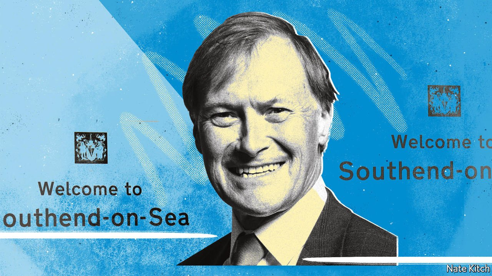

###### Bagehot

# The death of Sir David Amess holds lessons for British politics 

##### So, too, does his life 

 

> Oct 20th 2021 

MPS GATHERED in the Palace of Westminster on October 18th, first in the House of Commons and then in St Margaret’s Church, to celebrate the life of one of their own. They told stories about the man with the widest grin in Westminster: how this lifelong Roman Catholic had once got the pope to bless a boiled sweet by mistake and how this inveterate campaigner for city status for Southend deluged the authorities with proof of the place’s worthiness, such as the fact that it held the world record for the number of triangles played simultaneously. They also hinted at serious questions about what his murder meant for British democracy. How could potential murderers be spotted before they struck? What should be done about internet trolls who spew hatred? And would MPs have to retreat behind armed guards or fortified screens when meeting their constituents?

Sir David Amess was never one of Parliament’s high-flyers—indeed, he might well be described as a low-flyer. The furthest he climbed up the greasy pole was as a PPS (personal private secretary). But he was nevertheless a far more significant figure than many famous MPs. He was the embodiment of perhaps the most important political trend of the past 40 years: the rise of “Essex man”, that upwardly mobile figure who, thanks to his combination of self-reliance and truculence, drove the Thatcherite revolution of the 1980s and the Brexit revolution of the past decade.


His parents were Cockneys who moved to Essex in order to start a family. He was brought up in modest circumstances, with “an outside toilet and a tin bath hanging on the wall”, but nevertheless decided to become an MP in the same year that he passed the 11-plus test for the local grammar school. In the late 1970s he appeared in a political advertisement with Margaret Thatcher, who became his lifelong heroine. In 1983 he stood successfully for Basildon, then a swing seat that shifted to the Conservative column. And in 1997, after boundary changes, he switched to another Essex seat, Southend West. The constituency had been a pocket borough for the Guinness-Channon dynasty for more than a century, starting with Rupert Guinness, then passing to his wife, Gwendolyn, then to his son-in-law, the socialite diarist Henry “Chips” Channon, and finally to Chips’s son, Paul Channon. Sir David’s arrival was yet more proof that the party of the old aristocracy was becoming the party of the Essex man.

Sir David was also the quintessential local MP who believed that the highest calling of an elected member was to represent the people to the state rather than the state to the people. He gloried in the House of Commons in all its magnificent quirkiness, hanging an ornamental sword on his peg in the cloakroom, in deference to the tradition that swords had to be abandoned before entering the chamber. He disliked almost every change to the institution, not because he was a fuddy-duddy—or not just because he was a fuddy-duddy—but because they weakened Parliament’s power to oversee the executive. The end of late-night sittings was eroding camaraderie. The rise of professional politicians was turning Parliament into a rubber stamp. (He was particularly contemptuous of Tony Blair, “the biggest egotistical maniac I’ve ever met” and “sickeningly smooth” with it.) His proudest achievements were all local—keeping schools and hospitals open and preventing a forest of silver birches from being razed to the ground.

Sir David was happiest with his constituents. He relished the flummery of constituency life such as judging dog shows and raising money for a statue of Dame Vera Lynn, a popular wartime singer. But he didn’t just relish the Friday constituency surgeries where MPs meet constituents to hear their problems. He regarded them as key to the sacred bond between elected politician and electors. He pooh-poohed threats which, like all too many MPs, he received, and held his surgeries in local community centres to make himself accessible. It was while he was holding one of these surgeries in a Methodist church that he was stabbed to death.

The atrocity has provoked an agonised debate about how to stop future attacks. Politicians from the prime minister down have insisted the best way to honour Sir David’s legacy is to remain open to the public. But this is a little blasé. Sir David is the second MP to be killed at work in five years (the first being Jo Cox, a Labour MP who was murdered on her way to a surgery by a neo-Nazi). Many politicians are considering posting police officers and security guards in their surgeries. Policymakers are also discussing the question of how to identify potential assailants before they make it to surgeries. William Shawcross, who is reviewing the government’s counter-terrorism Prevent strategy, to which the suspect was referred, is likely to argue that MI5 should have more say as to whether potential extremists are placed in anti-extremism programmes. Policy Exchange, an influential think-tank, urges the authorities to combat the grievance culture that poisons the minds of some young Muslims rather than waiting until they show signs of violent intent.

In memoriam

The physical defence of MPs needs to be linked to a wider defence of their calling. There is a tendency in popular culture to demonise politicians as self-seeking parasites who do not care about the common good. But if you are interested in fiddling your way to wealth there are easier ways to do it than to put yourself in the public spotlight. There is a tendency among historians to treat the history of Parliament as a sideshow. But in fact the House of Commons has played a crucial role in providing a civilised outlet for social divisions that elsewhere result in violence. It is fitting that the queen should have honoured one of Sir David’s quixotic causes by making Southend a city. It would be even more fitting if the political nation—journalists and academics, as well as politicians—were to devote more energy to seeing the virtues as well as the failings of the institution to which he devoted his life. ■

An early version of this article was published online on October 20th 2021

