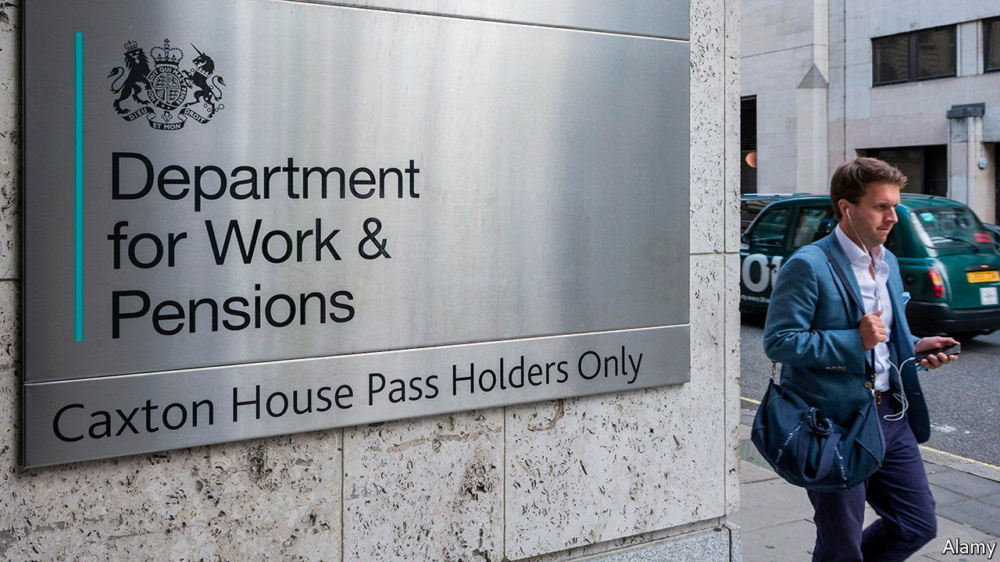

###### Doffing the cap

# The government wants pension funds to help with levelling up 

##### That will take more than a tweak to fee rules 

 

> Oct 23rd 2021 

EVEN BY THE standards of the OECD, a club of mostly rich countries, Britain has quite a nest-egg. In 2020 the organisation’s pensions report valued the country’s pot at $3.6trn, second only to America out of the 37 members. A sizeable chunk of that is set aside for workers who will not retire for decades, and who hope it will have grown by the time they do. So how should it be invested in the meantime?

In recent years, regulation has focused on keeping down costs. In 2016, wary of fund managers eating up workers’ retirement savings with outsized charges, the government introduced a cap. Workplace pensions were restricted to investing in funds with annual fees of 0.75% or less.


That seems set to change. Spying a chance to redirect pension assets towards the government’s “levelling up” ambitions, in August the prime minister and chancellor of the exchequer wrote to pension trustees to encourage them to start an “investment big bang”. By investing in unlisted British assets like green infrastructure and early-stage, innovative firms, trustees could ensure their savers were “benefiting from the fruits of UK ingenuity and enterprise”, securing better returns and backing British success stories at the same time.

In practice, this would mean pension schemes investing less in listed equities and bonds, and more in venture capital and infrastructure funds. The snag is the fee cap. Such funds tend to charge more than 0.75% per year, plus a share of the profits once returns beat a “hurdle” rate. And so Treasury officials are reportedly looking at ways to loosen the cap.

There is certainly room for more investment. A report by the government-funded British Business Bank (BBB) found that less than a fifth of British venture-capital funding between 2010 and 2019 came from pension funds. That compares with over 70% in America. Much of the funding gap was plugged by agencies like the European Investment Fund and the BBB.

Meanwhile, workers saving for retirement are missing out on an asset class that yields higher returns. The British Private Equity &amp; Venture Capital Association, an industry body, reckons that funds managed by its members returned an average of 14% a year over the decade to 2019. That compares with an average of 8% a year by the FTSE All-Share index of British listed equities. Yet two-thirds of defined-contribution schemes, the most common type of workplace pension, do not invest in such assets at all.

That said, raising the fee cap is unlikely to trigger a rush of pension-fund investment, cautions Raj Mody of PwC, a consultancy. The workers most likely to benefit from high-risk, high-growth investments like venture capital are those furthest from retirement. Such savers also tend to have the smallest pots. And simply raising the cap will not solve the problem of unlisted funds’ performance fees, which can be volatile and depend on returns. “It is an enabling step, not a solution,” says Mr Mody.

Part of the reason American pension schemes can invest in venture capital at scale is their sheer size: the largest five funds have combined assets of $1.8trn. That gives them leverage to negotiate fees, and makes it economical to hire specialist teams. The closest thing Britain has to this scale is the £276bn ($382bn) of pension assets in its Local Government Pension Scheme—which is split into 90 separate funds. A big bang might require more concentration of the Treasury’s firepower. ■

