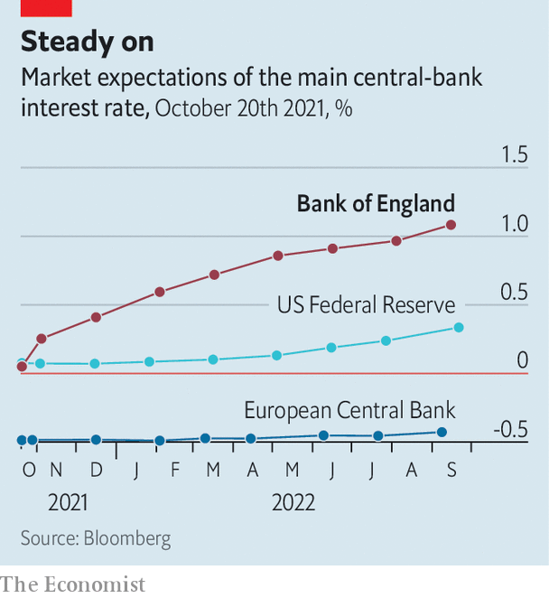

###### Ready for a leap in the dark

# Why the Bank of England is looking unusually hawkish 

##### Among other issues, policymakers fret about their credibility 

 

> Oct 23rd 2021 

THE BANK OF ENGLAND is an outlier. Investors expect it to raise interest rates before the end of the year and then to 1% by August 2022—faster than either the European Central Bank or the Federal Reserve (see chart). It may even start to do so before it finishes its programme of bond buying, known as quantitative easing. The bank’s leaders feel themselves to be in an exceptionally tricky position. Ben Broadbent, the deputy governor and a member of its monetary-policy committee for a decade, reckons it is “the most challenging period for monetary policy of any I’ve seen”.

 


Some of the discomfort is shared across central banks. After the covid-19 pandemic struck, underlying inflation did not fall by as much as expected, as supply struggled to keep up with seismic shifts in demand. More recently snarled supply chains and energy shocks have kept prices buoyant. Britain’s consumer-price index rose by 3.1% in the year to September, and the Bank of England expects it to climb above 4% later this year. Meanwhile, in September annual inflation soared to more than 5% in America and to 3.4% in the euro area.


Policymakers insist these pressures will fade. But as inflation is likely to persist well into next year, the risk is that people will start to factor it into their wage demands, generating a spiral of climbing prices and wages. The chances of that happening depend on the underlying strength of the real economy—about which there is little certainty. If policymakers overestimate its strength and contract credit too quickly, they will further wound it. If they underestimate its strength and offer loose credit conditions for too long, they risk exacerbating an inflation problem.

Given the circumstances, the Bank of England might be expected to be on the cautious end of the spectrum. The IMF predicts that America’s economy will this year be bigger in real terms than it was in 2019, whereas Britain’s will only reach that milestone in 2022. It also expects the British government to tighten fiscal policy more quickly than America or the euro area. Rishi Sunak, the chancellor of the exchequer, has trumpeted his rectitude in advance of the budget on October 27th. As he has put it: “Stacking up bills for future generations to pay is not just economically irresponsible—it is immoral.”

It is possible investors are overestimating the Bank of England’s hawkishness, after a decade of doing just that. The recent surge in confidence that a rate rise is due came after a speech on October 17th by Andrew Bailey, the Bank of England’s governor, in which he said “we will have to act”. But he added that action would only be in response to “a risk, particularly to medium-term inflation and to medium-term inflation expectations”. He did not specify that these conditions had been met.

A lack of data on Britain’s labour market after the withdrawal of pandemic wage support makes it unlikely that the Bank of England will raise rates as soon as November. But, despite the bank’s confusing communications strategy, the overall hawkish tilt is clear. Notably, Mr Bailey chose not to push back against growing expectations of a coming rate rise.

One reason Britain may pull away from its rich-world peers is that it suffered the double whammy of the pandemic and Brexit. The combination makes the health of the economy difficult to decipher, offering cause for caution. But the additional damage may also hasten the point at which underlying inflation becomes a problem.

A decision to raise interest rates would reflect credibility concerns. As a smaller and more open economy, Britain is especially vulnerable to shocks. Investors’ expectations of inflation in the next five years have been creeping up. Household expectations of inflation in the next five to ten years are at their highest since 2013.

Inflation expectations have been rising in America and the euro area, too. But the policy context is different. The Fed and the European Central Bank both see the 2010s as a period in which monetary policy was too tight, and inflation expectations were too soggy. Both have updated their inflation-fighting frameworks to allow for inflation higher than 2%. The Bank of England came much closer to its target and thus has not revised it. That leaves policymakers more antsy about any overshoot. In other words, the Bank of England is a victim of its past success.

The political mood in Britain further complicates things. In July the House of Lords economic-affairs select committee berated the bank for its lack of transparency about post-pandemic bond buying. Its schedule of bond purchases was strikingly similar to the Treasury’s own schedule for bond sales, raising suspicions of blurred lines between the monetary and fiscal authorities. If outsiders start to believe that the Bank of England is more interested in propping up the Treasury than in curbing inflation—of which there is no good evidence to date—it would compound any credibility problems.

All bark, no bite

The hawkish chatter may be a ploy to persuade markets to do the Bank of England’s dirty work. If investors believe that monetary policy will tighten, then credit conditions in the real economy will tighten regardless of what the bank actually does. On October 14th Catherine Mann, a member of the monetary-policy committee, suggested that the increase in long-term interest rates reduced the need for rate-setters to follow through.

Plenty of sceptics do not believe anything more than tough talk is warranted. High household inflation expectations have not fed through to higher wages for at least 15 years, says Samuel Tombs of Pantheon Macroeconomics, a research firm. Andrew Goodwin of Oxford Economics, another research house, says that aside from some small sectors generating headlines, the story of much of today’s labour market is in fact a glut of workers.

Britain’s monetary policymakers may also struggle to push against the global forces that have dragged down interest rates over the past two decades, says Dario Perkins of TS Lombard, a research outfit. “Whenever one central bank has tried to break out of that over the past 20 years, they have ended up having to reverse it,” he notes. Investors may expect the monetary-policy committee to strike out on its own, but it would still be a bold move. ■

