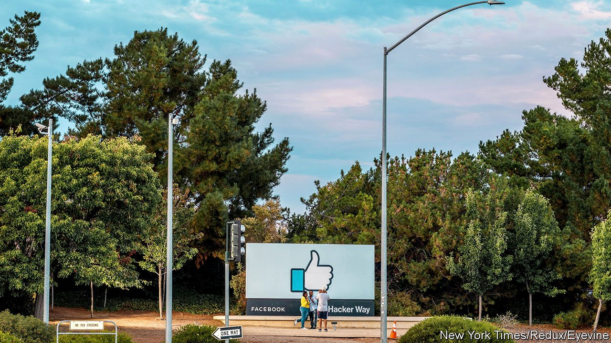

###### About-face

# Facebook’s rumoured name-change reflects ambition—and weakness 

##### The company is more than a social network. It also has a reputation problem 

 

> Oct 21st 2021 

WORTH NEARLY $1TRN, Facebook is the world’s sixth-most-valuable company. Its revenues have grown by 56% in the past year, and its share price by more than a quarter. Nearly 3bn people use its products every month. Why would such a glittering success change its name, as the Verge, a news site, reports it plans to within days?

The likely official reason for the rebranding, which Facebook has not confirmed, is that the firm has outgrown the social network that Mark Zuckerberg started 17 years ago in a Harvard dorm. Today it encompasses other social apps (Instagram, WhatsApp, Messenger) and video hardware (Oculus, Portal). It has launched a digital wallet (Novi) and may yet offer a currency (Diem). Mr Zuckerberg expects people eventually to associate his firm more with the “metaverse”, a virtual space for work, play and more, than with social media. This week Facebook said it would hire 10,000 people to work on the metaverse.


If the Facebook network is to take a back seat, there may be a case for regrouping under a new name. Facebook wouldn’t be the first tech titan to do so. In 2015 Google set up Alphabet, a holding company for the search engine and its many side projects. Under this model, Facebook would become just another app within a wider family, albeit by far its biggest earner.

There is another, less flattering possible motive for a makeover. For all its pecuniary success, the Facebook brand has become tarnished. The social network is blamed for stoking everything from teenage anorexia to insurrection at the US Capitol. This month Frances Haugen, a former employee, told Congress that Facebook was failing to moderate content on its platform and covering up a drop in young American users (it denies this). Public trust in it is lower than in most tech giants, and falling. Although two years ago the firm started branding its apps as being “from Facebook”, its new “smart glasses”, which can record video and take phone calls, feature only the logo of its partner, Ray-Ban.

Facebook investors seem untroubled. But its social apps’ growing toxicity threaten to poison its other projects. On October 19th Democratic senators signed a letter arguing that Novi and Diem should be scrapped, since “Facebook cannot be trusted to manage a payment system or digital currency when its existing ability to manage risks and keep consumers safe has proven wholly insufficient.”

Mr Zuckerberg himself has been a lightning rod for much of the criticism of Facebook, and of bossy tech firms more generally. As the all-powerful founder, he has a higher profile than his opposite numbers at TikTok, YouTube and other social networks. Normally, a brand facing a reputational crisis might dump its unpopular CEO. But Mr Zuckerberg’s position is unassailable, which may explain why he would want to dump the brand instead. ■

For more expert analysis of the biggest stories in economics, business and markets, , our weekly newsletter.

An early version of this article was published online on October 20th 2021

