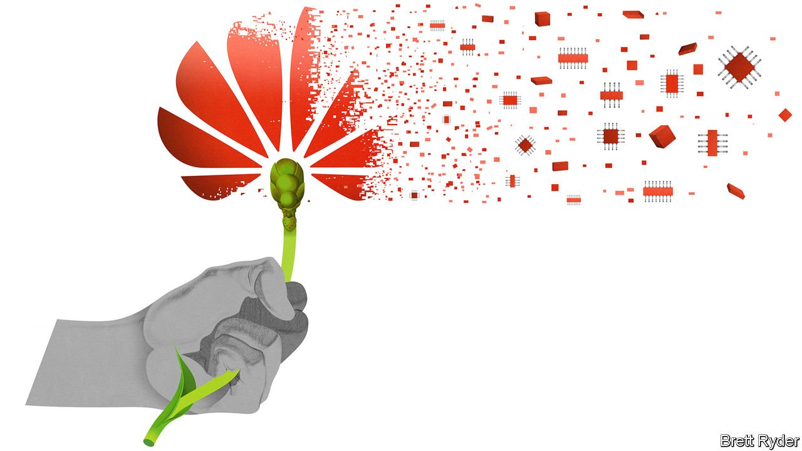

###### Schumpeter

# Huawei should dissolve, disperse and seed China’s high-tech future 

##### It is too prominent to be able to reinvent itself 

 

> Oct 23rd 2021 

HUAWEI, A CHINESE firm emblematic of the breakdown in Sino-American relations, makes for a perfect business-school case study. Less than two years ago the company, based in the southern boom town of Shenzhen, had not only surpassed Nokia and Ericsson, its Nordic rivals, to become the world’s leading supplier of telecoms infrastructure. It had also overtaken Samsung to become the biggest seller of mobile phones. Like all good case studies, it has vivid characters, from its founder, Ren Zhengfei, a former army officer and engineer, to his daughter, Meng Wanzhou, just freed from a starring role in the first prisoner-exchange drama of the tech cold war. It is a groundbreaking firm. Like Japan’s Sony in the 1980s, it helped change the perception of its home country from one of cheap knock-offs to eye-catching innovation. And its very future may be in peril. With the long arm of American law enforcement around its neck, it is being throttled by a lack access to cutting-edge technology, such as 5G smartphone chips.

The question is what Huawei ought to do next. Should it tough out American sanctions and hope, as Victor Zhang, its global vice-president, puts it, that its research and development (R&amp;D) budget, a whopping $21.8bn last year, can “fertilise” a new array of business activities that will redefine its future? Or should it instead quietly break itself up, dispersing a 105,000-strong army of engineers to seed a flurry of new ventures? In short, should it remain a tall poppy or let a hundred smaller flowers bloom?


It is a fairly safe bet that Huawei will take the first option. After all, it is an employee-owned company with a fierce self-belief. It has a never-say-die business culture; its salespeople are renowned for drinking anyone under the table in pursuit of a deal. It could become a national champion for President Xi Jinping’s mission to make the country more self-reliant in technology. And the government in Beijing would hate the idea of it wilting under pressure from Uncle Sam.

The tough-it-out approach is strewn with difficulties, though. Since America’s government branded Huawei’s 5G gear a national-security threat in 2019, and a year later curtailed the firm’s access to chips made with American equipment, its smartphone business, which in 2020 generated more than half of revenues, has cratered. Sales have tumbled from more than 60m units in the last three months of 2019 to about 15m units in the third quarter of 2021, according to Dan Wang of Gavekal Dragenomics, a research firm. In China its latest phones lack 5G connectivity.

Although Huawei remains the world’s number-one supplier of telecoms gear, its sales and market share are shrinking as America’s allies bar it from their 5G networks and other customers fret about its long-term viability. Huawei is putting on a brave face, nonetheless. It is in its “second startup phase”, in Mr Zhang’s words. Each year it pours at least a tenth of its revenues into R&amp;D (in 2020 the share reached almost 16%). This, Mr Zhang adds, will help build up new core ventures. It is expanding in areas from making cars smarter and helping coal mines become semi-autonomous to infrastructure for cloud-computing and regulating power supply in energy markets. None of these opportunities depends on cutting-edge semiconductors.

Promoting that startup culture in-house may work. But the new endeavours do not generate anything like the revenues of Huawei’s smartphone and networks businesses. One analyst describes the coal venture as “a dying company meets a dying industry”. A better, bolder way forward would be to embrace the Schumpetarian creed of “creative destruction”: let the old firm die so that new ones could emerge, dispersing capital, ideas and talent.

Silicon Valley provides a striking precedent. In 1957 the so-called “traitorous eight” walked out of Shockley Semiconductor Laboratory to found Fairchild Semiconductor. The “Fairchildren” became the backbone of the area’s high-tech, risk-taking culture, establishing Intel, a chip giant, and scores of other firms, including venture-capital veterans like Kleiner Perkins. Huawei’s engineers at HiSilicon, its chip-design unit, could do something similar. That could advance China’s growing ambitions in the chip industry, illustrated by the unveiling on October 19th by Alibaba, a tech giant, of a new, custom-built, state-of-the-art server chip.

Huawei has no plans for a HiSilicon spin-off, Mr Zhang says. The firm’s tactical retreat in the smartphone business illustrates what it may and may not be able to do. Last year it sold Honor, a niche smartphone brand, to give it the freedom to evade American export controls. Honor’s new phones now have access to American chips and the software and services of Google, an American tech giant, that Huawei still does not. Despite the backing of Shenzhen’s government, which invites questions about just how entrepreneurial Honor will be, the industry’s reaction to the divestiture has been “really positive” both inside and outside China, reports Ben Stanton of Canalys, a telecoms-research firm. Moreover, he reckons, Huawei’s best smartphone engineers have moved to Honor, keeping alive the older firm’s engineering and sales culture.

Tall-poppy syndrome

Unsurprisingly, Honor has also attracted the attention of America’s foreign-policy hawks, including Marco Rubio, a Republican senator who on October 14th called it an “arm of the Chinese Communist Party” and a foreign-policy threat, and urged President Joe Biden’s administration to blacklist it. This is a reminder of how hard it will be for any firm in Huawei’s shadow to shake off such accusations, whether true or not. Better for its engineers to roam free instead. They are likely to be more creative within small groups than inside a corporation—all the more so if what Mr Wang calls “China’s Sputnik moment” engenders a burst of domestic innovation. Huawei’s liberated brain-boxes may then also teach America a lesson in how counterproductive knee-jerk technonationalism can be. ■


