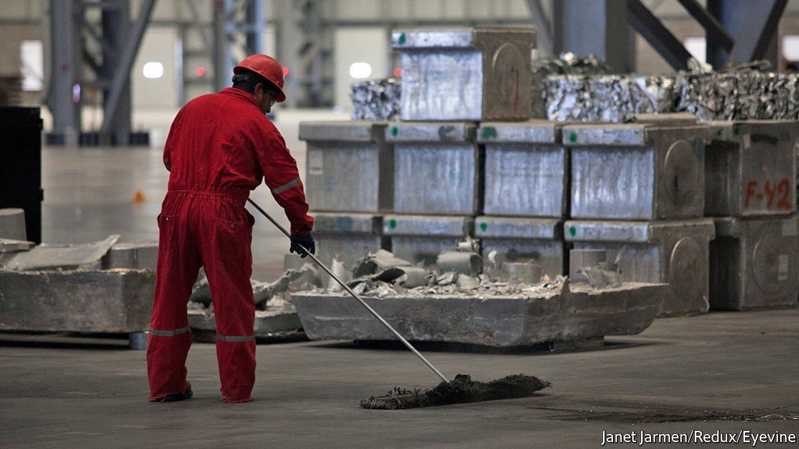

###### Chinese business

# Zhongwang, a Chinese aluminium giant, resists American pressure 

##### But buckle under domestic power cuts 

 

> Oct 23rd 2021 

LIU ZHONGTIAN has been called Asia’s “aluminium king”. His firm, Zhongwang Group, is one of the world’s largest makers of aluminium products. At one point he was the richest man in China’s north-eastern rust belt, where the company is based. In America, Mr Liu has a different reputation. Firms controlled by the 57-year-old were convicted in late August of orchestrating one of the most brazen tariff-avoidance schemes in history. Now his empire appears to be coming undone, not at the hands of American prosecutors but owing to domestic economic woes.

Zhongwang’s long, hollow metal rods are a key component in everything from cars to homes and bridges. They have undergirded China’s building and manufacturing boom. Literally at times: Zhongwang grabbed big contracts with the construction groups behind the 2008 Beijing Olympics and the World Expo in Shanghai in 2010. An initial public offering in Hong Kong in 2009 made Mr Liu one of China’s richest industrialists.


Mr Liu’s fortunes turned in 2019. He was indicted by America’s Department of Justice (DoJ) for running a scheme whereby shell companies shipped in products subject to import duties disguised as crudely welded aluminium pallets. Prosecutors say that Mr Liu arranged for these pallets, 2.2m of which his firm had stockpiled in its American warehouses, to be turned into other things at melting facilities in America. The conviction in August found American firms he controls guilty of trying to evade $1.8bn in tariffs. The sentence, expected in December, may allow the DoJ to go after Zhongwang’s American assets. Days after the ruling Zhongwang froze the trading of its shares in Hong Kong, ostensibly pending the delayed release of results for the first half of 2021.

All debilitating, to be sure. But probably not fatal. The firm remains the world’s second-biggest aluminium-extruder with a vast home market. Disclosure delays are common in Hong Kong and may be unrelated to the DoJ case. And China’s government, itself in a tussle with America over trade and geopolitics, might even help shield Zhongwang from the DoJ’s lawmen.

Then, on October 15th, the firm divulged that two important subsidiaries in China were facing severe difficulties “due to major losses”. Analysts reckon that without a bailout Mr Liu’s group could collapse. The company has offered little explanation. But like many Chinese firms it has been paralysed by power cuts, which could cause the country’s industry to run at 5-10% below its usual capacity until the end of the year. In order to prevent blackouts, local governments are permitting some energy-intensive manufacturers to operate only ten days a month, says Johnson Wan of Jefferies, an investment bank.

Aluminium extrusion requires lots of energy, so power cuts and surging electricity costs have hit Zhongwang hard. Having sold its smelter business in 2020 the firm faces rocketing prices for aluminium, as other smelters raise prices to help offset their own rising bills amid shortages of the metal. As Zhongwang’s home province of Liaoning braces for a bitter-cold winter, manufacturers are in for more disruptions as coal is burned to heat homes rather than produce industrial electricity. For Mr Liu, escaping the clutches of American law must feel like cold comfort. ■


