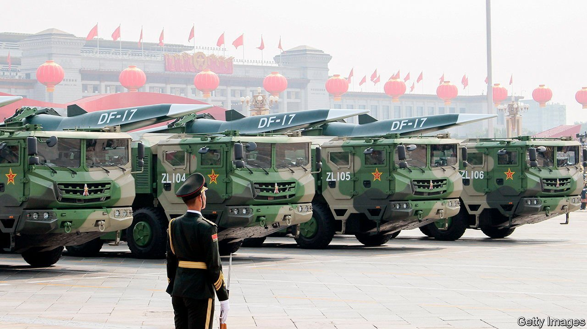
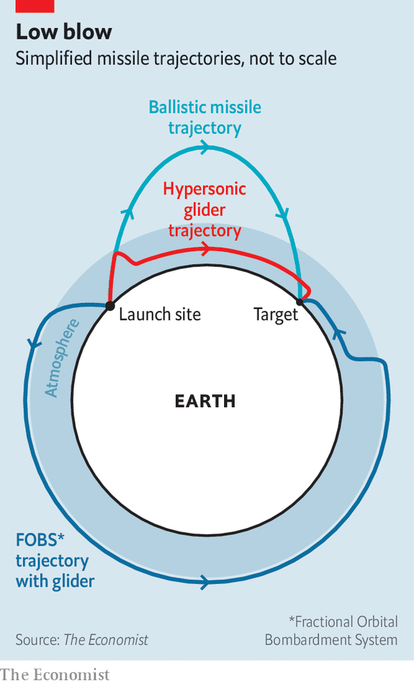

###### Glide and seek

# China’s test of a hypersonic missile worries America 

##### It is the latest front in an emerging nuclear arms race 

 

> Oct 23rd 2021 

IN LATE JULY a Chinese Long March rocket streaked into space, much like the dozens that took off last year. But having begun to orbit the Earth, this rocket’s payload then lurched downwards, glided through the upper atmosphere and finally crashed to the ground. American officials were stunned, says the Financial Times, which recently broke news that this had been a test of a nuclear-capable hypersonic glider (China denies it). China conducted another such experiment a couple of weeks later, says the newspaper.

 


The novelty of such gliders is not that they are unusually fast—in some cases, they are slower than an intercontinental ballistic missile (ICBM) as it re-enters the atmosphere—but that they are manoeuvrable. A Russian or Chinese ICBM fired at America travels over the North Pole and high into space, visible to radar systems in the Arctic, and then plunges back down in a predictable way (see diagram).

Gliders are also taken up on rockets but they are released much lower and re-enter the atmosphere very quickly, if they leave it at all, making them less visible to radar. Then they cruise, unpowered, over long distances, allowing them to take convoluted routes that skirt around missile defences. America and the Soviet Union experimented with gliders in the cold war. Many others are doing so today.

China’s tests, however, involved a twist. The gliders did not simply go up and coast down, but also circled the Earth in space. This is similar to the approach employed by the Soviet Union’s Fractional Orbital Bombardment System—fractional because it did not involve a full revolution around the Earth—which was deployed between 1969 and 1983. The advantage of an orbital weapon is that it can go over the South Pole and reach America from a direction where the country has neither ground-based radar nor perfect coverage from infra-red satellites that can spot rocket engines.

The combination of orbiter and glider is not in itself new. America’s old space shuttle and its current X-37B spaceplane are examples of things that are sent up by rocket, go into orbit and then glide back. The difference is that the shuttle was not built to crash to the ground with nukes attached. China appears to be the first to turn this combination into a prototype of a weapon, says Tong Zhao of the Carnegie-Tsinghua Centre for Global Policy in Beijing.

China’s motivation for doing this may, in part, relate to America’s development of missile defences, which intensified after the administration of George W. Bush withdrew from the Anti-Ballistic Missile treaty in 2002. China and Russia are building ever more exotic nukes to ensure that their missiles can penetrate any current or future American defences.

The growing geopolitical and military competition between America and China seems to have turbocharged China’s nuclear ambitions. Earlier this year, researchers discovered two large fields of suspected ICBM silos in northern China. All this reflects not just narrow military calculations, but political ones, too. China, suggests Mr Zhao, believes that nuclear strength “helps force the US to accept peaceful co-existence”. ■

