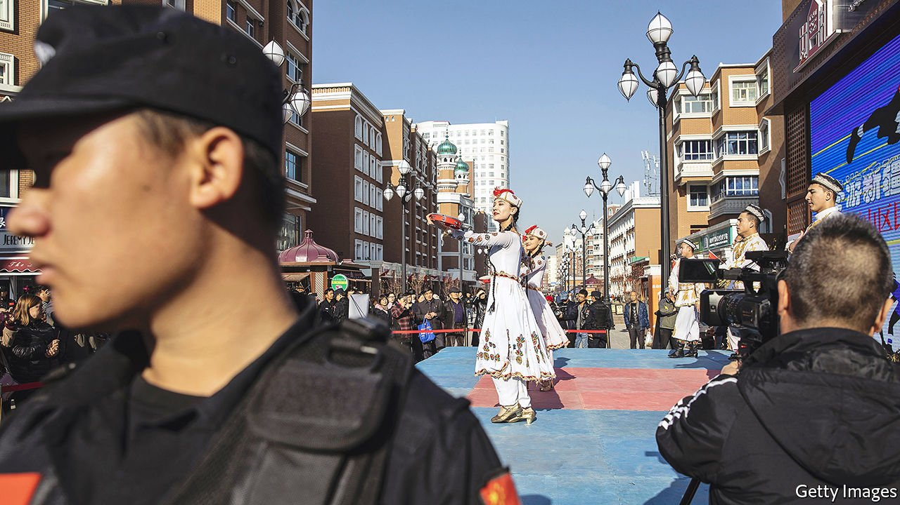

###### Poetry from the gulag

# In Xinjiang, officials are trying to stamp out Uyghur identity 

##### Uyghur artists and intellectuals are being rounded up, but some of their work escapes 

 

> Oct 21st 2021 

OFFICIALS IN XINJIANG have always been suspicious of the distinctive cultural identity of ethnic Uyghurs. They worry that it may fuel separatist yearnings in the far-western region. But in 2014, as the authorities stepped up their campaign to crush terrorism there, the government still tolerated displays of pride in Uyghur culture. In October that year a new talent show, “The Voice of the Silk Road”, aired on state-owned Xinjiang Television. It featured songs in various styles, from pop and R&amp;B to traditional muqam music with lyrics influenced by classical poetry. The judges mostly spoke in Uyghur.

When China began to open up in the late 1970s, after the death of Mao Zedong, Uyghur culture was allowed to flourish, as long as it avoided any hint of support for a separate Uyghur state. Uyghur writers produced poems and songs filled with universally familiar themes such as love and loss, but also conveying pride in their identity. They created innovative blends of muqam with rock and hip-hop that turned a few Uyghurs into household names in China. Songs in such styles were aired on “The Voice of the Silk Road”.


There was nothing politically edgy about the show. It was merely a regional adaptation of a national hit, “The Voice of China” (which is still running). But it fell victim to a security clampdown, launched in response to sporadic attacks by Uyghurs on Chinese belonging to the ethnic-Han majority. Since 2017 some of the show’s stars have disappeared into a vast new gulag in which more than 1m people, most of them Uyghurs, have been locked up.

Officials say the camps offer “vocational education” to help Uyghurs find better jobs and to curb their “extremist” tendencies. But many of those detained have shown no more sign of extremism than simply being devout Muslims. Often, as with those involved in “The Voice of the Silk Road”, their crime has been to show too much enthusiasm for Uyghur culture, not necessarily just Islam.

Those rounded up who were linked with the show include Zahirshah Ablimit, who came second in the competition of 2014, and Muhtar Bugra, a businessman and poet who was its financier and head producer. Both were eventually released. Still thought to be inside are Memetjan Abduqadir, another producer who is also an actor and singer, and Mekhmutjan Sidiq, the director of Xinjiang Television.

Uyghur groups in the West reckon that the four are among nearly 400 intellectuals and cultural figures who have been detained in the new camps, sent to regular prisons or who have otherwise disappeared since the clampdown began. Some are well known in the region: Perhat Tursun, a novelist and poet; Tashpolat Tiyip, the president of Xinjiang University; Rahile Dawut, a scholar of Uyghur folklore; and Ablajan Ayup, an actor and singer sometimes described as a Uyghur Justin Bieber. Others associated with Uyghur culture have been paraded on state television praising the virtues of the Communist Party or singing patriotic songs.

The chill had begun even before the airing of the first episode of “The Voice of the Silk Road”. In September 2014 Ilham Tohti, a revered academic with moderate political views, was sentenced to life in prison for separatism. Mr Tohti had maintained a website that hosted writing by Uyghur intellectuals on social and cultural issues. He had dared to call for more enlightened official treatment of his ethnic group.

Today the only Uyghur culture allowed in China is of a token kind, conforming to a stereotype endorsed by the party such as smiling Uyghurs wearing brightly coloured traditional costume, dancing in public squares and singing, often in Mandarin. On September 29th, at a side event during a meeting in New York of the UN General Assembly, Chinese diplomats showed a video of such performances. It was called “Xinjiang is a Wonderful Land”.

Uyghurs living in exile in the West have been waging a parallel campaign to keep their culture alive. It has involved airing the works of underground artists in Xinjiang whose songs and poems explore more politically risky themes such as oppression and alienation, says Mukaddas Mijit, a specialist in Uyghur music living in France. As repression has tightened, she says, the works of such musicians and poets have become increasingly suffused with lament and despair.

Some writing has even emerged from the camps, such as poetry by Abduqadir Jalalidin, an academic. His verses were memorised by other inmates who relayed them to the outside world. “In this forgotten place I have no lover’s touch”, one begins. “Each night brings darker dreams, I have no amulet / My life is all I ask, I have no other thirst / These silent thoughts torment, I have no way to hope.” The translation is by Joshua Freeman of Princeton University, a former student of his.

In 2022 a novel by Mr Tursun, one of the detained writers, will be published abroad in English. Called “The Backstreets”, it first appeared online, in Uyghur, in 2013. The surreal fable echoes Ralph Ellison’s classic novel “Invisible Man”, about a black American who does not feel fully seen (Mr Tursun was influenced by Ellison). On a street in Urumqi, Xinjiang’s capital, the narrator meets a man who vows to “chop” to death everyone in southern Xinjiang, a mostly Uyghur area. The man vanishes into the fog and the narrator muses: “I would always be the one he was going to chop, even though we didn’t know each other.”

Mr Tursun’s writings and links with other cultural personalities in Xinjiang may have led to his detention in 2018 and his reported jail term of 16 years. A public figure in Urumqi, his politics had once been officially acceptable. He had even criticised Uyghur ethno-nationalism.

But displays of loyalty to the party are no longer enough to keep people safe. In 2017 Shireli Eltekin, a famous singer, released “A Song for Leader Xi Jinping”, a paean to China’s president. It includes fawning lyrics such as: “You put light into the hearts of the people.” Uyghurs in exile were dismayed to hear a much-loved performer crooning for the regime. But one night in June he was taken away from his home in his pyjamas, says a family friend.

In 2018 “The Voice of the Silk Road” was discontinued.It returned last year, with changes. Introducing the new series, the host made approving remarks about building socialism in Xinjiang and loving the party. In this year’s competition, the first contestant to take to the stage sang a Uyghur-language song from the 1950s called “Leader Mao Zedong”. In the show’s early days, this would have been “unimaginable”, says Elise Anderson of the Uyghur Human Rights Project in Washington, an American ethnomusicologist who competed in the inaugural series of “The Voice of the Silk Road” in 2014.

Such popular entertainment used to suggest at least some official acceptance of Uyghur culture. Now it is evidence of its suppression. Ms Anderson worries that, inside China, “only a Potemkin version” may survive. ■

An early version of this article was published online on October 20th 2021

