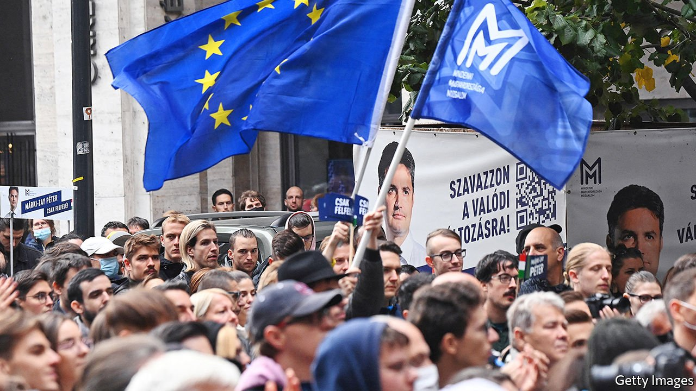

###### The unexpected challenger

# A small-town mayor takes on Hungary’s prime minister, Viktor Orban 

##### Peter Marki-Zay has unexpectedly won the opposition primary 

 

> Oct 21st 2021 

UNTIL A FEW weeks ago only political junkies knew who Peter Marki-Zay was. That changed with his unexpected victory on October 17th in the run-off of the first-ever primary for the Hungarian opposition. The 49-year-old mayor of Hodmezovasarhely, a smallish and almost unpronounceable town in south-eastern Hungary, was elected by supporters of six parties as their candidate to try to replace Viktor Orban, Hungary’s prime minister, at parliamentary elections next April.

“We won the battle, but we need to win the war,” said Mr Marki-Zay, a conservative Catholic not affiliated with any party, at a rally in Budapest. Several politicians stood next to him, as did several relatives (he is a father of seven). Notably absent was his rival, Klara Dobrev, a vice-president of the European Parliament. Ms Dobrev merely acknowledged her defeat and pledged to support Mr Marki-Zay in his quest to remove Mr Orban from power.


Ms Dobrev won the first round of the primaries last month and Mr Marki-Zay had come third after Gergely Karacsony, the mayor of Budapest. Yet (after some hesitation) Mr Karacsony withdrew in Mr Marki-Zay’s favour. Both reckoned that Ms Dobrev could not beat Mr Orban, mainly because she is married to Ferenc Gyurcsany, a wildly unpopular former prime minister who faced riots in 2006 after revelations that he had repeatedly lied about the state of the economy.

Now comes the harder part. The six opposition parties that range from leftist and liberal parties such as Momentum and Democratic Coalition to Jobbik, a former far-right party that has become more moderate in recent years, need to maintain their united front. As well as electing a common candidate for prime minister they have picked one unified candidate for each of Hungary’s 106 constituencies. But even before the run-off they had started bickering. The small-town mayor accused Ms Dobrev of blackmailing politicians into voting for her. Ms Dobrev accused Mr Marki-Zay of methods reminiscent of Mr Orban and Donald Trump.

The opposition still needs to do a lot to win a majority, especially in smaller cities, says Robert Laszlo of Political Capital, a research outfit in Budapest. Forging a single joint list for the 93 proportionally elected seats will be the main source of conflict, he predicts; but he also worries about a fight for dominance between the allied parties. Moreover, Fidesz, the party of Mr Orban, will do whatever it can to drive wedges between the allies.

Mr Orban, who controls a two-thirds majority in parliament, will use every tool in his box to defeat his rival. He would have preferred to fight Mr Karacsony or Ms Dobrev, as the claim that the opposition is a puppet of Mr Gyurcsany will not be effective against a rural, conservative mayor. He will probably attack Mr Marki-Zay’s hectic manner, his unpredictability and his penchant for long speeches. He will no doubt label him an “American agent”, since he once worked for a car-parts firm in America, and that is all the evidence a conspiracy-monger like Mr Orban needs.

The prime minister is diligently wooing voters with their own money. He promises to send $2bn on a tax refund for families early next year. Pensioners will get a special bung in November and two weeks of extra state-pension payments in January. The minimum wage will rise.

Mr Orban’s friends control most media outlets. He can also count on the support of the various oligarchs who became rich on his watch. Yet despite all the prime minister’s advantages, polls put his challenger neck-and-neck with him. If the opposition alliance wins, Mr Marki-Zay has promised to mend fences with the European Union. He wants Hungary to join the European Public Prosecutor’s Office, which can investigate the theft of EU funds—a huge problem in Hungary. He also wants to prepare his country to adopt the euro.

Mr Marki-Zay has already surprised observers twice, first by winning the mayor’s office in a town previously loyal to Fidesz, and then by prevailing in the primary. A third upset—beating the man who made Hungary a byword for demagoguery—will be harder still. But it is not impossible. ■

