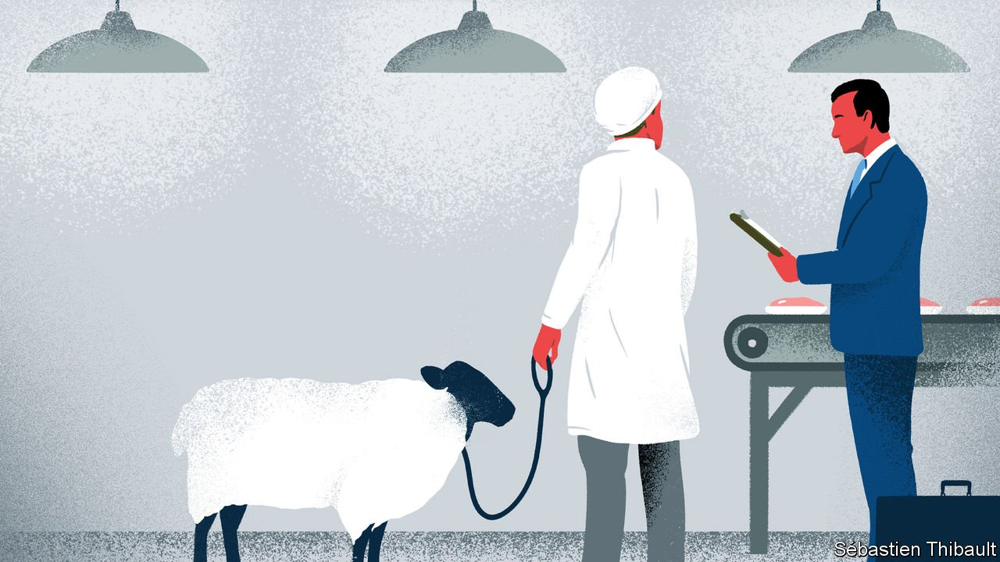

###### Trouble and knife

# Europe is in a muddle over ritual slaughter 

##### A patchwork of conflicting laws leaves Jews, Muslims and vegans confused 

 

> Oct 21st 2021 

EUROPE’S BUREAUCRATS are not usually shy about prescribing how exactly to prepare and present food. Yet there is one ultra-sensitive matter they prefer not to touch: whether Jews and Muslims should be allowed to slaughter animals as their faith usually requires, with just a swipe of a super-sharp knife that causes blood to cascade from the veins. American bodies that promote religious freedom have called the legal mess disgraceful; animal-rights activists and secular-minded organisations agree, for exactly opposite reasons.

A mess there is. Most EU members allow a religious exception to the general rule that animals should be stunned before slaughter. But Denmark, Sweden and Slovenia do not. Finland says that slaughter and stunning can be simultaneous. The Dutch decree that the animal must not be sentient for more than 40 seconds after its throat being cut. In fractious Belgium, the Dutch- and French-speaking regions ban non-stun slaughter. Administratively separate Brussels, where many ethnic Moroccans live, has no such ban. This has prompted lawsuits by Jewish and Muslim groups; the latest has just been rejected by Belgium’s constitutional court. Two Muslim bodies may take the matter to the European Court of Human Rights.


Jewish groups were also disappointed when, on October 5th, the European Commission laid out a strategy against anti-Semitism. While proposing ways to foster Jewish life and promote Holocaust remembrance, it ducked how to guarantee time-honoured Jewish customs, says Pinchas Goldschmidt of the Conference of European Rabbis. By refusing to spell out a right to kosher slaughter, Europe’s institutions are sending an unfriendly message to Jews already fretting over their safety, says the rabbi. “This has more to do with two-legged animals than four-legged animals,” he says. Bans on religious slaughter have a dark history in Europe: they were imposed in Switzerland in the 1890s to stop Jews immigrating and in Germany in the 1930s to make them leave.

In Britain, where halal food is big business, the authorities are prevaricating. Religiously slaughtered meat should at least be clearly labelled so that the non-religious, as well as the devout, can follow their consciences, says Stephen Evans of the National Secular Society.

