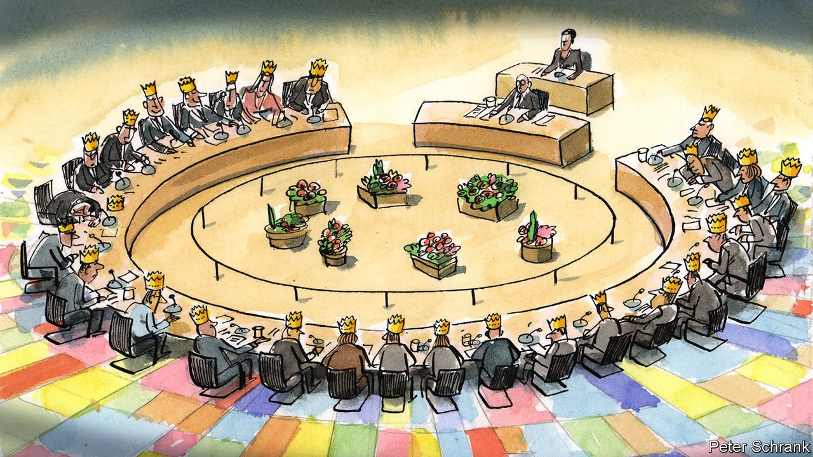

###### Charlemagne

# In the EU, every leader becomes a monarch 

##### The European Council hands leaders too much power 

 

> Oct 23rd 2021 

CORONATIONS HAVE taken many forms throughout European history. Spanish kings received a golden apple. French kings were doused in sacred oils from the Holy Ampulla in Reims. Napoleon went for a variation on a theme, oiling up and then crowning himself in the presence of a pope. Polish kings endured the alarming spectacle of waking up to an archbishop in their bedchamber on the big day.

Coronations of a different sort happen whenever the EU’s 27 leaders gather for the European Council, the club’s top institution, which began a two-day summit on October 21st. The Europa Building—a glass cube encasing a fluorescent oval nicknamed the “space egg” which hosts the gathering—may lack the pomp of Reims cathedral. Yet once presidents or prime ministers enter the ovum, they in effect become elected monarchs. For the next few hours, each leader abides by a royalist creed: l’état, c’est moi, with 27 national governments reduced to 27 individuals.


Invented in 1974 as an informal gentlemen’s dining club (it was all gentlemen, back then), the European Council was a place for leaders to discuss continental issues in private. It sat outside the EU’s treaties. Valéry Giscard d’Estaing, the French president who invented the forum, christened it with a regal flourish: “Le Sommet est mort. Vive le Conseil Européen!” (The summit is dead, long live the European Council). Skip forward five decades and it stands as the most powerful EU institution, settling every major question, whether constitutional or merely controversial.

As a result, the European Council hands vast powers to the individual leaders who sit on it. For some countries this is no big deal. In France, Emmanuel Macron sits atop a system that hands the president huge powers compared with his fellow leaders. For those with weaker executives, it is awkward. Italy has a carousel of changing leaders, with some there through talent and others via dumb luck. It has rattled through eight heads of government in Angela Merkel’s 16 years as German chancellor. In an intimate setting like the European Council, where personality collides with power, this is a weakness. Why cut a deal with someone, if he or she will be replaced in a few months?

Unlike an actual king, EU leaders do have to worry about voters and parliaments at home. Sometimes this is tactics. Conjuring up the spectre of frothing MPs at home is a good way of winning concessions from peers. Some parliaments, particularly Scandinavian ones, do keep their leaders on a short leash—a tactic legislators in other countries would do well to follow. All leaders are aware of each others’ domestic constraints.But the European Council exists to forge compromise. How to reach it ultimately comes down to the individuals at the table.

Once a decision is taken by the individual leaders, it is difficult to unpick. If 27 have agreed to do it, then 27 have to agree to undo it. Inertia is a powerful force in EU politics. Once the club sets off in a certain direction, it is hard to stop. For that reason, the European Council is supposed to be far-sighted, like a company board. While the EU’s management does the day-to-day, heads of government should meet a few times a year to set the general direction. A few sentences are usually enough for the grandest schemes. Huge proposals, such as monetary union, begin life as a few lines in a European Council communiqué.

The European Council is explicitly not a legislator, according to the EU’s treaties. Yet it increasingly finds itself in effect producing laws. Line-by-line haggling once reserved for major constitutional moments such as treaty change is now common when devising specific policies. In July 2020 leaders spent five days locked in argument over €1.8trn ($2.1trn) of spending, including the make-up of a €750bn package of new jointly guaranteed debt. Fractions of a percent of gross national income were fiddled with until the early hours. Since the European Council’s conclusions are seen as a royal proclamation, it gives little leeway for the EU’s actual legislators to fiddle again, if instructions are too specific.

To its defenders, the European Council is the most democratic EU institution. Leaders are household names. But the EU suffers from an attention deficit rather than a democratic one. On paper, the EU is a parliamentary system: an executive is beholden to a directly elected chamber, while national governments act collectively as co-legislators. Summits suck attention, and with it legitimacy, from the rest of the system, where MEPs and ministers grind out EU law. Leaders would rather do it themselves than delegate. The upshot? More meetings. In the 1990s, leaders gathered three or four times a year; in the 2010s, they met twice as often. If able to muster via video, the temptation is to convene even more.

King for a day

Even the format of summits has drawbacks. The European Council is nimble, but narrow. The largest states shrink to the small clutch of advisers who make the trip. Decisions are made in deliberately stressful circumstances. Summits start late and end late because physical exhaustion mixes with social pressure to get deals over the line. It embeds the misleading idea that progress in the EU is possible only in crisis, even if artificially created. A tool that works well in emergencies is relied on for the everyday, a bit like using a fire extinguisher to fill a kettle.

Since individuals wield so much power, personality counts for a lot in the court of kings. France under François Hollande was rather meek. Mr Macron is happiest performing in a continental arena, pushing French ideas onto a much wider realm. Sheer force of character can lend even the smallest country clout. In such a forum a change of personnel can lead to a change of policy. The departure of Mrs Merkel, who this week was attending what may be her last such meeting, will change the dynamic at the EU’s top table. Another monarch will be along soon enough. The queen is dead. Long live the next one. ■

