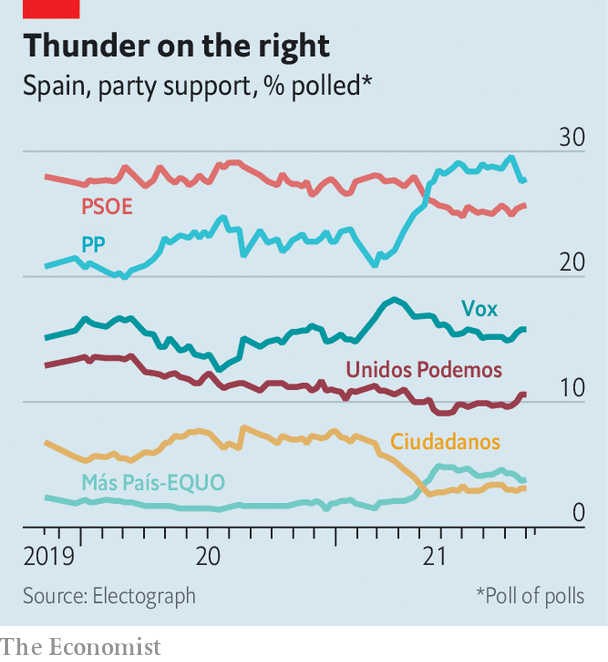

###### Liberty lady

# Isabel Díaz Ayuso, the new hope of Spain’s right 

##### Where will Madrid’s leader go next? 

 

> Oct 21st 2021 

WHEN OWNERS of cafés and bars in Madrid wanted to honour the regional boss, Isabel Díaz Ayuso, after the hardest months of the pandemic were over, several offered dishes a lo Ayuso, con dos huevos, or with two eggs; a reference to the expression’s other meaning: “with a pair of balls”.

Ms Ayuso is riding a wave. In 2019 she was elected president of the Madrid region (including the city and surrounding towns, with 6.6m people), representing the centre-right People’s Party (PP). Just a year later she faced a brutal first wave of the coronavirus, and heavy criticism for its toll on Madrid. Nonetheless, over the ensuing year, she fought to keep the region’s businesses open—earning the gratitude of madrileños such as those bar owners. Today her face adorns signs in shops (“We Are All Ayuso”), and even socks depicting her as a Catholic saint.


Most important, in a snap election in May (after a falling out with her coalition partner), she romped to a second victory. The Socialists, who lead the national government, limped to third place. Pablo Iglesias, the leader of Podemos, a radical-left party that governs with the Socialists nationally, took a risk and left the cabinet to fight the Madrid elections. His fifth-place result led him to quit politics.

Ms Ayuso’s victory came with a slogan simple to the point of crudity: “Liberty or communism”. But freedom is a note she sounds again and again. “Madrid is liberty, or else it isn’t Madrid,” she tells The Economist, returning to the theme no matter what she is asked about. Madrid prospers when people are left alone to run businesses, do with their property as they will and live as they choose. Asked what government can do besides get out of the way, her answer is to give people more freedom of choice, for example in work schedules.

This is reflected in her economic policy. Her chief economic adviser, Javier Fernández-Lasquetty, gives credit to €53bn ($62bn) worth of tax cuts since 2004 for helping bring Madrid’s once-sluggish growth rate above the national average. Madrid now has Spain’s biggest regional economy, ahead of Catalonia’s. In early September she scrapped the region’s last independent tax, making it the only region under Spain’s usual fiscal arrangements to lack any such levies. She praises economic rivalry between Spain’s regions: “When has competition ever been a bad thing?”

This has led to carping. Ximo Puig, the Socialist president of Valencia, complained recently that Madrid’s position as the capital brought jobs its government had done little to earn, allowing it to engage in “fiscal dumping”. Ms Ayuso retorts that “this is the discourse of the politicians who cross their arms and do nothing.” Neutral observers note that Madrid has been the capital since the 16th century; its economic rise is far more recent.

The party has seemed unsure how to handle its rising star. When she said she would run for the PP presidency in Madrid, the leadership acted startled, saying the regional party should be run by someone not also running a government. Ms Ayuso quipped: “I’m a woman and can do two things at once.” (In every other region the PP governs, the jobs are held by the same person.) The press pitted her against Pablo Casado, the PP’s national leader, in a trivial spat that lasted weeks.

 


Mr Casado’s attacks on Pedro Sánchez, the prime minister, are wearyingly predictable. His party leads in many polls (see chart), but Mr Casado’s own ratings are poor. By contrast, Ms Ayuso is spontaneous and genuine, meaning that she makes headlines, if also gaffes. Asked whether she supported Mr Sánchez’s proposal to ban prostitution, her criticism of the government included the line “They only want to destroy jobs.” But her moment in the spotlight has led to speculation about a national future. For a time she did little to discourage it. She opened a Madrid office tasked with exploiting the global standing of Spanish to boost business, something more appropriate for the national government. Her repeated wanderings into issues beyond the remit of a regional leader—and a trip to Washington and New York to meet politicians and think-tankers at the height of the PP’s internal spat—fuelled talk about her ambitions.

At the party’s recent conference in Valencia, though, she pointedly thanked Mr Casado for assisting her career, and said “My place is Madrid.” This will not end speculation. Unlike some of the party’s barons, she comes from the middle class and has risen far. Critics who say she is no intellectual nonetheless concede her cleverness. Others say she was lucky, rather than brilliant, to share madrileños’ desire not to be ordered to stay at home in the pandemic. Just 43, childless, churchless, single (so “you can tell the market is bare,” she has joked) and even bearing a tattoo on her forearm, she is hardly an obvious leader of Spain’s traditional conservative party. But she proudly declares herself a liberal, not a conservative, saying the PP has room for both. Madrid is her place for now. But Spaniards are watching to see whether her style has room to grow. ■

