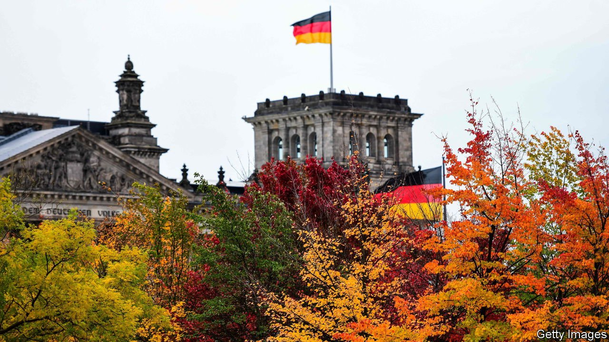

###### Green-lit

# Olaf Scholz’s “traffic-light” coalition is taking shape 

##### The broad outline has been agreed; details still to come 

 

> Oct 23rd 2021 

ONE THING seemed clear during Germany’s topsy-turvy election campaign. Whatever the result, the negotiations required to form the first government of the post-Angela Merkel era would be complex, difficult and extremely long. A fragmented electorate was likely to force Germany into its first three-way coalition since the 1950s, binding together parties previously united only by distrust and disagreement. Mrs Merkel, mused some, would have to don one of her famous coloured blazers for one last New Year’s speech as chancellor, as the coalition talks ground into January.

The election result was indeed messy. Yet less than a month later matters have progressed more smoothly than anyone dared hope. The Social Democrats (SPD), who won a narrow victory over Mrs Merkel’s conservative Christian Democratic bloc, are discussing a “traffic-light” coalition (the name comes from the parties’ colours). with the Greens and Free Democrats (FDP), a pro-business outfit. The parties’ negotiators spent a week huddled in a Berlin exhibition hall thrashing out their differences. So far, they appear to have got along swimmingly.


On October 15th the three parties issued a 12-page paper with the results of their deliberations so far. The FDP, the odd man out in what will otherwise be a left-leaning coalition, has won guarantees of no tax rises on personal or corporate income, and that Germany’s deficit-limiting “debt brake”, enshrined in the constitution, will not be touched. These are concessions to reality as much as to the FDP. The progressive parties could not hope to get tax increases or constitutional changes through the Bundesrat, Germany’s upper house.

Seeking to prove that their putative alliance can be more than the sum of its parts, its members are promoting a narrative of “modernisation”. This finds expression in commitments to halve the approval time for infrastructure schemes, accelerate digitalisation, loosen immigration laws, increase R&amp;D spending and reduce the voting age to 16. There are also pledges to boost house building, tackle child poverty and to lift the hourly minimum wage to €12 ($14), the signature policy of Olaf Scholz, the SPD’s candidate for chancellor.

Yet the paper is vague, or silent, on the trickiest issues. Its proposed tweaks to the creaking public-pension system will not suffice to see off a coming demographic crunch. Its ambivalent statement on the European Union’s fiscal rules, over which governments will scrap early next year, “just shows that we couldn’t agree on anything consistent”, says Sven Giegold, a Green MEP involved in the negotiations.

The biggest open question is how the government can hope to fund the huge investments needed for Germany’s promised energy and digital transitions. Pundits are buzzing with ideas, including the establishment of public companies or complex off-budget vehicles. But for now the parties promise merely to “ensure the necessary investments…within the framework of the constitutional debt brake”. Threading this needle may be the trickiest part of the formal coalition talks to come.

Almost 300 negotiators, spread across 22 working groups, will now spend the coming weeks thrashing out the details. Their bosses must manage the delicate question of apportioning government jobs: the FDP and Greens both have their eye on the finance ministry, currently occupied by Mr Scholz. (After the  on October 20th, they must also agree on a new president of the Bundesbank.) All being well, the parties will conclude a formal coalition agreement—likely to be the length of a small book—in December. Assuming it is approved by the Green membership, and perhaps that of the SPD, Mr Scholz will be granted his wish of being anointed chancellor before Christmas, and Mrs Merkel hers of leaving her blazer in the wardrobe on December 31st. ■

For more coverage of the German elections, visit our dedicated 

