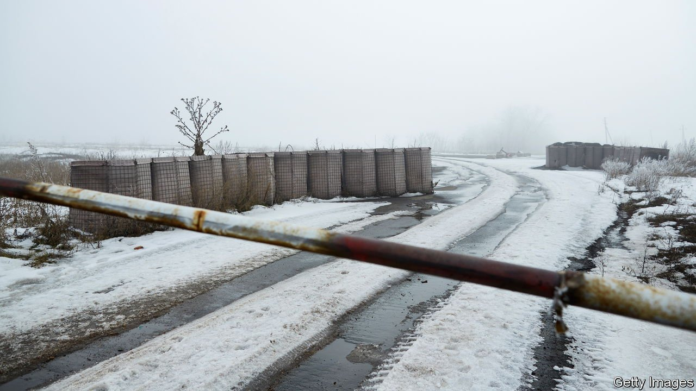
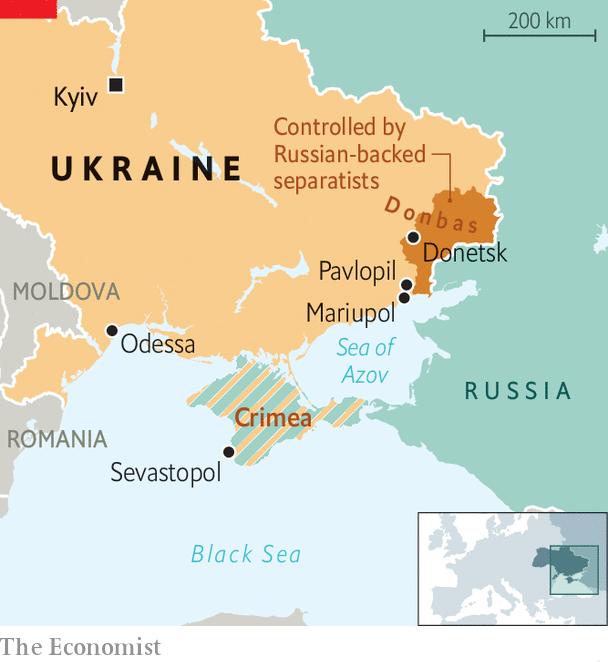

###### Winter is coming

# Ukrainians are coping stoically with Russian aggression 

##### But Vladimir Putin’s gas diplomacy terrifies them 

 

> Oct 21st 2021 

AS AN ICY wind rattles the windows of his office, Sergei Shapkin dips a biscuit in honey and ponders the art of survival. He is the mayor of Pavlopil, a village in eastern Ukraine. When Vladimir Putin started grabbing Ukrainian territory in February 2014, Mr Shapkin knew his village was in danger. On one side were pro-Russian separatists, armed by the Kremlin. On the other were loyalist forces. If they fought over Pavlopil, villagers would die.

So Mr Shapkin, a cardigan-wearing former history teacher, talked to the men with guns. His village was of no strategic value, but it had shops. He suggested that the separatists enter in the morning, unarmed and on foot, to buy food and cigarettes. The Ukrainian army could do the same each afternoon. That way, they would not bump into each other and start shooting. It worked—there was no fighting in Pavlopil, and the locals stayed alive, apart from one whose tractor hit a mine.


Ceasefires have come and gone since September 2014, and sporadic shooting continues in eastern Ukraine. Just on October 12th, the day of an EU-Ukraine summit in Kyiv, monitors counted nearly 300 ceasefire violations, including 77 explosions. “Everyone has a shelter,” says Mr Shapkin. “We’re all prepared with candles, hammers and torches. And we all have bags packed in case we suddenly have to move.”

Mr Putin wrote an essay in July expanding his argument that Russia and Ukraine are a single nation. Since he has already annexed Crimea, a Ukrainian peninsula, and sponsored the takeover of a big chunk of eastern Ukraine by ethnic Russian separatists, Ukrainians take his threats seriously. In March and April he massed  on the border, before pulling them back. Now, as winter approaches, Ukrainians have another worry: that Russia will turn off the gas again.

In 2009 it shut off the flow of gas through Ukraine for two weeks. This cost Russia a fortune, since its gas needs to pass through Ukraine to reach customers in Europe. Soon, though, it may be able to pump gas to Germany via a new pipeline, , that bypasses Ukraine. Once it opens—which could be soon, though it is subject to legal and diplomatic challenges—Mr Putin will be able to choke off supplies to Ukraine almost at will.

Technically Ukraine does not buy gas directly from Russia, but from downstream countries such as Hungary. In reality, it takes Russian gas in the east and substitutes its own gas, which is produced in the west of Ukraine, for transmission onwards. So if the flow through Ukraine were to stop, the east of the country would be in trouble. “We’re gas hostages,” says Vadim Boichenko, the mayor of Mariupol, a port city 25km south of Pavlopil.

On October 12th in Kyiv Ursula von der Leyen, the president of the European Commission, assured Ukrainians that Europe would protect their energy independence. They are not reassured. President Volodymyr Zelensky seeks shelter for his country inside NATO and the EU. But this is a non-starter. NATO members do not want to extend their principle of “an attack on one is an attack on all” to a country Russia has already attacked. And the EU has enough trouble integrating corrupt ex-communist states such as Hungary without admitting a grubbier, bigger one like Ukraine.

Trust is lacking on both sides. Mr Zelensky’s first taste of geopolitics was when President Donald Trump urged him , with a veiled threat that American support for Ukraine’s security might depend on it. President Biden has not been much better, from a Ukrainian perspective. To cement relations with Germany, in May  that might have blocked Nord Stream 2.

 


The West would like to support reform in Ukraine, but it is not easy. Corruption is rife. Oligarchs dominate the economy, control two of the bigger political parties and put other lawmakers on retainer. The IMF hesitates to throw money at a state from which billions have been stolen with apparent impunity.

The oligarchs are entrenched in public life in complex ways. Consider Mariupol, which nearly fell to pro-Kremlin forces during the war. The conscripts who were supposed to defend it were about to flee. The city was saved when the local steel baron, Rinat Akhmetov, urged his staff onto the streets and another oligarch, Ihor Kolomoisky, armed a militia. Seeing that the militiamen were ready to fight, Ukrainian soldiers stayed, too. Since then, Mariupol has become a haven for fugitives from the fighting: 100,000 out of a population of 540,000. The city looks far nicer than it did in 2014. Hefty investment has improved its buses, roads, parks and rubbish collection. A new airport and university are planned.

Public opinion has shifted, too. Before the war two-thirds of people in Mariupol supported a pro-Russia political party. That share has fallen by half. Mr Putin’s aggression has alienated the people he claims to defend. So the kind of “hybrid warfare” that worked in Donbas, where Russia stirred up local ethnic Russians to demand secession, will not work in Mariupol, says Mr Boichenko. Yet Russia still has a hand on Mariupol’s throat. The amount of cargo processed in its port has fallen by half since 2012, first because of the war, then because Mr Putin made it harder for big ships to reach it from the Black Sea. Critics wonder if it is healthy for a city to depend so much on one tycoon. Mr Akhmetov is said to be Ukraine’s richest man.

Mr Zelensky, a former comedian, has vowed to cut Ukraine’s oligarchs down to size. He is expected to sign a new law soon that would allow a panel he appoints to label as “oligarchs” anyone who is very rich, finances a political party and controls media assets. This would make it harder for anyone so labelled to raise capital.

Critics note that Mr Zelensky has close ties to Mr Kolomoisky, one of the most controversial oligarchs, whose television channel hosted the show that propelled the president to stardom. They worry that the law might give Mr Zelensky too much discretion to cow his enemies and force them to sell their television channels to his friends. “It’s to make oligarchs behave, politically,” says Daria Kaleniuk of the Anti-Corruption Action Centre, an NGO. “Not to stop them from being oligarchs.”

One illustration of how oligarchs weaken Ukraine is the retail market for gas. Many homes get their gas from companies controlled by Dmitry Firtash, a tycoon with Russian ties who is living in Vienna and fighting extradition to America for alleged corruption. His firms have huge unpaid debts to Naftogaz, the state wholesale supplier. This is money that could have been invested to increase domestic gas production. Meanwhile, a new Naftogaz CEO appointed by Mr Zelensky agreed to pay the state a fat dividend out of the firm’s frosty-day fund. This will help Mr Zelensky build roads, which are popular, but will leave less in the kitty for Ukraine to buy emergency supplies should Mr Putin ramp up his pipeline power politics. ■

An early version of this article was published online on October 17th 2021

