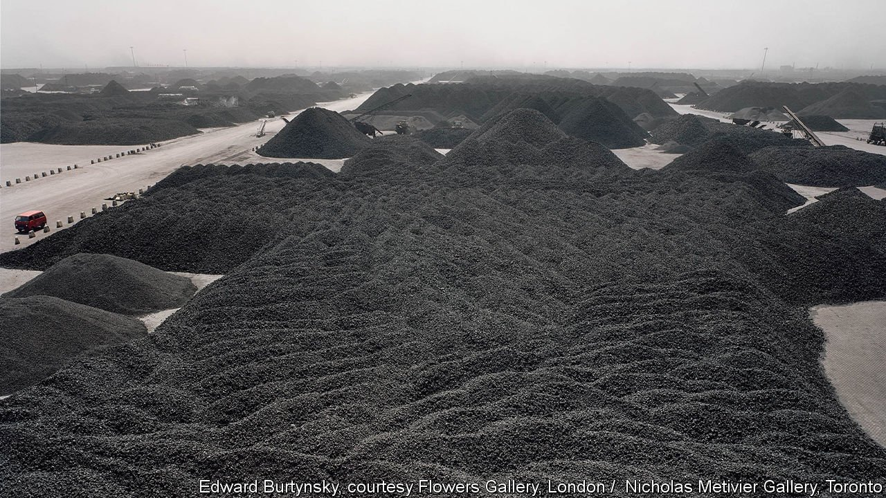
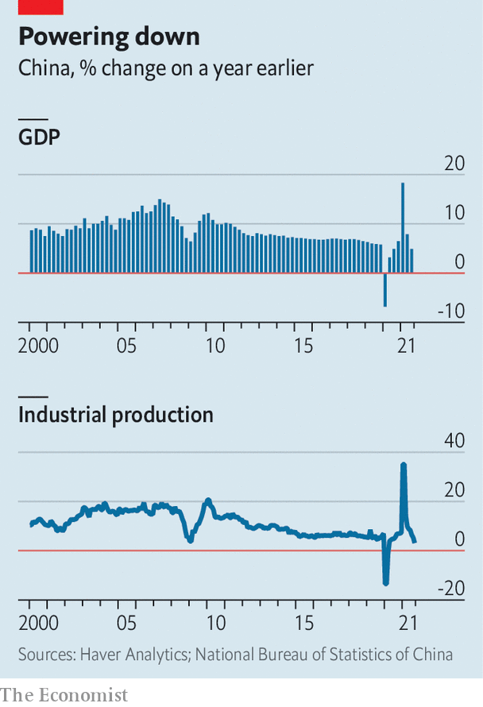

###### From the sublime to the subpar

# A triple shock slows China’s growth 

##### Coal shortages, covid-19 and a construction slowdown all take their toll 

 

> Oct 21st 2021 

IN A SCENE from “Manufactured Landscapes”, a documentary released in 2006, Edward Burtynsky, a landscape photographer, seeks permission to take pictures of the black mountains of Chinese coal awaiting shipment in Tianjin, an industrial city near Beijing. “Through his camera lens, through his eyes, it will appear beautiful,” Mr Burtynsky’s assistant assures his sceptical host. That turns out to be not quite true. Through the photographer’s lens, the piles of coal have a dark, satanic geometry—not beautiful exactly, but awe-inspiring in their immensity.

Looking at those pictures (one of which is shown above), it is hard to imagine China could ever run short of this fuel. But in recent months, the black pyramids have been not quite immense enough. A scarcity of coal, which accounts for almost two-thirds of China’s electricity generation, has contributed to the worst power cuts in a decade. And the blackouts have, in turn, hurt growth. “Our economy is developing very fast,” Mr Burtynsky’s host tells him, so as to excuse the gloom and dirt in the air. But that is not quite true any more either.

 


The Chinese economy has been hit by a triple shock, stemming not only from the power cuts but also the pandemic and a property slowdown exacerbated by the financial woes of Evergrande, a developer. Figures published on October 18th showed that economic growth slowed to 4.9% in the third quarter, compared with a year earlier (see chart). Industrial production expanded by only 3.1% year-on-year in September, slower than in any month during the global financial crisis. More than a year and a half after covid-19 first struck, China is reporting growth rates that were unheard of before the pandemic.


Consider the energy crunch first. The causes of the coal shortage fall into two categories: structural and incidental. The unlucky contingencies include floods in Henan province in July and in Shanxi this month, which forced some mines to close. In addition, in Inner Mongolia, which accounts for about a quarter of China’s coal output, an investigation into corruption has implicated and hamstrung some of the officials who might previously have approved expansions in coal mining. Shaanxi province, China’s third-largest producer of coal, slowed production to keep the skies clear for a national athletics event in September, which President Xi Jinping attended. And coal expansion has also been inhibited by safety inspectors, who have scrutinised 976 mines, after more than 100 industrial accidents nationwide last year.

The deeper reason for the coal crunch is China’s efforts to reduce its dependence on the fuel, which is responsible for a big share of the country’s carbon emissions. The authorities have been reluctant to approve new mines or the expansion of existing ones in recent years, because “it’s clearly driving the bus in the wrong direction”, says David Fishman of The Lantau Group, an energy consultancy.

When supply is tight, prices are supposed to rise, obliging customers to economise on their consumption. But as the price of coal shot up, power stations were unable to pass their higher costs on. The amount they could charge the grid company that buys the bulk of their power could rise only up to 10% above a regulated price, which was changed infrequently. And the tariff paid by end-users was based on a catalogue of prices that was similarly inflexible. Some power stations simply stopped operating, refusing to generate at a loss.

Another shock to the economy came from the pandemic. Outbreaks of covid-19, such as a cluster that began in Nanjing in July, prompted strict, localised lockdowns, depressing retail spending, especially catering, and travel. According to Flight Master, a travel site, airlines were operating at less than half their full capacity in August and at only two-thirds of it in September.

The final shock was to the country’s property sector, a perennial engine of growth, employment, leverage and anxiety. Regulators are trying to curb speculative demand for flats and limit the excessive borrowing of homebuilders. That effort to limit financial risk has brought some existing dangers to a head. Evergrande, huge firm with $300bn in liabilities,  on a dollar bond on September 24th, and has been followed by others. Some homebuyers are now understandably nervous about handing over their cash to any developer who may not be in business long enough to finish the projects they are selling.

Against this backdrop, China’s developers started 13.5% fewer homes this September than they had a year earlier and their sales, measured by floorspace, fell by a similar percentage. China also reported sharp falls in the production of cement (down by 13% in September compared with last year) and steel (which fell by 14.8%).

On October 15th China’s central bank described Evergrande as an idiosyncratic case in a generally healthy industry. That should have been reassuring, except that policymakers will not come to the property sector’s rescue until they are sufficiently worried about its plight. Anxiety among regulators may be a necessary condition for alleviating the anxiety of homebuilders and their creditors.

Most economists think China’s year-on-year growth will slow even further in the last three months of the year. Bank of America has forecast growth of 2.5% in a base case. China will maintain its vigilance against covid-19, and the property downturn has further to run. But one of the three whammies should at least pack less of a punch in the remainder of the year. Power stations, unlike property developers, have won belated relief from higher authorities. Mines have been ordered to expand production. And China’s principal planning body threatened on October 19th to step in if coal prices remain punishingly high, prompting a sharp sell-off of coal futures.

That threat of intervention in upstream pricing followed a big step towards liberalisation further downstream. The government will give power stations more freedom to pass on higher costs to the grid company. It will also force industrial and commercial customers (but not households or farmers) to pay power prices negotiated in the market, not those set down in a catalogue. These reforms have been in the works for a long time. But it took an acute crisis to force the issue. Policymakers might once have preferred a “measured roll-out of market reforms”, notes Mr Fishman. But things changed “when the lights started to go out in factories across the country”. China likes to cross rivers by feeling for the stones. But when a stone gives way, it is time to take a leap. ■

For more expert analysis of the biggest stories in economics, business and markets, , our weekly newsletter.

An early version of this article was published online on October 18th 2021

