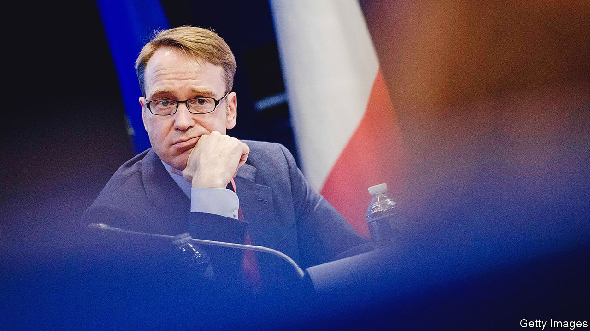

###### Hawk descending

# Jens Weidmann steps down from the Bundesbank 

##### His resignation comes at a delicate moment for the euro zone 

 

> Oct 20th 2021 

IN 2012 MARIO DRAGHI, then head of the European Central Bank (ECB), vowed to do “whatever it takes” to keep Europe’s single currency together. His biggest foe in this endeavour was not the bond vigilantes sending yields spiralling in Greece and Italy—they were soon cowed—but a sceptical colleague. Jens Weidmann, who as head of the Bundesbank was one of the strongest voices on the ECB’s governing council (where central-bank governors from euro-zone members sit), responded to Mr Draghi’s gambit with a homily on the dangers of money-printing drawn from Goethe’s Faust. He threatened to resign.

Nine years later, he has done so. On October 20th, just two years into his second eight-year term as Bundesbank president, Mr Weidmann unexpectedly announced that he would step down at the end of the year. His departing statement, which warned about the side-effects of loose monetary policy, hinted at his unhappiness about the ECB’s bond-buying. Mr Weidmann has long feared that the bank’s activism underplayed inflationary risks and eased pressure on indebted southern European countries to reform.


Such positions often left Mr Weidmann in a hawkish minority. He had hoped to take over from Mr Draghi in 2019, but the EU’s leaders gave the job to Christine Lagarde, a former French finance minister. Mr Weidmann’s unease extended to the ECB’s decision later that year to restart quantitative easing. But he backed the results of the bank’s strategy review, as well as a €1.85trn ($2.15trn) bond-buying programme set up at the start of the pandemic, and Ms Lagarde’s growing focus on climate change. Sharp, well-briefed and courteous, Mr Weidmann found favour even among his doveish colleagues.

Mr Weidmann’s replacement at the Bundesbank will take over at a crucial moment. In December the ECB may confirm that its pandemic purchase scheme will expire in March. But the council is undecided on how much flexibility and firepower to grant an older bond-buying scheme in its place. Beyond that lie deeper divisions over how to interpret inflation, now running at 3.4% in the euro area. Rate rises are not imminent, but unease is growing—especially in Germany, where energy-price spikes are helping push inflation towards 5%.

Germans who valued Mr Weidmann’s leanings lamented his decision. Others say his reluctance to defend the ECB’s policies to a sceptical German public sapped their potency. “A new head of the Bundesbank willing to take on Germany’s conservative consensus would help give the ECB cover in the critical months ahead,” says Christian Odendahl of the Centre for European Reform, a think-tank in Berlin.

Mr Weidmann delayed announcing his decision until after  in September. Appointing his replacement will fall to the next government. Possible names include Isabel Schnabel, a member of the ECB’s board; and Claudia Buch, Mr Weidmann’s deputy. The resignation injects an extra degree of complexity into the coalition talks just beginning in Berlin. ■

For more expert analysis of the biggest stories in economics, business and markets, , our weekly newsletter.

An early version of this article was published online on October 20th 2021

