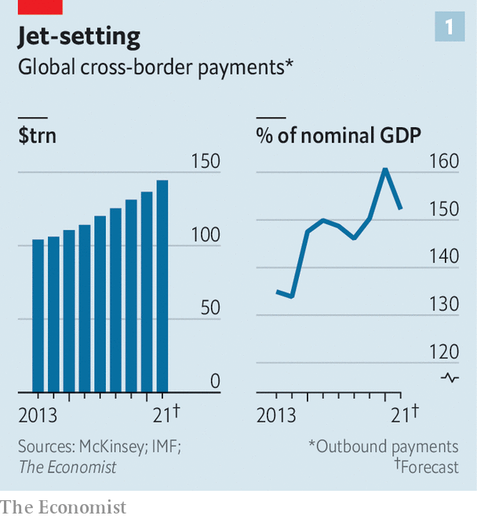
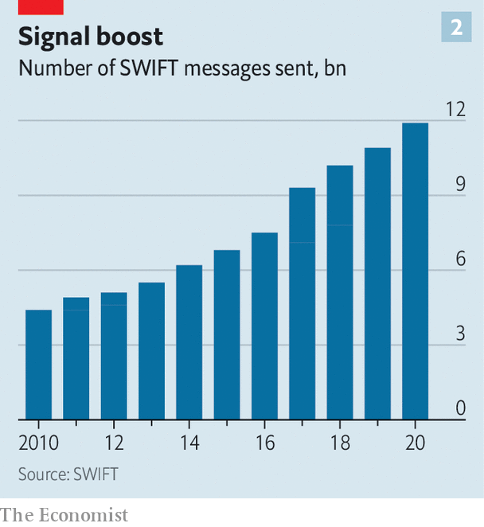

###### Message in a battle

# The race to redefine cross-border finance 

##### SWIFT enabled a surge in global payments over the decades. Now it faces threats from challengers—and is fighting back 

 

> Oct 21st 2021 

IN 1977 A string of 12 characters ushered in a new age of global finance. Until then a bank wiring money abroad needed to relay up to ten instructions on public phone lines, which were then typed into forms, taking time and causing errors. Then payments began to be facilitated by a code and secure network created by the Society for Worldwide Interbank Financial Telecommunications (SWIFT), a club of 500-odd banks. A surge in global trade and investment followed. More than $140trn has been transmitted across borders in the past year, equivalent to 152% of global GDP. Analysts reckon about 90% of that went through SWIFT. Its 11,000 members in 200 countries ping each other 42m times a day.

 


Now SWIFT confronts another financial revolution. Customers want faster payments. Fintechs, banks and governments are vying to rival the network. Facebook is muscling in: on October 19th it began a trial of its digital-currency wallet. SWIFT, for its part, is fighting back. On October 14th it said 100 banks had signed up to SWIFT Go, its high-speed transfer service. It is seeking to link instant-payment networks across countries, in order to make transfers seamless. Whoever wins the race to redefine cross-border payments will determine the future shape of the financial system—and who holds sway over it.


The system of correspondent banking through which cross-border payments flow works like air transport: when two faraway banks do not have a direct relationship, money travelling from one to the other stops over at banks in between. SWIFT provides the radio signal directing the money. The Belgium-based network, which is owned by its members, provides the standards and services that allow firms to exchange information on transactions.

In recent years, however, SWIFT has faced three criticisms. One is that it is technologically backward, making transfers slow and costly. Here the problem lies with correspondent banking, not SWIFT. Time differences and banks’ limited opening hours hold back processing. Checks have intensified along with the fight against dirty money, adding to costs and delays.

Security is another concern. In 2016 North Korean hackers  for the Central Bank of Bangladesh’s account at the New York Federal Reserve and sent transfer requests to various banks. Most were blocked, but $81m slipped through. A third gripe is that SWIFT is no longer a neutral part of the financial plumbing. In 2011 America leant on it to exclude Iranian banks by making various threats, including that of sanctions on the network itself, says a former official close to the talks. SWIFT eventually complied. It also came under pressure to cut off Russian banks after the invasion of Crimea in 2014. Although they remained connected, America’s foes now know that relying on SWIFT makes them vulnerable.

SWIFT has gone some way towards placating its critics. It has bolstered its security defences, and its international governance, it says, reinforces its neutral status. In 2017 it launched SWIFT Global Payments Innovation (GPI), a network that allows banks to process wholesale (ie, high-value) payments more quickly and to track transfers. It now accounts for three-quarters of SWIFT payments. Today 92% of these reach their destinations in less than 24 hours. In July it launched SWIFT Go, a similar service for retail (low-value) payments.

All this may help neutralise the threat from fintech firms. Many do not bypass SWIFT entirely: they aggregate payments at one end and net them off against transactions going the opposite way, so as to make just one, smaller cross-border transfer, and then use fast local networks to channel the money. That means fewer payments and less access to transaction data for SWIFT. Ripple, a more radical disrupter, evades the network altogether, and uses a cryptocurrency to facilitate transactions.

 


Yet fintechs so far play a minuscule role in cross-border payments. Data crunched by FXC Intelligence, a consultancy, for The Economist suggest that the share of cross-border payments by value going through SWIFT has remained broadly unchanged since 2019. The number of messages sent across the network has risen steadily. Ripple, by contrast, has struggled to gain traction. Last year it settled just $2.4bn.

Instead the bigger threats to SWIFT come from bigger beasts.  are building the infrastructure to process retail “push” payments (those initiated by the sender, rather than the receiver, as is usually the case with credit cards) that will run largely parallel to SWIFT. Both Visa and Mastercard, whose networks have over 15,000 member banks each, have bought startups that facilitate account-to-account transfers. Facebook’s wallet could make cross-border payments cheaper.

Big banks are developing payment networks to serve wholesale clients. Earlier this year JPMorgan Chase, which accounts for a quarter of dollar payments going through SWIFT, teamed up with DBS, a Singaporean bank, and Temasek, Singapore’s sovereign-wealth fund, to launch Partior. This is a network that aims to get around the flaws of correspondent banking by recording transfers on “permissioned” blockchain ledgers, where only members can validate transactions. The network will allow for instant, transparent and “programmable” payments (ie, the funds move only if certain conditions are met).

Another threat is state-sponsored. Many central banks are developing  (known as CBDCs). Over time these could allow banks to conduct overseas transactions across a shared ledger, undercutting SWIFT. America’s foes are building new plumbing. In 2015 China launched its Cross Border Interbank System (CIPS), which offers clearing and settlement for renminbi payments. The system, which processed $7trn in 2020, uses SWIFT as its main messaging channel, but has the tools to become a rival.

SWIFT has responded by schmoozing with central banks and running experiments of its own, in the hope of securing a place at the heart of any cross-border CBDC infrastructure. In February it also formed a tie-up with CIPS and China’s central bank. And sheer force of habit could mean international finance continues to be bound by its current nervous system, even if the institutional muscle and monetary blood that compose it evolve, says Markos Zachariadis, the co-author of a book on SWIFT.

But it is also possible to imagine a scenario in which banks gravitate towards a new platform. Most are not especially loyal to SWIFT: America’s biggest banks feel they have no voice, says an executive at one of them. Just two American lenders sit on its board, only one of which—Citigroup—is a major bank. Meanwhile Partior, which aims in time to host both central-bank and commercial-bank digital money, is in talks to recruit core settlement banks for euro, renminbi and yen payments, says one of its sponsors. China is touting CIPS’s messaging skills, says Eswar Prasad, a former official at the IMF. SWIFT may not be in immediate danger, but the next decade is full of uncertainty. An epic battle over how money travels is just beginning. ■

For more expert analysis of the biggest stories in economics, business and markets, , our weekly newsletter.

An early version of this article was published online on October 19th 2021

